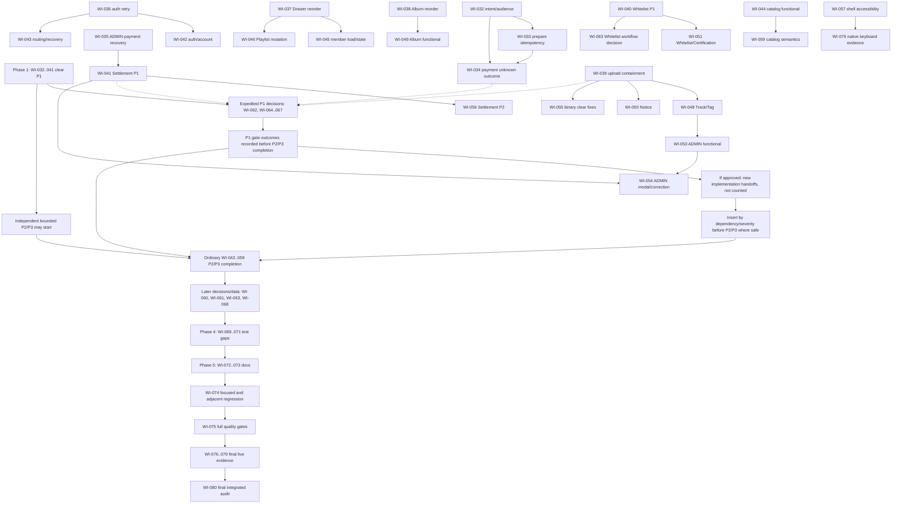

# WI-20260809-ATS-031 Phase A Consolidated Source Inventory

## 1. Audit Boundary

- Phase: `A` only. This document inventories source items; it does not merge
  roots, reassess severity, select fixes, or propose WI-032+ work.
- Baseline inherited from the approved handoff:
  `codex/v1-release-rehearsal-fixes@e343c2085fbc82c66b44fb8e5edde35bf920980f`.
- Primary evidence: the findings and Evidence Packs for WI-021 through WI-030.
- Scope controls: `REQ-20260809-ATS-001`, the WI-019 active-surface inventory,
  and the WI-020 acceptance matrix were used only to confirm row ownership,
  evidence lanes, and audit limits.
- No product source was reopened for a broad audit. No test, build, browser,
  API, database, Provider, file-delivery, Git mutation, or secret inspection
  was performed.
- The intentional ZIP and ignored secret-bearing files were not inspected.
- `Provisional category` is a Phase A routing label only. It is not a root
  merge, remediation decision, or finding resolution.

## 2. Documented Source Counts

| Source WI | Documented independent source count | Documented breakdown                                                                            | Adjacent row/evidence count kept outside the independent-ID total                          |
| --------- | ----------------------------------: | ----------------------------------------------------------------------------------------------- | ------------------------------------------------------------------------------------------ |
| WI-021    |                                   7 | 4 confirmed findings, 1 debt, 1 observation, 1 blocker                                          | Evidence Pack: 11 PASS / 3 FAIL / 1 BLOCKED scenario groups                                |
| WI-022    |                                  16 | 8 product findings, 3 documentation drifts, 2 review decisions, 3 blockers                      | 7 owned rows: 0 PASS / 2 FAIL / 5 BLOCKED                                                  |
| WI-023    |                                  16 | 10 defects, 1 documentation drift, 2 data/fixture gaps, 1 static risk, 1 blocker, 1 review item | 8 owned rows: 0 PASS / 8 FAIL                                                              |
| WI-024    |                                  16 | `F-UI-024-001` through `F-UI-024-016`                                                           | 17 rows: 1 PASS / 15 FAIL / 1 BLOCKED                                                      |
| WI-025    |                                  15 | 3 P1, 11 P2, 1 P3/REVIEW                                                                        | 9 in-scope FAIL rows; guard sublanes 1 PASS / 2 BLOCKED                                    |
| WI-026    |                                  12 | `ATS-026-F01` through `ATS-026-F12`                                                             | 5 anonymous guards PASS; authenticated/live/durable lanes BLOCKED                          |
| WI-027    |                                  11 | 1 P0 candidate, 3 P1, 6 P2, 1 P3                                                                | PASS controls and live BLOCKED lanes are evidence rows, not additional findings            |
| WI-028    |                                  14 | 3 P1, 11 P2                                                                                     | 4 decision-required findings; 1 WI-028 sublane PASS; authenticated/live/file lanes BLOCKED |
| WI-029    |                                  17 | 16 defects: 8 P1 and 8 P2; plus 1 control finding (`A02`)                                       | Confirmed-control and blocked-evidence sections are not included in 17                     |
| WI-030    |                                  12 | 1 P1, 11 P2; 11 NEW and 1 ADJACENT-REGRESSION                                                   | 7 policy questions; static controls and live blocked lanes are not included in 12          |
| **Total** |                             **136** | Exact sum of documented independent issued items                                                | Unnumbered controls/blocks/questions remain separately inventoried below                   |

## 3. Complete Issued-ID Inventory

### WI-021

| Source WI | Original ID    | Original severity / classification        | Concise cause                                                             | Provisional category |
| --------- | -------------- | ----------------------------------------- | ------------------------------------------------------------------------- | -------------------- |
| WI-021    | `F-UI-021-001` | P2 / Implementation defect                | Missing Notice collapses localized 404 into English text without recovery | FIX-NOW              |
| WI-021    | `F-UI-021-002` | P2 / Implementation defect                | `SubscriberRoute` drops the safe return target                            | FIX-NOW              |
| WI-021    | `F-UI-021-003` | P3 / Accessibility defect                 | Mobile Header does not close on Escape or restore focus                   | FIX-NOW              |
| WI-021    | `F-UI-021-004` | P3 / Accessibility/localization drift     | Theme accessible names remain English                                     | FIX-NOW              |
| WI-021    | `D-UI-021-001` | P3 / Dependency migration debt            | React Router v7 future-flag warning remains                               | FIX-NOW              |
| WI-021    | `O-UI-021-001` | None / Non-repeatable latency observation | One transient Track-title timing sample did not repeat                    | CONTROL              |
| WI-021    | `B-UI-021-001` | Unrated / Browser-input limitation        | In-app browser could not prove native Submit or Tab behavior              | EXTERNAL/BLOCKED     |

### WI-022

| Source WI | Original ID    | Original severity / classification             | Concise cause                                                         | Provisional category |
| --------- | -------------- | ---------------------------------------------- | --------------------------------------------------------------------- | -------------------- |
| WI-022    | `F-UI-022-001` | MAJOR / Duplicate-submit window                | Complete-profile submit is unfenced during async validation           | FIX-NOW              |
| WI-022    | `F-UI-022-002` | MAJOR / Fail-open capability UX                | Capability discovery failure leaves password UI advertised            | FIX-NOW              |
| WI-022    | `F-UI-022-003` | MINOR / Invalid route-state handling           | Invalid Profile tab renders a blank content area                      | FIX-NOW              |
| WI-022    | `F-UI-022-004` | MAJOR / Error/empty-state conflation           | Subscription load errors render as authoritative absence              | FIX-NOW              |
| WI-022    | `F-UI-022-005` | MINOR / Missing completed-profile route guard  | Completed profiles can enter a dead-end completion route              | FIX-NOW              |
| WI-022    | `F-UI-022-006` | MINOR / Error-guidance loss                    | Password-reset request discards safe rate-limit/server guidance       | FIX-NOW              |
| WI-022    | `F-UI-022-007` | MINOR / Error-guidance loss                    | Profile password update discards bounded backend guidance             | FIX-NOW              |
| WI-022    | `F-UI-022-008` | MAJOR / Accessibility semantics                | Auth/account fields, states, and selectors lack equivalent semantics  | FIX-NOW              |
| WI-022    | `D-UI-022-001` | MAJOR / Documentation drift                    | Registration destination and verification behavior disagree           | DOC-GAP              |
| WI-022    | `D-UI-022-002` | MAJOR / Documentation drift                    | View-my-info contract omits `companyName`                             | DOC-GAP              |
| WI-022    | `D-UI-022-003` | MINOR / Documentation drift                    | Profile modal/toast documentation differs from tab/inline UI          | DOC-GAP              |
| WI-022    | `R-UI-022-001` | REVIEW / Missing consent contract              | Consent scope, control, and persistence are undefined                 | POLICY-GATE          |
| WI-022    | `R-UI-022-002` | REVIEW / Unverified-login policy inconsistency | Backend, verification UI, and docs define different login policy      | SECURITY-GATE        |
| WI-022    | `B-UI-022-001` | BLOCKED / Fixture-session boundary             | Valid login/Profile mutation lacks a restorable authenticated fixture | EXTERNAL/BLOCKED     |
| WI-022    | `B-UI-022-002` | BLOCKED / Controlled-mail boundary             | Valid, expired, and reused links lack approved mail fixtures          | EXTERNAL/BLOCKED     |
| WI-022    | `B-UI-022-003` | BLOCKED / External-provider boundary           | Live social OAuth lacks an approved provider identity                 | EXTERNAL/BLOCKED     |

### WI-023

| Source WI | Original ID    | Original severity / classification          | Concise cause                                                        | Provisional category |
| --------- | -------------- | ------------------------------------------- | -------------------------------------------------------------------- | -------------------- |
| WI-023    | `F-UI-023-001` | MAJOR / Missing recovery state              | Missing Track/Album detail has bare errors and no recovery           | FIX-NOW              |
| WI-023    | `F-UI-023-002` | MAJOR / Invalid pagination recovery         | Invalid collection pages repeat bad requests or expose raw errors    | FIX-NOW              |
| WI-023    | `F-UI-023-003` | MINOR / View contract divergence            | Album view switch drops query state and changes page size            | FIX-NOW              |
| WI-023    | `F-UI-023-004` | MAJOR / Keyboard and touch entry gap        | Album cards/rows are mouse-only                                      | FIX-NOW              |
| WI-023    | `F-UI-023-005` | MINOR / Raw order presentation              | Album position displays zero-based order                             | FIX-NOW              |
| WI-023    | `F-UI-023-006` | MAJOR / Hidden direct-play control          | Track play control is hidden outside hover/playing states            | FIX-NOW              |
| WI-023    | `F-UI-023-007` | MAJOR / Hidden mobile control flow          | Collapsed Header/Player controls remain interactive                  | FIX-NOW              |
| WI-023    | `F-UI-023-008` | MAJOR / Modal accessibility and status gap  | Tag filter lacks names and availability-error presentation           | FIX-NOW              |
| WI-023    | `F-UI-023-009` | MAJOR / Async stale-response risk           | Album loads lack cancellation/latest ownership                       | FIX-NOW              |
| WI-023    | `F-UI-023-010` | MAJOR / Stale playback context              | Page Track context survives owner unmount                            | FIX-NOW              |
| WI-023    | `D-UI-023-001` | MAJOR / Track metadata contract drift       | Track detail omits documented duration/waveform presentation         | DOC-GAP              |
| WI-023    | `G-UI-023-001` | MAJOR / Known duration data drift           | Existing stored durations disagree with decoded media                | EXTERNAL/BLOCKED     |
| WI-023    | `G-UI-023-002` | MAJOR / Usage fixture mismatch              | Prefixed Usage fixture double-renders `#` and has no active link     | EXTERNAL/BLOCKED     |
| WI-023    | `R-UI-023-001` | MINOR / Unclamped persisted progress        | Restored progress is accepted without runtime proof of clamping      | TEST-GAP             |
| WI-023    | `B-UI-023-001` | BLOCKED / Frozen fixture-effect boundary    | Authenticated/media/error/pagination variants lack approved fixtures | EXTERNAL/BLOCKED     |
| WI-023    | `R-UI-023-002` | REVIEW / Unsettled entry-point requirements | Home play and Album download requirements lack canonical authority   | POLICY-GATE          |

### WI-024

| Source WI | Original ID    | Original severity / classification       | Concise cause                                                    | Provisional category |
| --------- | -------------- | ---------------------------------------- | ---------------------------------------------------------------- | -------------------- |
| WI-024    | `F-UI-024-001` | P1 / Confirmed finding                   | Playlist Drawer sends one-based reorder data                     | FIX-NOW              |
| WI-024    | `F-UI-024-002` | P2 / Confirmed finding                   | Subscriber guard loses return target and toasts during render    | FIX-NOW              |
| WI-024    | `F-UI-024-003` | P2 / Confirmed finding                   | Playlist Drawer lacks dialog and keyboard ownership              | FIX-NOW              |
| WI-024    | `F-UI-024-004` | P2 / Confirmed finding                   | Drawer destructive actions bypass confirmation and hide errors   | FIX-NOW              |
| WI-024    | `F-UI-024-005` | P2 / Confirmed finding                   | Member loads lack latest-request ownership                       | FIX-NOW              |
| WI-024    | `F-UI-024-006` | P2 / Confirmed finding                   | Question owner delete is offered outside `OPEN`                  | FIX-NOW              |
| WI-024    | `F-UI-024-007` | P2 / Confirmed finding                   | Playlist and create cards are mouse-only                         | FIX-NOW              |
| WI-024    | `F-UI-024-008` | P2 / Confirmed finding                   | Invalid IDs can leave pages loading forever                      | FIX-NOW              |
| WI-024    | `F-UI-024-009` | P2 / Confirmed finding                   | Add-to-Playlist has blank loading, no retry, silent expiry close | FIX-NOW              |
| WI-024    | `F-UI-024-010` | P2 / Confirmed finding                   | Guest Player actions lose the origin route                       | FIX-NOW              |
| WI-024    | `F-UI-024-011` | P2 / Confirmed finding                   | Question attachment download lacks pending/failure ownership     | FIX-NOW              |
| WI-024    | `F-UI-024-012` | P2 / Confirmed finding                   | Playlist capacity can default silently or stay stale             | FIX-NOW              |
| WI-024    | `F-UI-024-013` | REVIEW / Partial-save atomicity question | Metadata can commit before reorder fails                         | POLICY-GATE          |
| WI-024    | `F-UI-024-014` | P3 / Confirmed finding                   | Member labels and loading/status copy are inconsistent           | FIX-NOW              |
| WI-024    | `F-UI-024-015` | P3 / Confirmed finding                   | Playlist preview object URLs are not revoked                     | FIX-NOW              |
| WI-024    | `F-UI-024-016` | P2 / Test coverage finding               | Dedicated page tests are absent and one test protects bad data   | TEST-GAP             |

### WI-025

| Source WI | Original ID    | Original severity / classification            | Concise cause                                                          | Provisional category |
| --------- | -------------- | --------------------------------------------- | ---------------------------------------------------------------------- | -------------------- |
| WI-025    | `F-UI-025-001` | P1 / Durability contract conflict             | Track soft delete physically removes contracted history/relations      | POLICY-GATE          |
| WI-025    | `F-UI-025-002` | P1 / Confirmed defect                         | Album reorder always sends one-based data                              | FIX-NOW              |
| WI-025    | `F-UI-025-003` | P2 / Confirmed defect                         | Track forms accept formats the backend rejects                         | FIX-NOW              |
| WI-025    | `F-UI-025-004` | P2 / Confirmed defect                         | Track edit cannot clear all Tags/blank metadata                        | FIX-NOW              |
| WI-025    | `F-UI-025-005` | P2 / Confirmed defect                         | Album management clearing, stale modal, pagination, validation diverge | FIX-NOW              |
| WI-025    | `F-UI-025-006` | P2 / Confirmed defect                         | Album thumbnail validation races selection/submission                  | FIX-NOW              |
| WI-025    | `F-UI-025-007` | P2 / Confirmed defect                         | Album Track search copy, request ownership, and combobox fail          | FIX-NOW              |
| WI-025    | `F-UI-025-008` | P2 / Confirmed defect                         | Edit routes do not validate IDs                                        | FIX-NOW              |
| WI-025    | `F-UI-025-009` | P2 / Confirmed defect                         | Track forms lack accessible controls and retry recovery                | FIX-NOW              |
| WI-025    | `F-UI-025-010` | P2 / Mixed implementation/document defect     | Track management has stale URL/request/action/recovery gaps            | FIX-NOW              |
| WI-025    | `F-UI-025-011` | P2 / Confirmed defect                         | Tag management hides recovery and association-deletion impact          | FIX-NOW              |
| WI-025    | `F-UI-025-012` | P2 / Confirmed defect                         | Notice create/edit/download states and metric read are incomplete      | FIX-NOW              |
| WI-025    | `F-UI-025-013` | P1 / Conditional stored-content security risk | ADMIN files lack authoritative validation under public static root     | SECURITY-GATE        |
| WI-025    | `F-UI-025-014` | P2 / Test coverage finding                    | Six pages lack dedicated tests; reorder test is false-positive         | TEST-GAP             |
| WI-025    | `F-UI-025-015` | P3 / REVIEW                                   | Authenticated responsive behavior was not observed                     | EXTERNAL/BLOCKED     |

### WI-026

| Source WI | Original ID   | Original severity / classification | Concise cause                                                | Provisional category |
| --------- | ------------- | ---------------------------------- | ------------------------------------------------------------ | -------------------- |
| WI-026    | `ATS-026-F01` | P2 / UI-server state mismatch      | Removal-requested delete copy claims a no-op deleted the row | FIX-NOW              |
| WI-026    | `ATS-026-F02` | P2 / State-action mismatch         | Primary action is shown for backend-ineligible states        | FIX-NOW              |
| WI-026    | `ATS-026-F03` | P2 / Validation mismatch           | Frontend accepts non-YouTube/HTTP URLs rejected by backend   | FIX-NOW              |
| WI-026    | `ATS-026-F04` | P3 / Validation mismatch           | Whitelist URL lacks the server's 255-character UI bound      | FIX-NOW              |
| WI-026    | `ATS-026-F05` | P2 / Workflow-copy mismatch        | Editing processed channels silently requeues them            | FIX-NOW              |
| WI-026    | `ATS-026-F06` | P2 / Ambiguous redundant workflow  | Revision-requested direct requeue and edit-requeue conflict  | POLICY-GATE          |
| WI-026    | `ATS-026-F07` | P1 / Operator-scope defect         | Export confirmation omits applied keyword/exact scope        | FIX-NOW              |
| WI-026    | `ATS-026-F08` | P1 / Stale actionable state        | Failed admin reload leaves old actionable rows               | FIX-NOW              |
| WI-026    | `ATS-026-F09` | P2 / Validation mismatch           | Admin whitelist note lacks 500-character limit/guidance      | FIX-NOW              |
| WI-026    | `ATS-026-F10` | P2 / Fail-open form state          | Certification form remains active after lookup failure       | FIX-NOW              |
| WI-026    | `ATS-026-F11` | P2 / Missing recovery              | Certification status/admin loads have no retry               | FIX-NOW              |
| WI-026    | `ATS-026-F12` | P3 / Localization drift            | English loading and stale legacy wording remain              | FIX-NOW              |

### WI-027

| Source WI | Original ID   | Original severity / classification             | Concise cause                                                 | Provisional category |
| --------- | ------------- | ---------------------------------------------- | ------------------------------------------------------------- | -------------------- |
| WI-027    | `ATS-027-F01` | P0 candidate / Charge-intent mismatch          | UI-only purpose can show zero payment behind full-price order | FIX-NOW              |
| WI-027    | `ATS-027-F02` | P1 / Audience identity mismatch                | Name-only routing can select wrong-audience plan              | FIX-NOW              |
| WI-027    | `ATS-027-F03` | P1 / Prepare idempotency defect                | Duplicate prepare requests create distinct orders             | FIX-NOW              |
| WI-027    | `ATS-027-F04` | P1 / Unknown-outcome UX                        | Response/reload loss leaves financial outcome ambiguous       | FIX-NOW              |
| WI-027    | `ATS-027-F05` | P2 / Load ownership and recovery               | Plan loading lacks retry/empty/latest handling                | FIX-NOW              |
| WI-027    | `ATS-027-F06` | P2 / Error-absence conflation                  | Billing Agreement/preview errors become absence               | FIX-NOW              |
| WI-027    | `ATS-027-F07` | P2 / Financial query validation                | Missing/malformed checkout values can invoke prepare          | FIX-NOW              |
| WI-027    | `ATS-027-F08` | P2 / Financial copy and terminal state         | Checkout/fail states misdescribe operation/outcome            | FIX-NOW              |
| WI-027    | `ATS-027-F09` | P2 / Missing confirmation                      | Reactivation is a one-click renewal mutation                  | FIX-NOW              |
| WI-027    | `ATS-027-F10` | P3 / Accessibility/localization                | Selection, status, and copy semantics are inconsistent        | FIX-NOW              |
| WI-027    | `ATS-027-F11` | P2 / Documentation and operator baseline drift | Table count is stale and branch authority is ambiguous        | DOC-GAP              |

### WI-028

| Source WI | Original ID | Original severity / classification  | Concise cause                                                  | Provisional category |
| --------- | ----------- | ----------------------------------- | -------------------------------------------------------------- | -------------------- |
| WI-028    | `F-01`      | P1 / Execution response-loss defect | Refund/correction failure UI lacks authoritative recovery read | FIX-NOW              |
| WI-028    | `F-02`      | P1 / BLOCKED-CONTRACT               | Track soft-delete retention contract conflicts with deletion   | POLICY-GATE          |
| WI-028    | `F-03`      | P1 / BLOCKED-POLICY                 | Stable cleanup failure is excluded from documented retry       | POLICY-GATE          |
| WI-028    | `F-04`      | P2 / Confirmed defect               | Stale ADMIN rejection does not refresh session role            | FIX-NOW              |
| WI-028    | `F-05`      | P2 / Missing contracted surface     | ADMIN User detail UI has no caller despite required matrix row | FIX-NOW              |
| WI-028    | `F-06`      | P2 / Request ownership              | Three ADMIN collections lack latest-request ownership          | FIX-NOW              |
| WI-028    | `F-07`      | P2 / State-machine mismatch         | Question UI offers illegal status transitions                  | FIX-NOW              |
| WI-028    | `F-08`      | P2 / Projection omission            | ADMIN plan rows omit audience and Playlist limit               | FIX-NOW              |
| WI-028    | `F-09`      | P2 / Pending modal ownership        | Raw ADMIN modals can close/retarget while pending              | FIX-NOW              |
| WI-028    | `F-10`      | P2 / Destructive copy omission      | Tag delete confirmation omits association removal              | FIX-NOW              |
| WI-028    | `F-11`      | P2 / Confirmation contract          | Local correction execute lacks required typed phrase           | FIX-NOW              |
| WI-028    | `F-12`      | P2 / Save ownership                 | Settings can show unsent draft after successful save           | FIX-NOW              |
| WI-028    | `F-13`      | P2 / BLOCKED-CONTRACT               | Dashboard matrix names an undefined fourth total               | POLICY-GATE          |
| WI-028    | `F-14`      | P2 / BLOCKED-CONTRACT               | Reconciliation GET has contradictory read/write semantics      | POLICY-GATE          |

### WI-029

| Source WI | Original ID       | Original severity / classification   | Concise cause                                                    | Provisional category |
| --------- | ----------------- | ------------------------------------ | ---------------------------------------------------------------- | -------------------- |
| WI-029    | `F-INTEG-029-A01` | P1 / SPECIFICATION GAP               | Question validation absent; exact attachment limits undefined    | POLICY-GATE          |
| WI-029    | `F-INTEG-029-A02` | CONTROL / DOCUMENT MATCH             | Question attachments correctly inherit Question visibility       | CONTROL              |
| WI-029    | `F-INTEG-029-A03` | P1 / CONTRACT DECISION REQUIRED      | Durable first-download grant can precede completed byte transfer | POLICY-GATE          |
| WI-029    | `F-INTEG-029-A04` | P2 / Contract inconsistency          | Binary filename/byte validation differs by client                | FIX-NOW              |
| WI-029    | `F-INTEG-029-A05` | P2 / Duplicate-request inconsistency | Download entry points use inconsistent pending fences            | FIX-NOW              |
| WI-029    | `F-INTEG-029-A06` | P2 / Missing integration proof       | Storage recovery lacks H2 plus real-files restart proof          | TEST-GAP             |
| WI-029    | `F-INTEG-029-A07` | P2 / Resource-bound defect           | Private document controllers buffer full files                   | FIX-NOW              |
| WI-029    | `F-INTEG-029-A08` | P2 / Missing batch bound             | Download-all has no server/client ceiling                        | POLICY-GATE          |
| WI-029    | `F-INTEG-029-B01` | P1 / Operator-scope defect           | Whitelist confirmation misstates export status mutation          | FIX-NOW              |
| WI-029    | `F-INTEG-029-B02` | P1 / Unknown-outcome defect          | Whitelist export lacks recoverable operation identity            | FIX-NOW              |
| WI-029    | `F-INTEG-029-B03` | P1 / Partial-success defect          | Partial Settlement import reports success and clears context     | FIX-NOW              |
| WI-029    | `F-INTEG-029-B04` | P1 / Server integrity gap            | IGNORE note and retry integrity are UI-only                      | SECURITY-GATE        |
| WI-029    | `F-INTEG-029-B05` | P1 / CSV policy-integrity gap        | Lenient decoding/grammar can silently alter evidence             | POLICY-GATE          |
| WI-029    | `F-INTEG-029-B06` | P1 / Durable representation gap      | Settlement financial/provider fields lack canonical bounds       | POLICY-GATE          |
| WI-029    | `F-INTEG-029-B07` | P2 / Concurrency and audit gap       | Duplicate handling is sequential, not atomic/file-auditable      | FIX-NOW              |
| WI-029    | `F-INTEG-029-B08` | P2 / Missing reconciliation bound    | Reconciliation has no explicit range/row ceiling                 | POLICY-GATE          |
| WI-029    | `F-INTEG-029-B09` | P2 / Outcome-count defect            | Unusable rows disappear from all summary counters                | FIX-NOW              |

### WI-030

| Source WI | Original ID      | Original severity / classification | Concise cause                                                | Provisional category |
| --------- | ---------------- | ---------------------------------- | ------------------------------------------------------------ | -------------------- |
| WI-030    | `F-QAFE-030-001` | P2 / NEW                           | Global playback shortcuts intercept focused controls         | FIX-NOW              |
| WI-030    | `F-QAFE-030-002` | P1 / NEW                           | Queued 401 replays are not marked retried                    | SECURITY-GATE        |
| WI-030    | `F-QAFE-030-003` | P2 / NEW                           | Central 401 fallback lacks consistent safe-origin handling   | SECURITY-GATE        |
| WI-030    | `F-QAFE-030-004` | P2 / NEW                           | Logout callers navigate before logout settles                | POLICY-GATE          |
| WI-030    | `F-QAFE-030-005` | P2 / NEW                           | Broken nonempty images have no fallback state                | POLICY-GATE          |
| WI-030    | `F-QAFE-030-006` | P2 / ADJACENT-REGRESSION           | ADMIN mobile navigation lacks keyboard/hidden-tree ownership | FIX-NOW              |
| WI-030    | `F-QAFE-030-007` | P2 / NEW                           | User and ADMIN Question rows are mouse-only                  | FIX-NOW              |
| WI-030    | `F-QAFE-030-008` | P2 / NEW                           | Track-download callers bypass Blob-aware error normalization | FIX-NOW              |
| WI-030    | `F-QAFE-030-009` | P2 / NEW                           | Modal focus restore has no fallback for removed opener       | FIX-NOW              |
| WI-030    | `F-QAFE-030-010` | P2 / NEW                           | Rejected lazy imports have no app-owned recovery             | FIX-NOW              |
| WI-030    | `F-QAFE-030-011` | P2 / NEW                           | Public Track/Album titles are not semantic headings          | FIX-NOW              |
| WI-030    | `F-QAFE-030-012` | P2 / NEW                           | Desktop Header nests Button inside Link                      | FIX-NOW              |

## 4. Unnumbered Controls, Blocks, and Questions

The sources do not assign original IDs to the items below. They are preserved
by source locator and are excluded from the exact `136` issued-ID total so this
inventory does not invent defect IDs or silently split grouped evidence prose.

| Source WI | Original source locator                          | Original classification                  | Concise cause / complete grouped inventory                                                                                                                                                                                                                                           | Provisional category |
| --------- | ------------------------------------------------ | ---------------------------------------- | ------------------------------------------------------------------------------------------------------------------------------------------------------------------------------------------------------------------------------------------------------------------------------------ | -------------------- |
| WI-024    | `Row Classification: G-AUTH`                     | PASS                                     | Protected routes preserved encoded return targets                                                                                                                                                                                                                                    | CONTROL              |
| WI-024    | `Row Classification: G-QUESTION`                 | BLOCKED                                  | Authenticated USER/ADMIN Question variants lacked a session                                                                                                                                                                                                                          | EXTERNAL/BLOCKED     |
| WI-025    | `G-ADMIN anonymous sublane`                      | PASS                                     | Nine ADMIN routes preserved local encoded return targets                                                                                                                                                                                                                             | CONTROL              |
| WI-025    | `G-ADMIN wrong-role/admin sublanes`              | BLOCKED                                  | Non-ADMIN and ADMIN authenticated UI/API/mutation evidence unavailable                                                                                                                                                                                                               | EXTERNAL/BLOCKED     |
| WI-025    | `Blocked / Not Run Coverage`                     | BLOCKED / NOT RUN                        | Mutations/uploads, live API results, DB/storage/public projection, Notice download, authenticated responsive views, Provider/mail/payment/secret/environment lanes were not run; ZIP remained preserved and uninspected                                                              | EXTERNAL/BLOCKED     |
| WI-026    | `Evidence Boundary: anonymous route checks`      | PASS                                     | Five guarded routes preserved local return targets                                                                                                                                                                                                                                   | CONTROL              |
| WI-026    | `Coverage Gaps`                                  | BLOCKED / NOT INSPECTED                  | Authenticated role matrix, responsive, live response, DB/storage, export bytes, audits, race, keyboard/focus, and restoration lanes unavailable                                                                                                                                      | EXTERNAL/BLOCKED     |
| WI-026    | `Evidence Boundary: targeted checks`             | PASS with missing command metadata       | 11 frontend files/57 tests, 27 backend suites/176 tests, typecheck, and ESLint passed; exact logs were not reconstructed                                                                                                                                                             | CONTROL              |
| WI-027    | `Blocked and Not Inspected`                      | PASSED / OBSERVED controls               | Frontend/backend checks, anonymous guards, public Plan browser state, plan ordering, and static 41-table inventory were positive bounded evidence                                                                                                                                    | CONTROL              |
| WI-027    | `Scheduler Boundary`                             | PASS / PARTIAL                           | Due selection, retry/grace/expiry, pending application, idempotency, and three nominal cron owners passed source/tests; completion ordering lacked a fence                                                                                                                           | CONTROL              |
| WI-027    | `Blocked and Not Inspected: live lanes`          | BLOCKED / PARTIAL                        | Authenticated runtime, Provider, live durable rows, live response loss, configuration/secrets, and ZIP were not inspected                                                                                                                                                            | EXTERNAL/BLOCKED     |
| WI-028    | `Confirmed Controls and API-only Classification` | CONTROL                                  | ADMIN routing; Dashboard ownership; role locking/audit; certification privacy; correction recovery; payment safety; Whitelist locking/snapshots; audio dry-run and License detail API-only support; refund/correction authoritative reads; unconsumed history wrapper classification | CONTROL              |
| WI-028    | `Authenticated ADMIN/browser variants`           | REMAINING (BLOCKED)                      | Authenticated ADMIN UI/API/Provider/durable/file/mutation evidence unavailable                                                                                                                                                                                                       | EXTERNAL/BLOCKED     |
| WI-029    | `Confirmed Controls`                             | CONTROL                                  | Fifteen named controls cover Notice ownership/preserve, Question hardening/delete, certification privacy/validation, first-download serialization, storage boundaries, Whitelist locking/snapshots/CSV, and Settlement authorization/parsing/inertness/UI fences                     | CONTROL              |
| WI-029    | `Blocked and Unproven Evidence`                  | BLOCKED / UNPROVEN                       | Live file/private/storage/DB/Provider lanes, destructive recovery, H2-plus-files restart, responsive browser, controller assertions, concurrency integration, and the absent exact operator-guide pointer remain unproven                                                            | EXTERNAL/BLOCKED     |
| WI-029    | `Part B Scope and Decisions: no export`          | Non-defect / unresolved future recipient | No current ATStudio Settlement export exists; future accounting recipient is undecided                                                                                                                                                                                               | POLICY-GATE          |
| WI-029    | `Part B Scope and Decisions: no preview`         | Non-defect / new requirement boundary    | Current contract is import then summary; absent pre-import preview is not a defect                                                                                                                                                                                                   | CONTROL              |
| WI-030    | `Part B1 controls`                               | CONTROL                                  | Safe OAuth returns, stale identity fencing, Subscriber guard generations, ADMIN subscription fencing, callback replay prevention, and Question identity/request shape                                                                                                                | CONTROL              |
| WI-030    | `Part C1 controls`                               | CONTROL with assertion gaps              | Playable projection, player persistence fencing, Track route fencing, player-local seek, image semantics, search URL ownership, repeated taxonomy envelope, and ADMIN Tag parity                                                                                                     | CONTROL              |
| WI-030    | `Part D1 controls`                               | CONTROL with assertion gaps              | Add-to-Playlist lifecycle, Playlist API ownership, download inventory, bounded partial-result behavior, binary helper boundary, Modal/ConfirmDialog controls, and status-boundary behavior                                                                                           | CONTROL              |
| WI-030    | `Part D2a controls`                              | CONTROL with blocked viewports           | Fixed-shell, Header/Admin, Track/card, filter/dialog, Playlist, and ADMIN-table responsive source controls                                                                                                                                                                           | CONTROL              |
| WI-030    | `Part D2b controls`                              | CONTROL with blocked runtime             | Route topology, safe returns, route-departure ownership, consumer adjacency, and load/toast presentation controls                                                                                                                                                                    | CONTROL              |
| WI-030    | `Policy Questions 1-7`                           | Unanswered policy questions              | Download-success meaning; safe post-refresh origin; interceptor versus guard navigation; logout timing; ADMIN download entitlement; broken-image fallback/alt; route-outliving mutation/download behavior                                                                            | POLICY-GATE          |
| WI-030    | `Final Source-Audit Boundary`                    | BLOCKED / NOT RUN                        | Live 1440/1024/390/360 widths, browser console, server-response lanes, and durable-state lanes remain unproven                                                                                                                                                                       | EXTERNAL/BLOCKED     |

## 5. Omission and Duplicate Check

### Method

1. Enumerate issued IDs from only the ten named findings files.
2. Compare each WI's ID count with the explicit count in its findings/Evidence
   Pack; use `(source WI, original ID)` as the uniqueness key.
3. Preserve source spelling and severity vocabulary. Do not normalize `MAJOR`,
   `P1`, `REVIEW`, `BLOCKED`, or `P0 candidate` into a new severity.
4. Treat WI-030 `OWNER-REFERENCE`, `SHARED-ROOT`, and `NON-DEFECT CONTROL`
   rows as references to already-issued items, not new issuance.
5. Put ID-less PASS, blocked, evidence-only, and policy material in Section 4.
   Exclude it from the 136-ID total rather than inventing IDs.
6. Do not merge matching symptoms or shared source pointers in Phase A.

### Reproducible Enumeration

```powershell
$patterns = [ordered]@{
  '21' = '(?:F|D|O|B)-UI-021-\d{3}'
  '22' = '(?:F|D|R|B)-UI-022-\d{3}'
  '23' = '(?:F|D|G|R|B)-UI-023-\d{3}'
  '24' = 'F-UI-024-\d{3}'
  '25' = 'F-UI-025-\d{3}'
  '26' = 'ATS-026-F\d{2}'
  '27' = 'ATS-027-F\d{2}'
  '28' = '(?m)^### (F-\d{2}) '
  '29' = '(?m)^### (F-INTEG-029-[AB]\d{2}) '
  '30' = '(?m)^### (F-QAFE-030-\d{3}) '
}

$counts = foreach ($number in $patterns.Keys) {
  $path = 'deliverables/agent/WI-20260809-ATS-{0:D3}-findings.md' -f [int]$number
  $text = Get-Content -Raw -LiteralPath $path
  $ids = @([regex]::Matches($text, $patterns[$number]) | ForEach-Object {
    if ($_.Groups.Count -gt 1 -and $_.Groups[1].Success) {
      $_.Groups[1].Value
    } else {
      $_.Value
    }
  } | Sort-Object -Unique)

  [pscustomobject]@{
    WI = 'WI-{0:D3}' -f [int]$number
    Count = $ids.Count
  }
}

$counts
[pscustomobject]@{
  WI = 'TOTAL'
  Count = ($counts | Measure-Object -Property Count -Sum).Sum
}
```

Main independently ran the equivalent unique-filtered enumeration and observed
per-WI counts `7, 16, 16, 16, 15, 12, 11, 14, 17, 12`, total `136`.

### Provisional Totals by Category

| Provisional category | Issued IDs |
| -------------------- | ---------: |
| FIX-NOW              |         95 |
| POLICY-GATE          |         17 |
| SECURITY-GATE        |          5 |
| EXTERNAL/BLOCKED     |          8 |
| TEST-GAP             |          4 |
| DOC-GAP              |          5 |
| CONTROL              |          2 |
| **Total**            |    **136** |

Section 4 adds complete source-section coverage for unnumbered material but no
numeric independent-item claim. Its prose groups vary between one lane, a row
set, and a multi-control section, so splitting it into an additional count
would be a new editorial decision rather than a documented source count.

## 6. Count Conflicts and Ambiguous IDs

1. **No issued-ID omission:** the documented per-WI total reconciles to 136.
2. **WI-024 count boundary:** 16 issued findings coexist with one PASS and one
   BLOCKED row that have no independent IDs. They are preserved in Section 4,
   not added to 16.
3. **WI-025 count boundary:** 15 findings coexist with guard PASS/BLOCKED and
   a larger blocked/not-run lane table. The source does not call those rows
   additional findings.
4. **WI-026 count boundary:** the report explicitly says 12 independent
   findings; its anonymous PASS and grouped coverage gaps are unnumbered.
5. **WI-028 ambiguous ID namespace:** `F-01` through `F-14` are unique only
   when qualified by WI-028. They are not globally machine-safe IDs.
6. **WI-029 count wording:** the checkpoint has 16 defects plus one independent
   control finding, so the complete issued-item count is 17, not 16.
7. **WI-030 duplicate references:** prior-owner reconciliation repeats IDs
   from WI-021 through WI-029 and must not increase their source counts.
8. **Severity vocabularies conflict:** WI-022 uses MAJOR/MINOR/REVIEW while
   other WIs use P-levels, BLOCKED, CONTROL, or None. No global severity total
   is asserted in Phase A.
9. **P0 status remains unresolved:** `ATS-027-F01` is explicitly a `P0
candidate`, not a confirmed P0. Phase A preserves that exact label and does
   not promote or demote it.

Phase A stopped at the boundary above. Phase B canonicalization follows.

## 7. Phase B Canonicalization Rules

- Canonical-root key: one stable `CR-031-NNN` identifier per independently
  evidenced source primitive, contract, or state owner.
- Exact merge count: five source pairs. The 136 issued items therefore map to
  **131 canonical roots**.
- A source item maps to exactly one root. Compound source items are not split
  across roots because that would violate the source-key uniqueness contract.
- Similar recovery, stale-request, keyboard, validation, and copy symptoms
  remain separate when their components, APIs, services, or durable owners
  differ.
- Normalized severity maps `MAJOR -> P2`, `MINOR -> P3`, unscored review
  questions to `P2`, confirmed controls to `CONTROL`, and evidence-only
  blockers to `BLOCKED`. A merged root uses the highest supported normalized
  severity among its affected source items. `ATS-027-F01` is normalized to
  **P1 while retaining its original P0-candidate label**; no confirmed Provider
  charge or durable live outcome supports promotion to P0.
- Canonical dispositions in this section supersede the provisional routing
  labels in Section 3 without changing any original field.

### Scope Codes

| Code | Affected layers, routes, and roles                                     |
| ---- | ---------------------------------------------------------------------- |
| S21  | UI/FE/browser; public shell, Notice, guards; anonymous/all roles       |
| S22  | UI/FE/API/docs; auth and Profile routes; guest/USER                    |
| S23  | UI/FE/API/player/data; public catalog and shared playback; all roles   |
| S24  | UI/FE/API; member, Playlist, Question, shared dialogs; guest/USER      |
| S25  | UI/FE/SV/storage/docs; creator and ADMIN content routes; ADMIN         |
| S26  | UI/FE/SV; Whitelist and Certification; USER/BUSINESS/ADMIN             |
| S27  | UI/FE/SV/Provider/durable/docs; plans, checkout, manage; USER/BUSINESS |
| S28  | UI/FE/SV/durable; ADMIN operations and support APIs; ADMIN             |
| S29  | UI/FE/SV/storage/durable; binary, CSV, download; USER/ADMIN            |
| S30  | UI/FE/shared router/store; cross-entry auth, shell, dialog; all roles  |

### Evidence-Lane Codes

| Code | Evidence lanes preserved from the owning WI                                          |
| ---- | ------------------------------------------------------------------------------------ |
| E21  | Browser/UI and FE source; Notice HTTP observed; stateful lanes out                   |
| E22  | UI/FE/SV source and focused tests; authenticated/mail/Provider lanes blocked         |
| E23  | Browser/UI/API/media source; fixture, authenticated, and durable lanes bounded       |
| E24  | UI/FE/SV source/tests; authenticated mutation and durable lanes blocked              |
| E25  | UI/FE/SV/storage source/tests; authenticated execution/durable result blocked        |
| E26  | UI/FE/SV source/tests; authenticated/runtime/export/durable lanes blocked            |
| E27  | UI/FE/SV and targeted tests; live Provider/authenticated/durable lanes blocked       |
| E28  | UI/FE/SV and targeted tests; live ADMIN/Provider/file/durable lanes blocked          |
| E29  | UI/FE/SV/storage tests; live bytes/private files/H2-plus-files/durable lanes blocked |
| E30  | UI/FE/tests plus bounded 1280px DOM; server/durable/other widths blocked             |

### Merge/Split Codes

| Code | Rationale                                                                                                    |
| ---- | ------------------------------------------------------------------------------------------------------------ |
| S    | Single source owner; no shared primitive was proven with similar findings                                    |
| M1   | Exact shared `SubscriberRoute` redirect/render owner                                                         |
| M2   | Shared Header collapsed-state/keyboard owner; PlayerBar companion makes this provisional                     |
| M3   | Exact shared `TrackService.deleteTrack` retention/deletion owner                                             |
| M4   | Exact shared `TagManagePage` + `TagService.deleteTag` owner                                                  |
| M5   | Same Whitelist export confirmation and applied-filter operation; compound consequences make this provisional |

## 8. Complete Source-to-Canonical Crosswalk

| Source WI | Original ID       | Canonical root |
| --------- | ----------------- | -------------- |
| WI-021    | `F-UI-021-001`    | `CR-031-001`   |
| WI-021    | `F-UI-021-002`    | `CR-031-002`   |
| WI-021    | `F-UI-021-003`    | `CR-031-003`   |
| WI-021    | `F-UI-021-004`    | `CR-031-004`   |
| WI-021    | `D-UI-021-001`    | `CR-031-005`   |
| WI-021    | `O-UI-021-001`    | `CR-031-006`   |
| WI-021    | `B-UI-021-001`    | `CR-031-007`   |
| WI-022    | `F-UI-022-001`    | `CR-031-008`   |
| WI-022    | `F-UI-022-002`    | `CR-031-009`   |
| WI-022    | `F-UI-022-003`    | `CR-031-010`   |
| WI-022    | `F-UI-022-004`    | `CR-031-011`   |
| WI-022    | `F-UI-022-005`    | `CR-031-012`   |
| WI-022    | `F-UI-022-006`    | `CR-031-013`   |
| WI-022    | `F-UI-022-007`    | `CR-031-014`   |
| WI-022    | `F-UI-022-008`    | `CR-031-015`   |
| WI-022    | `D-UI-022-001`    | `CR-031-016`   |
| WI-022    | `D-UI-022-002`    | `CR-031-017`   |
| WI-022    | `D-UI-022-003`    | `CR-031-018`   |
| WI-022    | `R-UI-022-001`    | `CR-031-019`   |
| WI-022    | `R-UI-022-002`    | `CR-031-020`   |
| WI-022    | `B-UI-022-001`    | `CR-031-021`   |
| WI-022    | `B-UI-022-002`    | `CR-031-022`   |
| WI-022    | `B-UI-022-003`    | `CR-031-023`   |
| WI-023    | `F-UI-023-001`    | `CR-031-024`   |
| WI-023    | `F-UI-023-002`    | `CR-031-025`   |
| WI-023    | `F-UI-023-003`    | `CR-031-026`   |
| WI-023    | `F-UI-023-004`    | `CR-031-027`   |
| WI-023    | `F-UI-023-005`    | `CR-031-028`   |
| WI-023    | `F-UI-023-006`    | `CR-031-029`   |
| WI-023    | `F-UI-023-007`    | `CR-031-003`   |
| WI-023    | `F-UI-023-008`    | `CR-031-030`   |
| WI-023    | `F-UI-023-009`    | `CR-031-031`   |
| WI-023    | `F-UI-023-010`    | `CR-031-032`   |
| WI-023    | `D-UI-023-001`    | `CR-031-033`   |
| WI-023    | `G-UI-023-001`    | `CR-031-034`   |
| WI-023    | `G-UI-023-002`    | `CR-031-035`   |
| WI-023    | `R-UI-023-001`    | `CR-031-036`   |
| WI-023    | `B-UI-023-001`    | `CR-031-037`   |
| WI-023    | `R-UI-023-002`    | `CR-031-038`   |
| WI-024    | `F-UI-024-001`    | `CR-031-039`   |
| WI-024    | `F-UI-024-002`    | `CR-031-002`   |
| WI-024    | `F-UI-024-003`    | `CR-031-040`   |
| WI-024    | `F-UI-024-004`    | `CR-031-041`   |
| WI-024    | `F-UI-024-005`    | `CR-031-042`   |
| WI-024    | `F-UI-024-006`    | `CR-031-043`   |
| WI-024    | `F-UI-024-007`    | `CR-031-044`   |
| WI-024    | `F-UI-024-008`    | `CR-031-045`   |
| WI-024    | `F-UI-024-009`    | `CR-031-046`   |
| WI-024    | `F-UI-024-010`    | `CR-031-047`   |
| WI-024    | `F-UI-024-011`    | `CR-031-048`   |
| WI-024    | `F-UI-024-012`    | `CR-031-049`   |
| WI-024    | `F-UI-024-013`    | `CR-031-050`   |
| WI-024    | `F-UI-024-014`    | `CR-031-051`   |
| WI-024    | `F-UI-024-015`    | `CR-031-052`   |
| WI-024    | `F-UI-024-016`    | `CR-031-053`   |
| WI-025    | `F-UI-025-001`    | `CR-031-054`   |
| WI-025    | `F-UI-025-002`    | `CR-031-055`   |
| WI-025    | `F-UI-025-003`    | `CR-031-056`   |
| WI-025    | `F-UI-025-004`    | `CR-031-057`   |
| WI-025    | `F-UI-025-005`    | `CR-031-058`   |
| WI-025    | `F-UI-025-006`    | `CR-031-059`   |
| WI-025    | `F-UI-025-007`    | `CR-031-060`   |
| WI-025    | `F-UI-025-008`    | `CR-031-061`   |
| WI-025    | `F-UI-025-009`    | `CR-031-062`   |
| WI-025    | `F-UI-025-010`    | `CR-031-063`   |
| WI-025    | `F-UI-025-011`    | `CR-031-064`   |
| WI-025    | `F-UI-025-012`    | `CR-031-065`   |
| WI-025    | `F-UI-025-013`    | `CR-031-066`   |
| WI-025    | `F-UI-025-014`    | `CR-031-067`   |
| WI-025    | `F-UI-025-015`    | `CR-031-068`   |
| WI-026    | `ATS-026-F01`     | `CR-031-069`   |
| WI-026    | `ATS-026-F02`     | `CR-031-070`   |
| WI-026    | `ATS-026-F03`     | `CR-031-071`   |
| WI-026    | `ATS-026-F04`     | `CR-031-072`   |
| WI-026    | `ATS-026-F05`     | `CR-031-073`   |
| WI-026    | `ATS-026-F06`     | `CR-031-074`   |
| WI-026    | `ATS-026-F07`     | `CR-031-075`   |
| WI-026    | `ATS-026-F08`     | `CR-031-076`   |
| WI-026    | `ATS-026-F09`     | `CR-031-077`   |
| WI-026    | `ATS-026-F10`     | `CR-031-078`   |
| WI-026    | `ATS-026-F11`     | `CR-031-079`   |
| WI-026    | `ATS-026-F12`     | `CR-031-080`   |
| WI-027    | `ATS-027-F01`     | `CR-031-081`   |
| WI-027    | `ATS-027-F02`     | `CR-031-082`   |
| WI-027    | `ATS-027-F03`     | `CR-031-083`   |
| WI-027    | `ATS-027-F04`     | `CR-031-084`   |
| WI-027    | `ATS-027-F05`     | `CR-031-085`   |
| WI-027    | `ATS-027-F06`     | `CR-031-086`   |
| WI-027    | `ATS-027-F07`     | `CR-031-087`   |
| WI-027    | `ATS-027-F08`     | `CR-031-088`   |
| WI-027    | `ATS-027-F09`     | `CR-031-089`   |
| WI-027    | `ATS-027-F10`     | `CR-031-090`   |
| WI-027    | `ATS-027-F11`     | `CR-031-091`   |
| WI-028    | `F-01`            | `CR-031-092`   |
| WI-028    | `F-02`            | `CR-031-054`   |
| WI-028    | `F-03`            | `CR-031-093`   |
| WI-028    | `F-04`            | `CR-031-094`   |
| WI-028    | `F-05`            | `CR-031-095`   |
| WI-028    | `F-06`            | `CR-031-096`   |
| WI-028    | `F-07`            | `CR-031-097`   |
| WI-028    | `F-08`            | `CR-031-098`   |
| WI-028    | `F-09`            | `CR-031-099`   |
| WI-028    | `F-10`            | `CR-031-064`   |
| WI-028    | `F-11`            | `CR-031-100`   |
| WI-028    | `F-12`            | `CR-031-101`   |
| WI-028    | `F-13`            | `CR-031-102`   |
| WI-028    | `F-14`            | `CR-031-103`   |
| WI-029    | `F-INTEG-029-A01` | `CR-031-104`   |
| WI-029    | `F-INTEG-029-A02` | `CR-031-105`   |
| WI-029    | `F-INTEG-029-A03` | `CR-031-106`   |
| WI-029    | `F-INTEG-029-A04` | `CR-031-107`   |
| WI-029    | `F-INTEG-029-A05` | `CR-031-108`   |
| WI-029    | `F-INTEG-029-A06` | `CR-031-109`   |
| WI-029    | `F-INTEG-029-A07` | `CR-031-110`   |
| WI-029    | `F-INTEG-029-A08` | `CR-031-111`   |
| WI-029    | `F-INTEG-029-B01` | `CR-031-075`   |
| WI-029    | `F-INTEG-029-B02` | `CR-031-112`   |
| WI-029    | `F-INTEG-029-B03` | `CR-031-113`   |
| WI-029    | `F-INTEG-029-B04` | `CR-031-114`   |
| WI-029    | `F-INTEG-029-B05` | `CR-031-115`   |
| WI-029    | `F-INTEG-029-B06` | `CR-031-116`   |
| WI-029    | `F-INTEG-029-B07` | `CR-031-117`   |
| WI-029    | `F-INTEG-029-B08` | `CR-031-118`   |
| WI-029    | `F-INTEG-029-B09` | `CR-031-119`   |
| WI-030    | `F-QAFE-030-001`  | `CR-031-120`   |
| WI-030    | `F-QAFE-030-002`  | `CR-031-121`   |
| WI-030    | `F-QAFE-030-003`  | `CR-031-122`   |
| WI-030    | `F-QAFE-030-004`  | `CR-031-123`   |
| WI-030    | `F-QAFE-030-005`  | `CR-031-124`   |
| WI-030    | `F-QAFE-030-006`  | `CR-031-125`   |
| WI-030    | `F-QAFE-030-007`  | `CR-031-126`   |
| WI-030    | `F-QAFE-030-008`  | `CR-031-127`   |
| WI-030    | `F-QAFE-030-009`  | `CR-031-128`   |
| WI-030    | `F-QAFE-030-010`  | `CR-031-129`   |
| WI-030    | `F-QAFE-030-011`  | `CR-031-130`   |
| WI-030    | `F-QAFE-030-012`  | `CR-031-131`   |

## 9. Canonical Root Register

| Root         | Title                                                                        | Affected original IDs                          | Scope                                                     | Disposition      | Severity | Confidence | Merge/split; evidence | Policy/security gate                                        |
| ------------ | ---------------------------------------------------------------------------- | ---------------------------------------------- | --------------------------------------------------------- | ---------------- | -------- | ---------- | --------------------- | ----------------------------------------------------------- |
| `CR-031-001` | Missing Notice collapses localized 404 into English text without recovery    | `WI-021/F-UI-021-001`                          | S21                                                       | FIX-NOW          | P2       | High       | S; E21                | None                                                        |
| `CR-031-002` | SubscriberRoute safe-return and notification ownership                       | `WI-021/F-UI-021-002`, `WI-024/F-UI-024-002`   | UI/FE router; SubscriberRoute; guest -> subscriber routes | FIX-NOW          | P2       | High       | M1; E21               | None                                                        |
| `CR-031-003` | Collapsed shared shell controls lack Escape and interaction-tree ownership   | `WI-021/F-UI-021-003`, `WI-023/F-UI-023-007`   | UI/CSS/focus; Header + PlayerBar; public/mobile           | FIX-NOW          | P2       | Medium     | M2; E21               | None                                                        |
| `CR-031-004` | Theme accessible names remain English                                        | `WI-021/F-UI-021-004`                          | S21                                                       | FIX-NOW          | P3       | High       | S; E21                | None                                                        |
| `CR-031-005` | React Router v7 future-flag warning remains                                  | `WI-021/D-UI-021-001`                          | S21                                                       | FIX-NOW          | P3       | High       | S; E21                | None                                                        |
| `CR-031-006` | One transient Track-title timing sample did not repeat                       | `WI-021/O-UI-021-001`                          | S21                                                       | CONTROL          | CONTROL  | Low        | S; E21                | None                                                        |
| `CR-031-007` | In-app browser could not prove native Submit or Tab behavior                 | `WI-021/B-UI-021-001`                          | S21                                                       | EXTERNAL/BLOCKED | BLOCKED  | Medium     | S; E21                | Live/fixture evidence required                              |
| `CR-031-008` | Complete-profile submit is unfenced during async validation                  | `WI-022/F-UI-022-001`                          | S22                                                       | FIX-NOW          | P2       | High       | S; E22                | None                                                        |
| `CR-031-009` | Capability discovery failure leaves password UI advertised                   | `WI-022/F-UI-022-002`                          | S22                                                       | FIX-NOW          | P2       | High       | S; E22                | PG review mandatory; no user decision                       |
| `CR-031-010` | Invalid Profile tab renders a blank content area                             | `WI-022/F-UI-022-003`                          | S22                                                       | FIX-NOW          | P3       | High       | S; E22                | None                                                        |
| `CR-031-011` | Subscription load errors render as authoritative absence                     | `WI-022/F-UI-022-004`                          | S22                                                       | FIX-NOW          | P2       | High       | S; E22                | None                                                        |
| `CR-031-012` | Completed profiles can enter a dead-end completion route                     | `WI-022/F-UI-022-005`                          | S22                                                       | FIX-NOW          | P3       | High       | S; E22                | None                                                        |
| `CR-031-013` | Password-reset request discards safe rate-limit/server guidance              | `WI-022/F-UI-022-006`                          | S22                                                       | FIX-NOW          | P3       | High       | S; E22                | None                                                        |
| `CR-031-014` | Profile password update discards bounded backend guidance                    | `WI-022/F-UI-022-007`                          | S22                                                       | FIX-NOW          | P3       | High       | S; E22                | None                                                        |
| `CR-031-015` | Auth/account fields, states, and selectors lack equivalent semantics         | `WI-022/F-UI-022-008`                          | S22                                                       | FIX-NOW          | P2       | High       | S; E22                | None                                                        |
| `CR-031-016` | Registration destination and verification behavior disagree                  | `WI-022/D-UI-022-001`                          | S22                                                       | DOC-GAP          | P2       | High       | S; E22                | DocOps; linked decision dependencies apply                  |
| `CR-031-017` | View-my-info contract omits `companyName`                                    | `WI-022/D-UI-022-002`                          | S22                                                       | DOC-GAP          | P2       | High       | S; E22                | DocOps; linked decision dependencies apply                  |
| `CR-031-018` | Profile modal/toast documentation differs from tab/inline UI                 | `WI-022/D-UI-022-003`                          | S22                                                       | DOC-GAP          | P3       | High       | S; E22                | DocOps; linked decision dependencies apply                  |
| `CR-031-019` | Consent scope, control, and persistence are undefined                        | `WI-022/R-UI-022-001`                          | S22                                                       | POLICY-GATE      | P2       | High       | S; E22                | USER + PG privacy decision                                  |
| `CR-031-020` | Backend, verification UI, and docs define different login policy             | `WI-022/R-UI-022-002`                          | S22                                                       | SECURITY-GATE    | P2       | High       | S; E22                | USER + PG auth-policy decision                              |
| `CR-031-021` | Valid login/Profile mutation lacks a restorable authenticated fixture        | `WI-022/B-UI-022-001`                          | S22                                                       | EXTERNAL/BLOCKED | BLOCKED  | Medium     | S; E22                | Live/fixture evidence required                              |
| `CR-031-022` | Valid, expired, and reused links lack approved mail fixtures                 | `WI-022/B-UI-022-002`                          | S22                                                       | EXTERNAL/BLOCKED | BLOCKED  | Medium     | S; E22                | Live/fixture evidence required                              |
| `CR-031-023` | Live social OAuth lacks an approved provider identity                        | `WI-022/B-UI-022-003`                          | S22                                                       | EXTERNAL/BLOCKED | BLOCKED  | Medium     | S; E22                | Live/fixture evidence required                              |
| `CR-031-024` | Missing Track/Album detail has bare errors and no recovery                   | `WI-023/F-UI-023-001`                          | S23                                                       | FIX-NOW          | P2       | High       | S; E23                | None                                                        |
| `CR-031-025` | Invalid collection pages repeat bad requests or expose raw errors            | `WI-023/F-UI-023-002`                          | S23                                                       | FIX-NOW          | P2       | High       | S; E23                | None                                                        |
| `CR-031-026` | Album view switch drops query state and changes page size                    | `WI-023/F-UI-023-003`                          | S23                                                       | FIX-NOW          | P3       | High       | S; E23                | None                                                        |
| `CR-031-027` | Album cards/rows are mouse-only                                              | `WI-023/F-UI-023-004`                          | S23                                                       | FIX-NOW          | P2       | High       | S; E23                | None                                                        |
| `CR-031-028` | Album position displays zero-based order                                     | `WI-023/F-UI-023-005`                          | S23                                                       | FIX-NOW          | P3       | High       | S; E23                | None                                                        |
| `CR-031-029` | Track play control is hidden outside hover/playing states                    | `WI-023/F-UI-023-006`                          | S23                                                       | FIX-NOW          | P2       | High       | S; E23                | None                                                        |
| `CR-031-030` | Tag filter lacks names and availability-error presentation                   | `WI-023/F-UI-023-008`                          | S23                                                       | FIX-NOW          | P2       | High       | S; E23                | None                                                        |
| `CR-031-031` | Album loads lack cancellation/latest ownership                               | `WI-023/F-UI-023-009`                          | S23                                                       | FIX-NOW          | P2       | High       | S; E23                | None                                                        |
| `CR-031-032` | Page Track context survives owner unmount                                    | `WI-023/F-UI-023-010`                          | S23                                                       | FIX-NOW          | P2       | High       | S; E23                | None                                                        |
| `CR-031-033` | Track detail omits documented duration/waveform presentation                 | `WI-023/D-UI-023-001`                          | S23                                                       | DOC-GAP          | P2       | High       | S; E23                | DocOps; linked decision dependencies apply                  |
| `CR-031-034` | Existing stored durations disagree with decoded media                        | `WI-023/G-UI-023-001`                          | S23                                                       | FIX-NOW          | P2       | High       | S; E23                | USER destructive-data cleanup approval                      |
| `CR-031-035` | Prefixed Usage fixture double-renders `#` and has no active link             | `WI-023/G-UI-023-002`                          | S23                                                       | FIX-NOW          | P2       | High       | S; E23                | USER fixture/data correction approval                       |
| `CR-031-036` | Restored progress is accepted without runtime proof of clamping              | `WI-023/R-UI-023-001`                          | S23                                                       | FIX-NOW          | P3       | High       | S; E23                | None                                                        |
| `CR-031-037` | Authenticated/media/error/pagination variants lack approved fixtures         | `WI-023/B-UI-023-001`                          | S23                                                       | EXTERNAL/BLOCKED | BLOCKED  | Medium     | S; E23                | Live/fixture evidence required                              |
| `CR-031-038` | Home play and Album download requirements lack canonical authority           | `WI-023/R-UI-023-002`                          | S23                                                       | POLICY-GATE      | P2       | High       | S; E23                | USER decision required                                      |
| `CR-031-039` | Playlist Drawer sends one-based reorder data                                 | `WI-024/F-UI-024-001`                          | S24                                                       | FIX-NOW          | P1       | High       | S; E24                | None                                                        |
| `CR-031-040` | Playlist Drawer lacks dialog and keyboard ownership                          | `WI-024/F-UI-024-003`                          | S24                                                       | FIX-NOW          | P2       | High       | S; E24                | None                                                        |
| `CR-031-041` | Drawer destructive actions bypass confirmation and hide errors               | `WI-024/F-UI-024-004`                          | S24                                                       | FIX-NOW          | P2       | High       | S; E24                | None                                                        |
| `CR-031-042` | Member loads lack latest-request ownership                                   | `WI-024/F-UI-024-005`                          | S24                                                       | FIX-NOW          | P2       | High       | S; E24                | None                                                        |
| `CR-031-043` | Question owner delete is offered outside `OPEN`                              | `WI-024/F-UI-024-006`                          | S24                                                       | FIX-NOW          | P2       | High       | S; E24                | None                                                        |
| `CR-031-044` | Playlist and create cards are mouse-only                                     | `WI-024/F-UI-024-007`                          | S24                                                       | FIX-NOW          | P2       | High       | S; E24                | None                                                        |
| `CR-031-045` | Invalid IDs can leave pages loading forever                                  | `WI-024/F-UI-024-008`                          | S24                                                       | FIX-NOW          | P2       | High       | S; E24                | None                                                        |
| `CR-031-046` | Add-to-Playlist has blank loading, no retry, silent expiry close             | `WI-024/F-UI-024-009`                          | S24                                                       | FIX-NOW          | P2       | High       | S; E24                | None                                                        |
| `CR-031-047` | Guest Player actions lose the origin route                                   | `WI-024/F-UI-024-010`                          | S24                                                       | FIX-NOW          | P2       | High       | S; E24                | None                                                        |
| `CR-031-048` | Question attachment download lacks pending/failure ownership                 | `WI-024/F-UI-024-011`                          | S24                                                       | FIX-NOW          | P2       | High       | S; E24                | None                                                        |
| `CR-031-049` | Playlist capacity can default silently or stay stale                         | `WI-024/F-UI-024-012`                          | S24                                                       | FIX-NOW          | P2       | High       | S; E24                | None                                                        |
| `CR-031-050` | Metadata can commit before reorder fails                                     | `WI-024/F-UI-024-013`                          | S24                                                       | POLICY-GATE      | P2       | High       | S; E24                | USER decision required                                      |
| `CR-031-051` | Member labels and loading/status copy are inconsistent                       | `WI-024/F-UI-024-014`                          | S24                                                       | FIX-NOW          | P3       | High       | S; E24                | None                                                        |
| `CR-031-052` | Playlist preview object URLs are not revoked                                 | `WI-024/F-UI-024-015`                          | S24                                                       | FIX-NOW          | P3       | High       | S; E24                | None                                                        |
| `CR-031-053` | Dedicated page tests are absent and one test protects bad data               | `WI-024/F-UI-024-016`                          | S24                                                       | TEST-GAP         | P2       | High       | S; E24                | RE proof required                                           |
| `CR-031-054` | Track soft-delete retention contradicts destructive relationship cleanup     | `WI-025/F-UI-025-001`, `WI-028/F-02`           | UI/FE/SV/durable/docs; Track delete; ADMIN                | POLICY-GATE      | P1       | High       | M3; E25               | USER retention decision                                     |
| `CR-031-055` | Album reorder always sends one-based data                                    | `WI-025/F-UI-025-002`                          | S25                                                       | FIX-NOW          | P1       | High       | S; E25                | None                                                        |
| `CR-031-056` | Track forms accept formats the backend rejects                               | `WI-025/F-UI-025-003`                          | S25                                                       | FIX-NOW          | P2       | High       | S; E25                | None                                                        |
| `CR-031-057` | Track edit cannot clear all Tags/blank metadata                              | `WI-025/F-UI-025-004`                          | S25                                                       | FIX-NOW          | P2       | High       | S; E25                | None                                                        |
| `CR-031-058` | Album management clearing, stale modal, pagination, validation diverge       | `WI-025/F-UI-025-005`                          | S25                                                       | FIX-NOW          | P2       | High       | S; E25                | None                                                        |
| `CR-031-059` | Album thumbnail validation races selection/submission                        | `WI-025/F-UI-025-006`                          | S25                                                       | FIX-NOW          | P2       | High       | S; E25                | None                                                        |
| `CR-031-060` | Album Track search copy, request ownership, and combobox fail                | `WI-025/F-UI-025-007`                          | S25                                                       | FIX-NOW          | P2       | High       | S; E25                | None                                                        |
| `CR-031-061` | Edit routes do not validate IDs                                              | `WI-025/F-UI-025-008`                          | S25                                                       | FIX-NOW          | P2       | High       | S; E25                | None                                                        |
| `CR-031-062` | Track forms lack accessible controls and retry recovery                      | `WI-025/F-UI-025-009`                          | S25                                                       | FIX-NOW          | P2       | High       | S; E25                | None                                                        |
| `CR-031-063` | Track management has stale URL/request/action/recovery gaps                  | `WI-025/F-UI-025-010`                          | S25                                                       | FIX-NOW          | P2       | High       | S; E25                | None                                                        |
| `CR-031-064` | Tag deletion confirmation omits association-removal impact                   | `WI-025/F-UI-025-011`, `WI-028/F-10`           | UI/FE/SV; Tag delete; ADMIN                               | FIX-NOW          | P2       | High       | M4; E25               | None                                                        |
| `CR-031-065` | Notice create/edit/download states and metric read are incomplete            | `WI-025/F-UI-025-012`                          | S25                                                       | FIX-NOW          | P2       | High       | S; E25                | None                                                        |
| `CR-031-066` | ADMIN files lack authoritative validation under public static root           | `WI-025/F-UI-025-013`                          | S25                                                       | FIX-NOW          | P1       | High       | S; E25                | PG review mandatory; no user decision                       |
| `CR-031-067` | Six pages lack dedicated tests; reorder test is false-positive               | `WI-025/F-UI-025-014`                          | S25                                                       | TEST-GAP         | P2       | High       | S; E25                | RE proof required                                           |
| `CR-031-068` | Authenticated responsive behavior was not observed                           | `WI-025/F-UI-025-015`                          | S25                                                       | EXTERNAL/BLOCKED | P3       | Medium     | S; E25                | Live/fixture evidence required                              |
| `CR-031-069` | Removal-requested delete copy claims a no-op deleted the row                 | `WI-026/ATS-026-F01`                           | S26                                                       | FIX-NOW          | P2       | High       | S; E26                | None                                                        |
| `CR-031-070` | Primary action is shown for backend-ineligible states                        | `WI-026/ATS-026-F02`                           | S26                                                       | FIX-NOW          | P2       | High       | S; E26                | None                                                        |
| `CR-031-071` | Frontend accepts non-YouTube/HTTP URLs rejected by backend                   | `WI-026/ATS-026-F03`                           | S26                                                       | FIX-NOW          | P2       | High       | S; E26                | None                                                        |
| `CR-031-072` | Whitelist URL lacks the server's 255-character UI bound                      | `WI-026/ATS-026-F04`                           | S26                                                       | FIX-NOW          | P3       | High       | S; E26                | None                                                        |
| `CR-031-073` | Editing processed channels silently requeues them                            | `WI-026/ATS-026-F05`                           | S26                                                       | FIX-NOW          | P2       | High       | S; E26                | None                                                        |
| `CR-031-074` | Revision-requested direct requeue and edit-requeue conflict                  | `WI-026/ATS-026-F06`                           | S26                                                       | POLICY-GATE      | P2       | High       | S; E26                | USER decision required                                      |
| `CR-031-075` | Whitelist export confirmation omits authoritative applied scope and mutation | `WI-026/ATS-026-F07`, `WI-029/F-INTEG-029-B01` | UI/FE/SV/CSV/durable; Whitelist export; ADMIN             | FIX-NOW          | P1       | Medium     | M5; E26               | None                                                        |
| `CR-031-076` | Failed admin reload leaves old actionable rows                               | `WI-026/ATS-026-F08`                           | S26                                                       | FIX-NOW          | P1       | High       | S; E26                | None                                                        |
| `CR-031-077` | Admin whitelist note lacks 500-character limit/guidance                      | `WI-026/ATS-026-F09`                           | S26                                                       | FIX-NOW          | P2       | High       | S; E26                | None                                                        |
| `CR-031-078` | Certification form remains active after lookup failure                       | `WI-026/ATS-026-F10`                           | S26                                                       | FIX-NOW          | P2       | High       | S; E26                | None                                                        |
| `CR-031-079` | Certification status/admin loads have no retry                               | `WI-026/ATS-026-F11`                           | S26                                                       | FIX-NOW          | P2       | High       | S; E26                | None                                                        |
| `CR-031-080` | English loading and stale legacy wording remain                              | `WI-026/ATS-026-F12`                           | S26                                                       | FIX-NOW          | P3       | High       | S; E26                | None                                                        |
| `CR-031-081` | UI-only purpose can show zero payment behind full-price order                | `WI-027/ATS-027-F01`                           | S27                                                       | FIX-NOW          | P1       | High       | S; E27                | MAIN escalation + PG/QA-INTEG review; P0 candidate retained |
| `CR-031-082` | Name-only routing can select wrong-audience plan                             | `WI-027/ATS-027-F02`                           | S27                                                       | FIX-NOW          | P1       | High       | S; E27                | None                                                        |
| `CR-031-083` | Duplicate prepare requests create distinct orders                            | `WI-027/ATS-027-F03`                           | S27                                                       | FIX-NOW          | P1       | High       | S; E27                | None                                                        |
| `CR-031-084` | Response/reload loss leaves financial outcome ambiguous                      | `WI-027/ATS-027-F04`                           | S27                                                       | FIX-NOW          | P1       | High       | S; E27                | None                                                        |
| `CR-031-085` | Plan loading lacks retry/empty/latest handling                               | `WI-027/ATS-027-F05`                           | S27                                                       | FIX-NOW          | P2       | High       | S; E27                | None                                                        |
| `CR-031-086` | Billing Agreement/preview errors become absence                              | `WI-027/ATS-027-F06`                           | S27                                                       | FIX-NOW          | P2       | High       | S; E27                | None                                                        |
| `CR-031-087` | Missing/malformed checkout values can invoke prepare                         | `WI-027/ATS-027-F07`                           | S27                                                       | FIX-NOW          | P2       | High       | S; E27                | None                                                        |
| `CR-031-088` | Checkout/fail states misdescribe operation/outcome                           | `WI-027/ATS-027-F08`                           | S27                                                       | FIX-NOW          | P2       | High       | S; E27                | None                                                        |
| `CR-031-089` | Reactivation is a one-click renewal mutation                                 | `WI-027/ATS-027-F09`                           | S27                                                       | FIX-NOW          | P2       | High       | S; E27                | None                                                        |
| `CR-031-090` | Selection, status, and copy semantics are inconsistent                       | `WI-027/ATS-027-F10`                           | S27                                                       | FIX-NOW          | P3       | High       | S; E27                | None                                                        |
| `CR-031-091` | Table count is stale and branch authority is ambiguous                       | `WI-027/ATS-027-F11`                           | S27                                                       | DOC-GAP          | P2       | High       | S; E27                | DocOps; linked decision dependencies apply                  |
| `CR-031-092` | Refund/correction failure UI lacks authoritative recovery read               | `WI-028/F-01`                                  | S28                                                       | FIX-NOW          | P1       | High       | S; E28                | None                                                        |
| `CR-031-093` | Stable cleanup failure is excluded from documented retry                     | `WI-028/F-03`                                  | S28                                                       | SECURITY-GATE    | P1       | High       | S; E28                | USER + PG cleanup-retry decision                            |
| `CR-031-094` | Stale ADMIN rejection does not refresh session role                          | `WI-028/F-04`                                  | S28                                                       | FIX-NOW          | P2       | High       | S; E28                | None                                                        |
| `CR-031-095` | ADMIN User detail UI has no caller despite required matrix row               | `WI-028/F-05`                                  | S28                                                       | FIX-NOW          | P2       | High       | S; E28                | None                                                        |
| `CR-031-096` | Three ADMIN collections lack latest-request ownership                        | `WI-028/F-06`                                  | S28                                                       | FIX-NOW          | P2       | High       | S; E28                | None                                                        |
| `CR-031-097` | Question UI offers illegal status transitions                                | `WI-028/F-07`                                  | S28                                                       | FIX-NOW          | P2       | High       | S; E28                | None                                                        |
| `CR-031-098` | ADMIN plan rows omit audience and Playlist limit                             | `WI-028/F-08`                                  | S28                                                       | FIX-NOW          | P2       | High       | S; E28                | None                                                        |
| `CR-031-099` | Raw ADMIN modals can close/retarget while pending                            | `WI-028/F-09`                                  | S28                                                       | FIX-NOW          | P2       | High       | S; E28                | None                                                        |
| `CR-031-100` | Local correction execute lacks required typed phrase                         | `WI-028/F-11`                                  | S28                                                       | FIX-NOW          | P2       | High       | S; E28                | None                                                        |
| `CR-031-101` | Settings can show unsent draft after successful save                         | `WI-028/F-12`                                  | S28                                                       | FIX-NOW          | P2       | High       | S; E28                | None                                                        |
| `CR-031-102` | Dashboard matrix names an undefined fourth total                             | `WI-028/F-13`                                  | S28                                                       | POLICY-GATE      | P2       | High       | S; E28                | USER decision required                                      |
| `CR-031-103` | Reconciliation GET has contradictory read/write semantics                    | `WI-028/F-14`                                  | S28                                                       | POLICY-GATE      | P2       | High       | S; E28                | USER decision required                                      |
| `CR-031-104` | Question validation absent; exact attachment limits undefined                | `WI-029/F-INTEG-029-A01`                       | S29                                                       | POLICY-GATE      | P1       | High       | S; E29                | USER + PG file-contract decision                            |
| `CR-031-105` | Question attachments correctly inherit Question visibility                   | `WI-029/F-INTEG-029-A02`                       | S29                                                       | CONTROL          | CONTROL  | High       | S; E29                | None                                                        |
| `CR-031-106` | Durable first-download grant can precede completed byte transfer             | `WI-029/F-INTEG-029-A03`                       | S29                                                       | POLICY-GATE      | P1       | High       | S; E29                | USER decision required                                      |
| `CR-031-107` | Binary filename/byte validation differs by client                            | `WI-029/F-INTEG-029-A04`                       | S29                                                       | FIX-NOW          | P2       | High       | S; E29                | None                                                        |
| `CR-031-108` | Download entry points use inconsistent pending fences                        | `WI-029/F-INTEG-029-A05`                       | S29                                                       | FIX-NOW          | P2       | High       | S; E29                | None                                                        |
| `CR-031-109` | Storage recovery lacks H2 plus real-files restart proof                      | `WI-029/F-INTEG-029-A06`                       | S29                                                       | TEST-GAP         | P2       | High       | S; E29                | RE proof required                                           |
| `CR-031-110` | Private document controllers buffer full files                               | `WI-029/F-INTEG-029-A07`                       | S29                                                       | FIX-NOW          | P2       | High       | S; E29                | None                                                        |
| `CR-031-111` | Download-all has no server/client ceiling                                    | `WI-029/F-INTEG-029-A08`                       | S29                                                       | POLICY-GATE      | P2       | High       | S; E29                | USER decision required                                      |
| `CR-031-112` | Whitelist export lacks recoverable operation identity                        | `WI-029/F-INTEG-029-B02`                       | S29                                                       | FIX-NOW          | P1       | High       | S; E29                | None                                                        |
| `CR-031-113` | Partial Settlement import reports success and clears context                 | `WI-029/F-INTEG-029-B03`                       | S29                                                       | FIX-NOW          | P1       | High       | S; E29                | None                                                        |
| `CR-031-114` | IGNORE note and retry integrity are UI-only                                  | `WI-029/F-INTEG-029-B04`                       | S29                                                       | FIX-NOW          | P1       | High       | S; E29                | PG review mandatory; no user decision                       |
| `CR-031-115` | Lenient decoding/grammar can silently alter evidence                         | `WI-029/F-INTEG-029-B05`                       | S29                                                       | POLICY-GATE      | P1       | High       | S; E29                | USER + PG/QA-INTEG CSV decision                             |
| `CR-031-116` | Settlement financial/provider fields lack canonical bounds                   | `WI-029/F-INTEG-029-B06`                       | S29                                                       | POLICY-GATE      | P1       | High       | S; E29                | USER + PG/QA-INTEG field-bound decision                     |
| `CR-031-117` | Duplicate handling is sequential, not atomic/file-auditable                  | `WI-029/F-INTEG-029-B07`                       | S29                                                       | FIX-NOW          | P2       | High       | S; E29                | None                                                        |
| `CR-031-118` | Reconciliation has no explicit range/row ceiling                             | `WI-029/F-INTEG-029-B08`                       | S29                                                       | POLICY-GATE      | P2       | High       | S; E29                | USER decision required                                      |
| `CR-031-119` | Unusable rows disappear from all summary counters                            | `WI-029/F-INTEG-029-B09`                       | S29                                                       | FIX-NOW          | P2       | High       | S; E29                | None                                                        |
| `CR-031-120` | Global playback shortcuts intercept focused controls                         | `WI-030/F-QAFE-030-001`                        | S30                                                       | FIX-NOW          | P2       | High       | S; E30                | None                                                        |
| `CR-031-121` | Queued 401 replays are not marked retried                                    | `WI-030/F-QAFE-030-002`                        | S30                                                       | FIX-NOW          | P1       | High       | S; E30                | PG review mandatory; no user decision                       |
| `CR-031-122` | Central 401 fallback lacks consistent safe-origin handling                   | `WI-030/F-QAFE-030-003`                        | S30                                                       | SECURITY-GATE    | P2       | High       | S; E30                | USER + PG auth-navigation decision                          |
| `CR-031-123` | Logout callers navigate before logout settles                                | `WI-030/F-QAFE-030-004`                        | S30                                                       | POLICY-GATE      | P2       | High       | S; E30                | USER + PG logout-semantics decision                         |
| `CR-031-124` | Broken nonempty images have no fallback state                                | `WI-030/F-QAFE-030-005`                        | S30                                                       | FIX-NOW          | P2       | High       | S; E30                | UX review; existing fallback pattern, no user gate          |
| `CR-031-125` | ADMIN mobile navigation lacks keyboard/hidden-tree ownership                 | `WI-030/F-QAFE-030-006`                        | S30                                                       | FIX-NOW          | P2       | High       | S; E30                | None                                                        |
| `CR-031-126` | User and ADMIN Question rows are mouse-only                                  | `WI-030/F-QAFE-030-007`                        | S30                                                       | FIX-NOW          | P2       | High       | S; E30                | None                                                        |
| `CR-031-127` | Track-download callers bypass Blob-aware error normalization                 | `WI-030/F-QAFE-030-008`                        | S30                                                       | FIX-NOW          | P2       | High       | S; E30                | None                                                        |
| `CR-031-128` | Modal focus restore has no fallback for removed opener                       | `WI-030/F-QAFE-030-009`                        | S30                                                       | FIX-NOW          | P2       | High       | S; E30                | None                                                        |
| `CR-031-129` | Rejected lazy imports have no app-owned recovery                             | `WI-030/F-QAFE-030-010`                        | S30                                                       | FIX-NOW          | P2       | High       | S; E30                | None                                                        |
| `CR-031-130` | Public Track/Album titles are not semantic headings                          | `WI-030/F-QAFE-030-011`                        | S30                                                       | FIX-NOW          | P2       | High       | S; E30                | None                                                        |
| `CR-031-131` | Desktop Header nests Button inside Link                                      | `WI-030/F-QAFE-030-012`                        | S30                                                       | FIX-NOW          | P2       | High       | S; E30                | None                                                        |

## 10. Canonical Totals

### Disposition

| Disposition      |   Roots |
| ---------------- | ------: |
| FIX-NOW          |      98 |
| POLICY-GATE      |      14 |
| SECURITY-GATE    |       3 |
| EXTERNAL/BLOCKED |       6 |
| TEST-GAP         |       3 |
| DOC-GAP          |       5 |
| CONTROL          |       2 |
| **Total**        | **131** |

### Normalized Severity

| Severity  |   Roots |
| --------- | ------: |
| P0        |       0 |
| P1        |      20 |
| P2        |      88 |
| P3        |      16 |
| CONTROL   |       2 |
| BLOCKED   |       5 |
| **Total** | **131** |

No root is normalized to P0. `CR-031-081` remains P1 with the source's
P0-candidate annotation and mandatory escalation.

## 11. Merge Audit

### Accepted Exact Merges

| Root         | Source IDs                     | Decision                                                                                                |
| ------------ | ------------------------------ | ------------------------------------------------------------------------------------------------------- |
| `CR-031-002` | `F-UI-021-002`, `F-UI-024-002` | Same `SubscriberRoute` owner; return-target loss and render-time notification are one guard transaction |
| `CR-031-054` | `F-UI-025-001`, WI-028 `F-02`  | Same Track delete service and retention conflict                                                        |
| `CR-031-064` | `F-UI-025-011`, WI-028 `F-10`  | Same Tag delete UI/service dependency effect                                                            |

### Provisional Ambiguous Merges

| Root         | Ambiguity                                                                                         | Phase B treatment                                                                                            |
| ------------ | ------------------------------------------------------------------------------------------------- | ------------------------------------------------------------------------------------------------------------ |
| `CR-031-003` | `F-UI-023-007` also contains PlayerBar hidden-tree behavior beyond WI-021's Header Escape finding | Kept merged because Header state/keyboard ownership is shared; confidence Medium; do not split the source ID |
| `CR-031-075` | WI-026 emphasizes draft/applied keyword scope; WI-029 emphasizes status mutation copy             | Kept merged because both arise in the same export confirmation/operation; confidence Medium                  |

### Deliberate Splits

- Missing recovery roots remain separate across Notice, catalog, Certification,
  member routes, and lazy-route import because their page/API owners differ.
- Stale-response roots remain separate across Album, member, creator, ADMIN,
  subscription, and settings owners.
- Mouse-only Album, Playlist, and Question entry roots remain separate because
  they do not share a component.
- Playlist and Album one-based reorder roots remain separate because they use
  different components, APIs, and backend services.
- Payment, Whitelist export, Settlement import, and local-correction
  unknown-outcome roots remain separate because their durable authorities and
  external effects differ.
- File validation, binary delivery, storage recovery, and public static serving
  roots remain separate despite sharing file-oriented symptoms.

## 12. User Decision Gates

| Gate       | Root/source                                     | Unanswered decision                                                                | Blocking impact                                                |
| ---------- | ----------------------------------------------- | ---------------------------------------------------------------------------------- | -------------------------------------------------------------- |
| UG-031-001 | `CR-031-019`                                    | Define Signup consent scope, control, and persistence                              | Blocks consent UI/docs implementation                          |
| UG-031-002 | `CR-031-020`                                    | Permit or restrict unverified login                                                | Blocks auth/backend/UI/doc alignment                           |
| UG-031-003 | `CR-031-038`                                    | Require, permit, or exclude Home play and Album-detail download                    | Blocks those entry-point changes                               |
| UG-031-004 | `CR-031-050`                                    | Require atomic Playlist metadata/order save or explicit partial success            | Blocks transaction/recovery choice                             |
| UG-031-005 | `CR-031-054`                                    | Define retained versus removed Track relationships on deactivation                 | Blocks Track-delete correction                                 |
| UG-031-006 | `CR-031-074`                                    | Choose direct requeue, edit-to-requeue, or a differentiated workflow               | Blocks Whitelist revision correction                           |
| UG-031-007 | `CR-031-093`                                    | Define safe retry/requeue for definite versus unknown billing-key cleanup failures | Blocks cleanup correction                                      |
| UG-031-008 | `CR-031-102`                                    | Define the fourth dashboard total or correct the matrix to three                   | Blocks dashboard contract change                               |
| UG-031-009 | `CR-031-103`                                    | Keep reconciliation GET observation-only or approve a separate mutation            | Blocks endpoint/matrix alignment                               |
| UG-031-010 | `CR-031-104`                                    | Canonicalize Notice/Question attachment types, counts, and byte limits             | Blocks authoritative upload validation                         |
| UG-031-011 | `CR-031-106`                                    | Define download success as durable grant or completed byte delivery                | Blocks completion/recovery semantics                           |
| UG-031-012 | `CR-031-111`                                    | Choose a supported download-all ceiling                                            | Blocks bounded bulk implementation                             |
| UG-031-013 | `CR-031-115`                                    | Define Settlement encoding, dialect, filename, MIME, and byte envelope             | Blocks strict parser contract                                  |
| UG-031-014 | `CR-031-116`                                    | Define canonical amount, currency, and Provider-ID bounds                          | Blocks durable field validation                                |
| UG-031-015 | `CR-031-118`                                    | Choose reconciliation date/range and row ceilings                                  | Blocks bounded reconciliation                                  |
| UG-031-016 | `CR-031-122`                                    | Define safe retained origins and interceptor-versus-guard navigation               | Blocks auth fallback correction                                |
| UG-031-017 | `CR-031-123`                                    | Await revocation or define immediate local logout plus bounded feedback            | Blocks logout ordering correction                              |
| UG-031-018 | WI-030 policy Q5; download owners               | Define ADMIN public-shell official-download entitlement                            | Blocks ADMIN shared-download presentation                      |
| UG-031-019 | WI-030 policy Q7; `CR-031-127` plus owner roots | Continue, globally report, or cancel route-outliving operations                    | Blocks cross-route operation ownership                         |
| UG-031-020 | WI-029 Part B future export                     | Choose any future accounting export recipient                                      | Non-blocking for current defects; blocks only a future feature |
| UG-031-021 | `CR-031-034`                                    | Approve bounded existing-duration cleanup/backfill                                 | Blocks data mutation, not code diagnosis                       |
| UG-031-022 | `CR-031-035`                                    | Approve contract-conforming Usage fixture/data correction                          | Blocks fixture mutation and live recheck                       |

The WI-030 broken-image fallback question is not elevated to a user policy
gate: `CR-031-124` is a clear missing failed-load transition and may use the
existing bounded placeholder/alt patterns, with UX review, without inventing a
new product policy. No specific asset or alt value is selected here.

## 13. Security Review Gates

| Root         | Security review reason                                           | Gate type                                |
| ------------ | ---------------------------------------------------------------- | ---------------------------------------- |
| `CR-031-009` | Auth capability discovery fails open in presentation             | Mandatory PG review; FIX-NOW             |
| `CR-031-019` | Consent may carry privacy requirements                           | PG review accompanies user decision      |
| `CR-031-020` | Unverified-login policy changes authentication access            | USER + PG decision                       |
| `CR-031-066` | ADMIN upload can place active content under a public root        | Mandatory PG review; FIX-NOW             |
| `CR-031-081` | Charge-bearing intent is materially misrepresented               | PG + QA-INTEG review and main escalation |
| `CR-031-093` | Billing-key cleanup retry handles sensitive Provider credentials | USER + PG decision                       |
| `CR-031-104` | Attachment validation affects private/public upload safety       | USER + PG decision                       |
| `CR-031-114` | Settlement IGNORE integrity is enforced only by UI               | Mandatory PG review; FIX-NOW             |
| `CR-031-115` | Lenient CSV parsing can alter financial evidence                 | USER + PG/QA-INTEG decision              |
| `CR-031-116` | Provider/financial fields lack canonical durable bounds          | USER + PG/QA-INTEG decision              |
| `CR-031-121` | Queued 401 replay can repeat refresh after retry                 | Mandatory PG review; FIX-NOW             |
| `CR-031-122` | Central auth fallback and retained origins are security policy   | USER + PG decision                       |
| `CR-031-123` | Logout ordering controls revocation/session semantics            | USER + PG decision                       |

`SECURITY-GATE` is used only for roots requiring a security-policy choice:
`CR-031-020`, `CR-031-093`, and `CR-031-122`. Clear security defects remain
`FIX-NOW` with mandatory PG review.

## 14. Evidence, Test, Document, and Control Registers

### External or Live Evidence

| Root/source              | Missing evidence                                         | Effect                                     |
| ------------------------ | -------------------------------------------------------- | ------------------------------------------ |
| `CR-031-007`             | Native keyboard Submit/Tab runner                        | Browser-input conclusion remains blocked   |
| `CR-031-021`             | Restorable authenticated Login/Profile fixture           | Authenticated account evidence blocked     |
| `CR-031-022`             | Controlled one-time mail-link fixtures                   | Verification/reset lifecycle blocked       |
| `CR-031-023`             | Approved social Provider identity                        | Live OAuth blocked                         |
| `CR-031-037`             | Authenticated/media/error/large-data fixtures            | Catalog entitlement/error variants blocked |
| `CR-031-068`             | Authenticated ADMIN viewports                            | Responsive defect remains unproven         |
| Section 4 WI-025/026/028 | Authenticated role sessions and durable state            | ADMIN/Business mutation acceptance blocked |
| Section 4 WI-027         | Live Provider and payment durable rows                   | Financial live outcome remains blocked     |
| Section 4 WI-029         | Live bytes/private files/H2-plus-files restart           | Binary/storage acceptance blocked          |
| Section 4 WI-030         | 1440/1024/390/360 widths, console, server, durable state | Cross-entry live acceptance blocked        |

Known duration and Usage data drift are **not** external-evidence roots:
`CR-031-034` and `CR-031-035` are FIX-NOW roots whose destructive/fixture
mutation requires explicit user approval.

### Test Gaps

| Root         | Gap                                                                |
| ------------ | ------------------------------------------------------------------ |
| `CR-031-053` | Member/shared dedicated page coverage and bad Drawer assertion     |
| `CR-031-067` | Six creator/ADMIN pages and false-positive Album reorder assertion |
| `CR-031-109` | Storage recovery lacks combined H2, real files, and restart proof  |

### Document Gaps

| Root         | Document gap                                               | Dependency                             |
| ------------ | ---------------------------------------------------------- | -------------------------------------- |
| `CR-031-016` | Registration destination/verification drift                | Depends on `CR-031-020`                |
| `CR-031-017` | View-my-info omits `companyName`                           | None                                   |
| `CR-031-018` | Profile modal/toast description differs from tab/inline UI | Current UX confirmation                |
| `CR-031-033` | Track detail metadata/waveform contract mismatch           | Presentation versus contract alignment |
| `CR-031-091` | Schema count and official-branch authority drift           | Operator baseline clarification        |

### Confirmed Controls

| Root/source              | Confirmed non-defect/control                                                   |
| ------------------------ | ------------------------------------------------------------------------------ |
| `CR-031-006`             | One non-repeatable Track timing sample is not a defect                         |
| `CR-031-105`             | Question attachment authorization inherits Question visibility                 |
| Section 4 WI-024/025/026 | Protected/ADMIN anonymous local return targets                                 |
| Section 4 WI-027         | Targeted checks, public Plan observations, scheduler safety controls           |
| Section 4 WI-028         | ADMIN routing, locks/audits, API-only supports, bounded recovery controls      |
| Section 4 WI-029         | Fifteen file/storage/Whitelist/Settlement controls; no preview is not a defect |
| Section 4 WI-030         | Auth, player, search, modal, responsive-source, route, and toast controls      |

## 15. P0/P1 Escalation and Correction Blockers

- **Confirmed P0:** none.
- **Retained candidate:** `CR-031-081` / `ATS-027-F01` remains a P0
  candidate in source and normalized P1. Main must escalate it before payment
  correction begins because the UI can advertise zero payment while a
  full-price order is prepared. Provider charge and live durable state remain
  unproven, so Phase B does not promote it.
- **P1 decision/security blockers:**

| Root         | Normalized severity | Blocking gate                               |
| ------------ | ------------------- | ------------------------------------------- |
| `CR-031-054` | P1                  | Track retention/deactivation decision       |
| `CR-031-093` | P1                  | Billing-key cleanup retry security policy   |
| `CR-031-104` | P1                  | Attachment limit/type contract              |
| `CR-031-106` | P1                  | Durable grant versus completed-byte success |
| `CR-031-115` | P1                  | Settlement CSV evidence envelope            |
| `CR-031-116` | P1                  | Settlement financial/Provider field bounds  |

P1 FIX-NOW roots without a user gate still require priority correction and the
review named in Sections 9 and 13; they are not correction-plan blockers merely
because of severity.

## 16. Phase B Stop Point

### Reconciliation Check

| Check                                                 |  Observed result |
| ----------------------------------------------------- | ---------------: |
| Section 3 issued source tuples                        |              136 |
| Section 8 crosswalk rows                              |              136 |
| Duplicate source tuples in either section             |                0 |
| Section 3 versus crosswalk difference                 |                0 |
| Crosswalk versus root-register source difference      |                0 |
| Referenced versus registered root difference          |                0 |
| Missing IDs in the sequential `CR-031-001..131` range |                0 |
| Single-source roots                                   |              126 |
| Two-source merged roots                               |                5 |
| Canonical roots                                       |              131 |
| Normalized severity `P0/P1/P2/P3/CONTROL/BLOCKED`     | `0/20/88/16/2/5` |

The corrected runnable PowerShell enumeration produced per-WI counts
`7, 16, 16, 16, 15, 12, 11, 14, 17, 12` and total `136`, matching main's
independent observation.

Phase B ends with 136 issued items mapped exactly once to 131 canonical roots.
No WI-032+ slice, write-scope allocation, dependency graph, regression plan, or
fix proposal has been created. Those belong to Phase C.

## 17. Phase C Portfolio Rules

- Portfolio range: `WI-032` through `WI-080`, **49 proposed portfolio WIs**.
  Numeric IDs group root ownership; they do not impose strict ascending
  execution when a higher-severity gate becomes ready.
- Root ownership means the one next action to which a canonical root is
  assigned. Verification WIs may reference earlier roots but do not own them.
- Every one of the 131 roots has exactly one owner action. No implementation is
  authorized by this plan.
- The 14 clear P1 FIX-NOW roots are owned by WI-032 through WI-041 before
  ordinary P2/P3 work: `039`, `055`, `066`, `075`, `076`, `081-084`, `092`,
  `112-114`, and `121`.
- The six P1 gated roots remain held and are not mixed into clear-fix WIs:
  `054`, `093`, `104`, `106`, `115`, and `116`.
- Immediately after clear P1 WI-032 through WI-041, main must execute or obtain
  the P1 decision packets WI-062, WI-064, WI-065, WI-066, and WI-067 as soon as
  USER/PG/QA-INTEG input is available, before ordinary P2/P3 completion.
- Approved implementations arising from those P1 packets are inserted by
  dependency and severity before ordinary P2/P3 work where safe. Each requires
  a new handoff and is not yet counted in WI-032 through WI-080.
- WI-063 and other non-P1 decisions may remain later with their stated domain
  prerequisites; this does not defer the expedited P1 decision lane.
- Sequential WIs may revisit a shared file only where the dependency column
  names the earlier owner and the distinct reason for the later edit.
- Risk domains remain separate: payment, auth/session, destructive retention,
  binary delivery, Whitelist export, Settlement evidence, and presentation /
  accessibility.

### Verification Codes

| Code    | Required gate                                                                                                                                                               |
| ------- | --------------------------------------------------------------------------------------------------------------------------------------------------------------------------- |
| `Q-ALL` | Focused tests; adjacent tests; full backend and frontend suites; coverage review; typecheck; ESLint; Prettier; backend/frontend builds; docs validation; `git diff --check` |
| `Q-DOC` | Prettier, docs validation, traceability/count reconciliation, internal links, `git diff --check`; `Q-ALL` is deferred until an approved correction exists                   |
| `R-UI`  | Required role/viewport browser evidence at 1440x900, 1024x768, 390x844, and 360x800 with loading/error/pending/keyboard states                                              |
| `R-X`   | UI invocation, HTTP/server result, Provider or file boundary where applicable, canonical durable state, and reload/audit agreement                                          |

## 18. Root-Owner Remediation Portfolio

The `Canonical roots` column is the authoritative root-to-next-action
crosswalk. WI-074, WI-075, and WI-080 contain non-owning verification
references.

### Phase 1 - Clear P1 Containment and Corrections

| WI     | Agent | Canonical roots | Purpose and bounded behavior                                                                                               | Primary write scope                                                                                                     | Adjacent read/regression scope                                                      | Dependencies / blocks                                                                                                             | Verification                                                                                                                                         | Approval gates                                                        | Documentation follow-up                                            |
| ------ | ----- | --------------- | -------------------------------------------------------------------------------------------------------------------------- | ----------------------------------------------------------------------------------------------------------------------- | ----------------------------------------------------------------------------------- | --------------------------------------------------------------------------------------------------------------------------------- | ---------------------------------------------------------------------------------------------------------------------------------------------------- | --------------------------------------------------------------------- | ------------------------------------------------------------------ |
| WI-032 | `se`  | `081,082`       | Make selected plan identity and server-returned purpose/amount authoritative; stop before billing auth on disagreement     | `SubscriptionPlanPage.tsx`, prepare/render portions of `SubscriptionPaymentPage.tsx`, subscription/payment DTO wrappers | Billing prepare service, USER/BUSINESS same-name plans, checkout guards             | First executable after CR-081 escalation; no Provider action                                                                      | F: purpose/amount/audience matrix; A: Plan -> Checkout and callbacks; R-X with test Provider only; `Q-ALL`                                           | Mandatory PG + QA-INTEG review; no real charge                        | Payment contract and screen-flow follow-up after verified behavior |
| WI-033 | `se`  | `083`           | Make prepare idempotent for one bounded intent without changing charge policy                                              | `BillingAgreementApplicationService`, `PaymentOrder` lookup/constraint path, focused backend tests                      | WI-032 request identity; callback/order reconciliation                              | Depends WI-032 command identity; shared prepare contract, backend owner only                                                      | F: sequential/concurrent/expiry idempotency; A: callback/reconciliation; R-X on test Provider/H2 only; `Q-ALL`                                       | PG/QA-INTEG review; architecture escalation if schema is unavoidable  | Payment command/idempotency docs                                   |
| WI-034 | `se`  | `084`           | Represent committed, failed, reload-failed, and unknown financial outcomes distinctly                                      | callback portion of `SubscriptionPaymentPage.tsx`, `SubscriptionManagePage.tsx`, user-subscription/payment wrappers     | Backend command status, cancel/reactivate no-charge replay, canonical reload        | Depends WI-032 and WI-033; revisits `SubscriptionPaymentPage.tsx` only for callback/recovery after authoritative intent is stable | F: response-loss/post-commit 5xx/reload failure; A: Plan/Checkout/Manage; R-X; `Q-ALL`                                                               | Test Provider only; no production durable action                      | Payment unknown-outcome and operator guidance                      |
| WI-035 | `se`  | `092`           | Add authoritative refund/correction recovery reads before retry                                                            | `PaymentOperationsPage.tsx`, ADMIN refund/correction detail wrappers                                                    | Admin payment detail APIs, audit rows, list refresh                                 | Separate ADMIN payment domain; follows WI-034 for shared unknown-outcome vocabulary only                                          | F: committed response loss for refund/correction; A: all payment tabs; R-X test Provider + H2; `Q-ALL`                                               | PG/QA-INTEG review; no live refund                                    | Payment operations runbook/detail API docs                         |
| WI-036 | `se`  | `121`           | Mark queued 401 replays exactly once and fail closed on second rejection                                                   | `frontend/src/api/client.ts` refresh queue/retry marker and tests                                                       | authStore, exclusions, ADMIN resync, Login/social callback                          | Auth/session domain isolated; precedes WI-043 and WI-060                                                                          | F: concurrent delayed 401/second rejection; A: authStore/guards/API exclusions; R-UI anonymous + fixture auth; `Q-ALL`                               | Mandatory PG review; no policy choice                                 | Security/auth client contract                                      |
| WI-037 | `se`  | `039`           | Send exact zero-based contiguous Drawer reorder and reconcile rejection                                                    | `PlaylistDrawer.tsx`, Drawer tests                                                                                      | Playlist service/controller contract, Edit-page reorder, active/inactive membership | No gate; precedes WI-045, WI-046, WI-058 because they revisit Playlist files for different state/semantics                        | F: exact payload/rollback/refetch; A: Edit/public order; R-X subscriber fixture; `Q-ALL`                                                             | Approved reversible fixture only                                      | Playlist reorder contract                                          |
| WI-038 | `se`  | `055`           | Send exact zero-based Album reorder and prove canonical public order                                                       | `AlbumEditPage.tsx`, dedicated Album edit tests                                                                         | Album service/controller, public Album detail/list                                  | No gate; precedes WI-049 because both touch Album edit/load state                                                                 | F: payload/rollback/refetch; A: public projection; R-X ADMIN fixture; `Q-ALL`                                                                        | Approved reversible Album fixture                                     | Album order contract                                               |
| WI-039 | `se`  | `066`           | Contain active-content upload risk with authoritative validation and safe serving                                          | storage validation/serving, Album/Notice upload services, security headers, focused backend tests                       | Existing image canonicalization, private attachments, public thumbnails             | Clear security correction; CR-104 exact attachment limits remain held and are not selected here                                   | F: HTML/polyglot/MIME/signature/oversize path safety using bounded current contracts; A: Album/Notice render/download; R-X local safe files; `Q-ALL` | Mandatory PG review; architecture/schema/destructive change escalates | Security, storage, and upload boundary docs                        |
| WI-040 | `se`  | `075,076,112`   | Bind Whitelist export to visible applied scope, quarantine stale rows, and recover unknown responses by operation identity | `WhitelistChannelManagePage.tsx`, Whitelist export API/service/batch read paths                                         | immutable snapshots, status transitions, CSV replay, USER channel views             | One owner prevents overlapping Whitelist export edits; precedes WI-051 and decision WI-063                                        | F: draft/applied scope, failed reload, response loss/replay; A: transitions/CSV; R-X ADMIN fixture; `Q-ALL`                                          | No live export; approved fixture and audit scope                      | Whitelist use case/runbook/export contract                         |
| WI-041 | `se`  | `113,114`       | Preserve mixed Settlement import context and enforce IGNORE integrity server-side                                          | Settlement portions of `PaymentOperationsPage.tsx`, controller/service request validation and audit                     | import/reconcile/list tabs, immutable audit, parser boundaries                      | Depends WI-035 for shared `PaymentOperationsPage.tsx` ownership; revisits only Settlement blocks, then precedes WI-056 and WI-067 | F: mixed result/retry, blank/duplicate IGNORE; A: import/reconcile/audit; R-X H2/safe synthetic CSV; `Q-ALL`                                         | Mandatory PG + QA-INTEG review; no production import                  | Settlement operation and audit docs                                |

### Phase 2 - Bounded P2/P3 Domain Corrections

| WI     | Agent | Canonical roots               | Purpose and bounded behavior                                                                                                | Primary write scope                                                                                 | Adjacent read/regression scope                                             | Dependencies / blocks                                                                                                               | Verification                                                                                                                      | Approval gates                                                 | Documentation follow-up                          |
| ------ | ----- | ----------------------------- | --------------------------------------------------------------------------------------------------------------------------- | --------------------------------------------------------------------------------------------------- | -------------------------------------------------------------------------- | ----------------------------------------------------------------------------------------------------------------------------------- | --------------------------------------------------------------------------------------------------------------------------------- | -------------------------------------------------------------- | ------------------------------------------------ |
| WI-042 | `se`  | `008-014`                     | Fence auth submits, distinguish capability/load states, validate Profile routing, preserve safe guidance                    | auth pages, Profile functional state, public-capability hook                                        | backend auth policy, rate limits, session refresh                          | Depends WI-036; WI-058 later revisits only semantics/announcements in these files                                                   | F: delayed validation, capability failure, invalid tab, errors; A: all auth routes; R-UI guest/USER; `Q-ALL`                      | PG review for CR-009; no user decision                         | Auth/Profile current-state docs after gates      |
| WI-043 | `se`  | `002,005,047,129`             | Repair safe subscriber/Player return targets and lazy-route recovery; adopt router future behavior                          | `SubscriberRoute`, PlayerBar guest navigation, router/lazy boundary                                 | ProtectedRoute, OAuth return validation, 404/500, Header links             | Depends WI-036; WI-057 later owns shell semantics only                                                                              | F: safe/unsafe origins, rejected imports/retry; A: guards/history; R-UI; `Q-ALL`                                                  | PG review of redirects; no external OAuth                      | Routing/error-recovery docs                      |
| WI-044 | `se`  | `024,025,026,028,031,032,036` | Correct catalog recovery, pagination/view state, ordering display, request ownership, Player context, and progress clamping | Track/Album list/detail functional logic, playerStore context/progress                              | shared APIs, queue/shuffle/repeat, browser persistence                     | WI-059 later edits only semantics/fallback; CR-038 entry-point policy excluded                                                      | F: invalid pages, stale Album loads, unmount context, persisted bounds; A: playback/history; R-UI public; `Q-ALL`                 | No data mutation                                               | Catalog/player behavior docs                     |
| WI-045 | `se`  | `042,045,049`                 | Give member loads latest ownership, terminate malformed IDs, and represent plan capacity as known/error                     | member list/detail load effects and plan-capacity state                                             | Playlist/Like/License/Question/Download routes                             | Depends WI-037; shares pages with WI-046/047 only in load/state blocks                                                              | F: deferred responses/invalid IDs/plan failures; A: guards/navigation; R-UI USER/subscriber; `Q-ALL`                              | Restorable fixture                                             | Member loading/error-state docs                  |
| WI-046 | `se`  | `041,046,052`                 | Add bounded confirmation/error/retry to Playlist mutations and clean preview URLs                                           | Playlist Drawer destructive paths, AddToPlaylistModal functional states, Playlist preview lifecycle | reorder from WI-037, list/detail/edit mutations                            | Depends WI-037 and WI-045; WI-058/059 later semantics only                                                                          | F: confirm, pending, retry, close/reopen, URL revoke; A: Playlist pages/player; R-X subscriber fixture; `Q-ALL`                   | Reversible Playlist fixture                                    | Playlist mutation/recovery docs                  |
| WI-047 | `se`  | `043,048,097`                 | Match Question owner/status state machine and own attachment requests                                                       | Question detail attachment/delete, ADMIN status controls/service mapping tests                      | Question list/navigation, private/public authorization control CR-105      | Depends WI-045 load ownership; WI-059 later keyboard semantics                                                                      | F: legal transitions/owner delete/pending failure; A: create/answer/list; R-X USER/ADMIN fixture; `Q-ALL`                         | Safe attachment fixture; no private-file disclosure            | Question use case/status docs                    |
| WI-048 | `se`  | `056,057,061,063,064`         | Align Track formats/clear semantics/IDs/management state and disclose Tag dependency deletion                               | Track upload/edit/manage functional logic, Tag delete UI/service contract                           | audio analyzer, Track public projection, Tag filters                       | Depends WI-039 upload containment; WI-058 later form semantics                                                                      | F: MP3/WAV, explicit empty tags, IDs, load/delete recovery, used Tag; A: catalog/filter; R-X ADMIN fixture; `Q-ALL`               | Track/Tag deletion uses reversible fixture; no CR-054 behavior | Track/Tag use cases and API docs                 |
| WI-049 | `se`  | `058,059,060`                 | Correct Album modal clearing/ownership/pagination, thumbnail races, and Track search contract                               | Album manage/create/edit functional state excluding reorder block                                   | WI-038 reorder, public Album pages, Track keyword API                      | Depends WI-038; same `AlbumEditPage.tsx` revisited only for search/thumbnail/load after order payload is fixed                      | F: clear/stale modal/pagination/selection generation/combobox data; A: public Album; R-X ADMIN fixture; `Q-ALL`                   | Reversible media fixture                                       | Album/search/thumbnail docs                      |
| WI-050 | `se`  | `001,065`                     | Provide bounded Notice recovery and coordinated create/edit/download/admin-read states                                      | Notice public detail and ADMIN Notice pages/service read mode                                       | attachment serving and upload containment WI-039                           | Depends WI-039; CR-104 exact limits held                                                                                            | F: 404/network/retry, pending conflicts, non-counting admin read; A: list/attachments; R-X; `Q-ALL`                               | Safe attachment fixture                                        | Notice use case/API docs                         |
| WI-051 | `se`  | `069-073,077-079`             | Align Whitelist state actions, URL/note validation, requeue disclosure, certification form gating/retry                     | USER Whitelist page and Certification USER/ADMIN functional states                                  | WI-040 export, backend state predicates/audits                             | Depends WI-040; CR-074 workflow choice excluded; WI-058 later localization only                                                     | F: every status/URL bound/note bound/lookup error/retry; A: export/admin review; R-X roles; `Q-ALL`                               | Restorable role fixtures                                       | Whitelist/Certification docs                     |
| WI-052 | `se`  | `085-089`                     | Repair Plan/Manage loading, typed absence, checkout query/state copy, and reactivation confirmation                         | Subscription Plan/Payment/Manage functional P2 state                                                | WI-032-034 authoritative financial flow                                    | Depends WI-032 through WI-034; WI-058 later semantics only                                                                          | F: stale loads, 404 vs 5xx, malformed query zero calls, fail copy, confirmation; A: payment callbacks; R-X test Provider; `Q-ALL` | No real payment                                                | Subscription/payment UX docs                     |
| WI-053 | `se`  | `094-096,098,101`             | Refresh stale ADMIN authority, add User detail, own list requests, expose plan fields, canonicalize settings save           | ADMIN User/License/Question/Track list ownership, subscriptions table, settings                     | guards, minimized PII DTOs, public certification guide                     | Depends WI-036 and WI-048; any shared Track management revisit is latest-request ownership only; WI-054 follows for modal ownership | F: 403 refresh/detail/latest-wins/fields/edit-during-save; A: ADMIN shell; R-X ADMIN; `Q-ALL`                                     | PG review for PII/session; reversible settings fixture         | ADMIN operations/settings docs                   |
| WI-054 | `se`  | `099,100`                     | Bind raw modal results to immutable targets and require typed local-correction execution                                    | shared ADMIN raw-modal owners and correction execute confirmation                                   | WI-053 pages, ConfirmDialog, audit/recovery                                | Depends WI-035, WI-041, and WI-053; shared page revisits are limited to immutable pending targets and typed confirmation            | F: Escape/backdrop/retarget/phrase/duplicate; A: all ADMIN modals; R-X ADMIN/H2; `Q-ALL`                                          | No Provider call; approved local correction fixture            | ADMIN correction/confirmation docs               |
| WI-055 | `se`  | `107,108,110,127`             | Normalize binary errors/filenames/bytes, fence duplicate downloads, and stream private files safely                         | download API helper/callers and private document controller delivery                                | CR-106/111 held semantics/bounds, first-download durability, storage tests | Depends WI-039 for shared storage-serving constraints; private binary response/streaming only; WI-065 holds completion/bulk policy  | F: Blob errors/header/type/zero byte/duplicates/streaming; A: all download entry points; R-X safe files; `Q-ALL`                  | PG review; no private user file                                | Binary/download contract docs                    |
| WI-056 | `se`  | `117,119`                     | Make Settlement duplicate handling atomic/file-auditable and count every unusable row                                       | Settlement import transaction/audit and reconciliation summary                                      | WI-041 mixed-result/IGNORE, evidence-contract WI-067                       | Depends WI-041; CR-115/116/118 held, so no new dialect/bounds selected                                                              | F: concurrent duplicates/file audit/count conservation; A: import/reconcile/ignore; R-X synthetic CSV/H2; `Q-ALL`                 | QA-INTEG review; no production import                          | Settlement audit/result docs                     |
| WI-057 | `se`  | `003,004,120,125,128,131`     | Correct shared shell/dialog keyboard, hidden-tree, focus fallback, localization, and nested controls                        | Header, Main/Admin layouts, PlayerBar shell state, shared Modal                                     | WI-043 routing, WI-036 auth, all shell consumers                           | Depends WI-043 and WI-053; shared files revisited only for semantics/focus after functional behavior                                | F: Escape/focus/hidden tree/shortcut/nested DOM; A: guards/logout/player; R-UI; `Q-ALL`                                           | PG review for auth controls; no policy choice                  | Accessibility/shell standard notes               |
| WI-058 | `se`  | `015,030,040,051,062,080,090` | Normalize form/modal/status accessible names, live regions, selection state, and Korean copy                                | auth forms, TagFilter, PlaylistDrawer, Track forms, Whitelist/Certification, payment semantics      | owning functional WIs 042/048/051/052 and WI-037                           | Depends all named functional owners; edits are semantics/copy only and must preserve request shapes                                 | F: roles/names/live regions/keyboard/selection; A: domain suites; R-UI assistive DOM; `Q-ALL`                                     | UX review; no product-policy wording invented                  | Frontend/accessibility standards and screen copy |
| WI-059 | `se`  | `027,029,044,124,126,130`     | Make catalog/member entries keyboard-operable, expose play, recover broken images, and use headings                         | Album/Track/Playlist/Question render semantics and image fallback                                   | WI-044 catalog, WI-046 Playlist, WI-047 Question                           | Depends WI-044/046/047; same files revisited only for semantic elements/fallback                                                    | F: keyboard activation/focus/image error/headings; A: nested actions/playback; R-UI all widths; `Q-ALL`                           | UX review; existing placeholder pattern, no user gate          | Accessibility/catalog UI docs                    |

### Phase 3 - Decision-Held Security, Policy, and Data Actions

This section groups decision ownership; it is not a strict post-P2 execution
barrier. After WI-032 through WI-041, WI-062 and WI-064 through WI-067 enter an
expedited P1 lane as soon as their USER/PG/QA-INTEG inputs are available, and
their gate outcomes must be obtained before ordinary P2/P3 completion. Evidence
prerequisites named in their rows may refine packet closure but must not defer
the gate request. WI-063 and other non-P1 decisions may remain later with their
domain prerequisites.

These WIs produce a decision/security record only. Product writes remain held.
An approved P1 outcome requires a new implementation handoff, inserted by
dependency and severity before ordinary P2/P3 work where safe; `Q-ALL` applies
to that later correction. Those future implementation handoffs are not counted
in WI-032 through WI-080.

| WI     | Agent      | Canonical roots   | Purpose and bounded behavior                                                                                                | Primary write scope                                                  | Adjacent read/regression scope                                                          | Dependencies / blocks                                                           | Verification                                                                                       | Approval gates                                                     | Documentation follow-up                                      |
| ------ | ---------- | ----------------- | --------------------------------------------------------------------------------------------------------------------------- | -------------------------------------------------------------------- | --------------------------------------------------------------------------------------- | ------------------------------------------------------------------------------- | -------------------------------------------------------------------------------------------------- | ------------------------------------------------------------------ | ------------------------------------------------------------ |
| WI-060 | `pg`       | `019,020,122,123` | Resolve consent, unverified login, auth navigation ownership, and logout semantics inside the identity/session domain       | Decision record only; auth product files frozen                      | auth/client/guards/OAuth/logout contracts                                               | After WI-036/042/043 evidence; blocks corresponding corrections                 | Decision consistency matrix; threat/privacy review; `Q-DOC`; later `Q-ALL`                         | USER + PG; gates UG-001/002/016/017                                | Auth/security/privacy docs after approval                    |
| WI-061 | `ps`       | `038,050,102`     | Resolve catalog entry-point scope, Playlist save atomicity, and the dashboard total without selecting unrelated risk policy | Decision record only; product files frozen                           | catalog, Playlist, and dashboard contracts                                              | After WI-037 and bounded current-state audits; blocks corresponding corrections | Contract option matrix and state/effect review; `Q-DOC`; later `Q-ALL`                             | USER; gates UG-003/004/008                                         | Use cases and traceability matrix after approval             |
| WI-062 | `ps`       | `054`             | Define retained versus removed Track relationships on deactivation as a dedicated destructive-retention decision            | Decision/retention record only; Track delete and durable data frozen | Track history, purchases, licenses, Playlist/Album relations, restoration/rollback      | P1 gated root `054` visibly held; blocks Track-delete correction                | Relationship inventory, retention/rollback options, data-impact matrix; `Q-DOC`; later `Q-ALL`     | USER destructive-content decision; gate UG-005                     | Track retention policy and operator procedure after approval |
| WI-063 | `ps`       | `074`             | Select the Whitelist revision/requeue state transition without changing export ownership                                    | Decision/workflow record only; Whitelist transitions frozen          | WI-040 export snapshots, USER edit/requeue, ADMIN audit/status                          | After WI-040/051 evidence; blocks revision correction only                      | State-transition and immutable-audit option matrix; `Q-DOC`; later `Q-ALL`                         | USER; gate UG-006                                                  | Whitelist workflow/use-case docs after approval              |
| WI-064 | `qa-integ` | `093,103`         | Resolve billing-key cleanup retry and reconciliation GET ownership within the payment/Provider domain                       | Decision record only; payment and Provider product files frozen      | WI-032-035 payment effects, cleanup/reconciliation audit and reload                     | After WI-033-035; P1 gated root `093` visibly held                              | UI -> API -> Provider -> durable effect matrix; read-before-retry analysis; `Q-DOC`; later `Q-ALL` | USER + PG; gates UG-007/009; test Provider only                    | Payment contract and runbook after approval                  |
| WI-065 | `qa-integ` | `106,111`         | Resolve durable-versus-byte delivery completion and bounded download-all scope within the binary-delivery domain            | Decision record only; binary delivery product files frozen           | WI-055 download paths, first-download grant, streaming, route-outliving operation owner | After WI-055; P1 gated root `106` visibly held                                  | Byte/durable-state boundary and bounded-bulk matrix; `Q-DOC`; later `Q-ALL`                        | USER + PG; gates UG-011/012/018/019                                | Binary delivery/entitlement runbook after approval           |
| WI-066 | `pg`       | `104`             | Canonicalize Notice/Question attachment type, count, and byte limits as a dedicated upload-security contract                | Decision/security record only; upload product files frozen           | WI-039 containment, WI-047/050 attachment flows, storage validation                     | After safe containment; P1 gated root `104` visibly held                        | Threat, compatibility, and allowlist/limit option analysis; `Q-DOC`; later `Q-ALL`                 | USER + PG; gate UG-010                                             | Attachment security and API limits after approval            |
| WI-067 | `sa`       | `115,116,118`     | Define Settlement file, field, and reconciliation evidence envelopes without guessing thresholds                            | Decision/spec record only; Settlement parser and persistence frozen  | WI-041/056 import, IGNORE, duplicate, audit, and reconciliation controls                | After WI-041/056; P1 gated roots `115/116` visibly held                         | Dialect/field/range compatibility and evidence-integrity matrix; `Q-DOC`; later `Q-ALL`            | USER + PG + QA-INTEG; gates UG-013/014/015/020; UG-020 future-only | Settlement contract, schema, and runbook after approval      |
| WI-068 | `re`       | `034,035`         | Prepare bounded duration cleanup and Usage fixture correction plans; no mutation until approved                             | Dry-run/cleanup plan and fixture manifest only                       | SR-99 analyzer, public Usage/filter/playback                                            | Non-blocking for code WIs; destructive/fixture execution held                   | Before/after manifest, rollback, sample verification; `Q-DOC`; later `Q-ALL`                       | USER destructive-data approval; gates UG-021/022                   | Data baseline and operator procedure after execution         |

### Phase 4 - Dedicated Test Gaps

| WI     | Agent | Canonical roots | Purpose and bounded behavior                                                    | Primary write scope                     | Adjacent read/regression scope     | Dependencies / blocks                                             | Verification                                                                                                  | Approval gates        | Documentation follow-up      |
| ------ | ----- | --------------- | ------------------------------------------------------------------------------- | --------------------------------------- | ---------------------------------- | ----------------------------------------------------------------- | ------------------------------------------------------------------------------------------------------------- | --------------------- | ---------------------------- |
| WI-069 | `re`  | `053`           | Add missing member/shared page assertions and remove the bad Drawer expectation | member/shared test files only           | WI-037, WI-045-047 behavior        | Depends owned corrections                                         | F: each missing page/state; A: shared player/guards; R-UI sampled; `Q-ALL`                                    | None                  | Test inventory/evidence only |
| WI-070 | `re`  | `067`           | Add six creator/ADMIN page suites and exact Album reorder assertions            | creator/ADMIN test files only           | WI-038/048-050                     | Depends owned corrections                                         | F: payload/stale/ID/pending/accessibility; A: public projection; R-UI sampled; `Q-ALL`                        | Safe fixtures         | Test inventory/evidence only |
| WI-071 | `re`  | `109`           | Prove storage journal recovery with H2, real temp files, and restart phases     | storage integration tests/fixtures only | WI-039 and WI-055 storage behavior | Depends security/binary corrections; environment support required | F: rollback/after-commit/restart/idempotency/reference retention; A: upload/download; R-X temp files; `Q-ALL` | No user/private files | Storage verification docs    |

### Phase 5 - Current Documentation Synchronization

| WI     | Agent    | Canonical roots | Purpose and bounded behavior                                       | Primary write scope                                 | Adjacent read/regression scope                    | Dependencies / blocks                                              | Verification                                               | Approval gates                      | Documentation follow-up  |
| ------ | -------- | --------------- | ------------------------------------------------------------------ | --------------------------------------------------- | ------------------------------------------------- | ------------------------------------------------------------------ | ---------------------------------------------------------- | ----------------------------------- | ------------------------ |
| WI-072 | `docops` | `016-018`       | Synchronize registration, profile response, and current Profile UX | `user-info.md`, auth/Profile UI docs only           | WI-042 and WI-060 decisions                       | CR-016 held until CR-020 decision; other edits after verified code | Semantic code/doc cross-check; internal links; `Q-ALL`     | Approved auth policy where required | This WI is the follow-up |
| WI-073 | `docops` | `033,091`       | Align Track-detail metadata and operator schema/branch baseline    | Track use case/UI docs and payment/operator indexes | WI-044 behavior, current schema/baseline evidence | Must distinguish current operator baseline from history            | Contract/source recount; links/index/traceability; `Q-ALL` | Operator-baseline confirmation      | This WI is the follow-up |

### Phase 6 - Focused, Adjacent, and Full Regression

These WIs reference roots for verification but own no canonical root.

| WI     | Agent      | Canonical root references                               | Purpose and bounded behavior                                                            | Primary write scope                                                     | Adjacent read/regression scope                  | Dependencies / blocks                     | Verification                                                                                                        | Approval gates                  | Documentation follow-up   |
| ------ | ---------- | ------------------------------------------------------- | --------------------------------------------------------------------------------------- | ----------------------------------------------------------------------- | ----------------------------------------------- | ----------------------------------------- | ------------------------------------------------------------------------------------------------------------------- | ------------------------------- | ------------------------- |
| WI-074 | `qa-integ` | All corrected/approved roots, non-owning                | Run focused plus adjacent cross-layer regression and reconcile every expected assertion | Test/evidence fixes only; no product behavior change without escalation | all domain WIs and approved gate outcomes       | Depends WI-032-073 applicable completions | Exact root-to-test matrix; frontend/backend focused and adjacent suites; R-X sampled; `Q-ALL`                       | All required fixtures/decisions | Regression evidence index |
| WI-075 | `qa`       | All repository corrections and current docs, non-owning | Run complete quality gates and coverage review before final live acceptance             | Quality/evidence outputs only                                           | whole repository excluding prohibited artifacts | Depends WI-074                            | full Gradle/tests/coverage; full frontend tests/coverage/typecheck/lint/Prettier/build; docs validation; diff check | No deployment                   | Quality-gate evidence     |

### Phase 7 - Final Browser, Role, API, and Durable Audit

WI-076 through WI-079 own the six external/live roots. WI-080 is a non-owning
final reconciliation over all roots.

| WI     | Agent      | Canonical roots           | Purpose and bounded behavior                                                                 | Primary write scope                                                   | Adjacent read/regression scope                      | Dependencies / blocks                                                | Verification                                                                                                       | Approval gates                                           | Documentation follow-up        |
| ------ | ---------- | ------------------------- | -------------------------------------------------------------------------------------------- | --------------------------------------------------------------------- | --------------------------------------------------- | -------------------------------------------------------------------- | ------------------------------------------------------------------------------------------------------------------ | -------------------------------------------------------- | ------------------------------ |
| WI-076 | `qa-fe`    | `007`                     | Prove native Submit, Tab, Escape, and focus behavior with a capable runner                   | Evidence/tests only; no product write unless a new defect is approved | Header search and shell keyboard roots              | After WI-057 and WI-075                                              | F + physical/second-runner keyboard matrix; R-UI; `Q-ALL`                                                          | Capable browser/input runner                             | Evidence Pack only             |
| WI-077 | `qa-integ` | `021-023`                 | Close authenticated Profile, controlled mail-link, and social OAuth evidence                 | Sanitized fixtures/evidence only                                      | auth gates/corrections and mail/Provider boundaries | After WI-042/060 and WI-075; provider identity and receiver required | Login/Profile restore; valid/expired/reused links; test OAuth; R-X; `Q-ALL`                                        | USER-approved fixtures; no raw tokens                    | Auth acceptance evidence       |
| WI-078 | `qa-fe`    | `037`                     | Exercise authenticated entitlement, media error, linked Usage, and large pagination variants | Controlled fixtures/evidence only                                     | WI-044/055/059                                      | After data decision WI-068 where needed and WI-075                   | Role/media/error/pagination matrix; R-UI/R-X; `Q-ALL`                                                              | Approved reversible fixtures; no uncontrolled download   | Catalog acceptance evidence    |
| WI-079 | `qa-fe`    | `068`                     | Execute authenticated ADMIN responsive acceptance at all four target widths                  | Browser evidence only                                                 | all ADMIN/creator corrections and presentation WIs  | After WI-039-059 and WI-075                                          | loading/error/modal/file/table/pending/keyboard screenshots and DOM bounds; R-UI; `Q-ALL`                          | Approved ADMIN session                                   | Responsive acceptance evidence |
| WI-080 | `qa-integ` | All 131 roots, non-owning | Final role/browser/API/durable audit and acceptance reconciliation                           | Final evidence only                                                   | every route/role/effect lane; controls retained     | Depends WI-076-079 and all approved live prerequisites               | R-UI all widths/roles; R-X UI -> request -> server/Provider -> durable/reload; final count reconciliation; `Q-ALL` | Explicit approval for any Provider/data/file side effect | Final audit docs/evidence only |

### No-Action Controls

| Action              | Canonical root | Result                                                                   |
| ------------------- | -------------- | ------------------------------------------------------------------------ |
| `NO-ACTION-031-001` | `006`          | Retain as a non-repeatable observation; no correction WI                 |
| `NO-ACTION-031-002` | `105`          | Retain confirmed Question authorization behavior as a regression control |

## 19. Dependency Graph



The dotted domain edges enrich the expedited packets with already-bounded P1
evidence; they are not prerequisites for asking or obtaining the P1 decisions.

Shared-file revisits are intentional only for distinct blocks named in the WI
rows: WI-032 -> WI-034 for payment intent versus callback recovery; WI-035 ->
WI-041 -> WI-054 for refund/correction, Settlement, then modal ownership inside
`PaymentOperationsPage.tsx`; WI-037 -> WI-046 for Drawer reorder versus mutation
recovery; WI-038 -> WI-049 for Album order versus search/thumbnail/load state;
WI-039 -> WI-055 for upload containment versus private binary delivery; WI-040
-> WI-051 for export versus status/form behavior; WI-041 -> WI-056 for
Settlement validation versus transaction/audit behavior; WI-048 -> WI-053 for
Track behavior versus latest-request ownership; and WI-057..059 semantics only
after their named functional owners stabilize.

## 20. Decision Bundles

All 22 gates from Section 12 remain present. Recommendations below are options
for user review, not selected outcomes. Bundles reduce escalation rounds only;
the listed WIs retain separate risk ownership and may be approved separately.

| Bundle / independent WIs                  | Gates preserved                                | Recommendation for decision                                                                                                                          | Primary tradeoff                                                                               |
| ----------------------------------------- | ---------------------------------------------- | ---------------------------------------------------------------------------------------------------------------------------------------------------- | ---------------------------------------------------------------------------------------------- |
| Identity, privacy, and session / WI-060   | UG-001, UG-002, UG-016, UG-017                 | Prefer one fail-closed identity authority, one navigation owner, explicit consent ownership, and a bounded logout completion model                   | Stronger safety/clarity versus more interruption and recovery UI                               |
| Product behavior / WI-061, WI-062, WI-063 | UG-003, UG-004, UG-005, UG-006, UG-008         | Prefer explicit entry-point/save/state contracts; evaluate durable Track retention and Whitelist revision in their dedicated WIs                     | Data/user trust versus added workflow steps, retention cost, and product constraints           |
| External effects / WI-064, WI-065         | UG-007, UG-009, UG-011, UG-012, UG-018, UG-019 | Prefer read-before-retry and observation-only GET for payment; define delivery completion, bulk ceiling, entitlement, and route ownership separately | Reduced duplicate/unknown effects versus latency, operator friction, and longer-lived UI state |
| Evidence envelopes / WI-066, WI-067       | UG-010, UG-013, UG-014, UG-015, UG-020         | Prefer owner-approved allowlists and bounds; keep attachment security and Settlement evidence contracts independent                                  | Evidence integrity versus legacy compatibility; UG-020 remains future-only                     |
| Data and fixture mutation / WI-068        | UG-021, UG-022                                 | Prefer dry-run manifests, scoped reversible updates, and before/after verification                                                                   | Correct baseline versus destructive cleanup risk and acceptance downtime                       |

## 21. Exact Coverage Reconciliation

### Root Ownership by Disposition

| Canonical disposition | Required count | Owner actions           | Assigned count | Difference |
| --------------------- | -------------: | ----------------------- | -------------: | ---------: |
| FIX-NOW               |             98 | WI-032..059 plus WI-068 |             98 |          0 |
| POLICY-GATE           |             14 | WI-060..067             |             14 |          0 |
| SECURITY-GATE         |              3 | WI-060 and WI-064       |              3 |          0 |
| EXTERNAL/BLOCKED      |              6 | WI-076..079             |              6 |          0 |
| TEST-GAP              |              3 | WI-069..071             |              3 |          0 |
| DOC-GAP               |              5 | WI-072..073             |              5 |          0 |
| CONTROL               |              2 | NO-ACTION-031-001/002   |              2 |          0 |
| **Total**             |        **131** |                         |        **131** |      **0** |

Document-local expansion of the owner cells produced 49 consecutive WI IDs
(`WI-032` through `WI-080`) with no missing WI number, 46 owning WI rows plus
two no-action controls, and 131 assignments for 131 unique roots. Duplicate,
missing, and out-of-range root counts are `0 / 0 / 0`. The canonical register
recount is `98 / 14 / 3 / 6 / 3 / 5 / 2` in the disposition order above, and
the decision-bundle recount preserves `22 / 22` unique gates.

### FIX-NOW Phase Reconciliation

| FIX-NOW class                              | Roots                                         |  Count |
| ------------------------------------------ | --------------------------------------------- | -----: |
| Clear P1 first                             | `039,055,066,075,076,081-084,092,112-114,121` |     14 |
| Bounded P2/P3 functional/presentation      | WI-042..059 owner lists                       |     82 |
| Data/fixture corrections held for approval | `034,035`                                     |      2 |
| **Total FIX-NOW**                          |                                               | **98** |

WI-074, WI-075, and WI-080 are excluded from ownership counts because they are
non-owning verification layers. The 22 user gates include three reference-only
questions (`UG-018`, `UG-019`, `UG-020`) and two data-mutation approvals
(`UG-021`, `UG-022`); this does not alter canonical disposition counts.

## 22. Next Executable WI and Escalation

- **Next executable WI:** `WI-032`, subscriber payment intent and audience
  containment for `CR-031-081` and `CR-031-082`.
- **Mandatory pre-handoff escalation:** main must surface that
  `ATS-027-F01` / `CR-031-081` remains a source P0 candidate normalized to P1:
  zero-payment copy can precede a full-price prepared order, while no live
  Provider charge or durable production outcome is proven.
- Main must obtain PG and QA-INTEG review of the containment boundary and
  reaffirm test-Provider/no-real-charge execution before delegating WI-032.
- No user policy decision blocks WI-032. The six P1 gated roots remain held in
  WI-062 and WI-064 through WI-067 and must not enter WI-032 scope. "Held"
  means awaiting required input, not scheduled after ordinary P2/P3.
- After clear P1 WI-032 through WI-041, main must open those five P1 decision
  packets as soon as USER/PG/QA-INTEG input is available and obtain their
  outcomes before ordinary P2/P3 completion. Numeric WI order does not override
  this severity lane.
- Any approved implementation from a P1 packet requires a new handoff and is
  inserted ahead of lower-severity or dependent P2/P3 slices where safe. Those
  future handoffs do not change the current WI-032 through WI-080 count.
- WI-063 and remaining non-P1 decisions continue later according to their
  domain prerequisites.

## 23. Phase C Stop Point

Phase C stops at the remediation portfolio and dependency graph. No WI-032
handoff, Evidence Pack, user summary, product implementation, test execution,
browser/API/database/Provider action, Git operation, or documentation update
has been created or performed.

## 24. Final Closeout Validation

The Phase C stop point above records the pre-closeout boundary. Subsequent
closeout created the Evidence Pack and user summary, then main supplied the
following final document-validation evidence:

- Initial Prettier check over the WI-031 handoff, consolidated findings,
  Evidence Pack, and user summary: exit `1`. The consolidated findings,
  Evidence Pack, and user summary required formatting; the handoff was already
  clean.
- Prettier `--write` over those three files: exit `0`. Reported timings were
  consolidated findings `215ms`, Evidence Pack `31ms`, and user summary `24ms`.
- Final Prettier check over all four files: exit `0`; all matched files use
  Prettier code style.
- Documentation validation: exit `0`; Tier 0 checks, internal links, 543
  traceability IDs, the document index, and all validations passed.
- `git diff --check`: exit `0` with no output. This is tracked-only evidence
  because the WI-031 outputs are untracked; Prettier and documentation
  validation directly checked those output files.
- Post-format independent portfolio recount with a whitespace-tolerant parser:
  46 owning WI rows plus two no-action roots, 131 assignments, 131 unique
  roots, zero duplicates, and zero missing roots.
- No product tests, builds, browser sessions, API calls, database queries,
  Provider actions, or Git mutation were performed. No secret or intentional
  ZIP inspection was performed.
