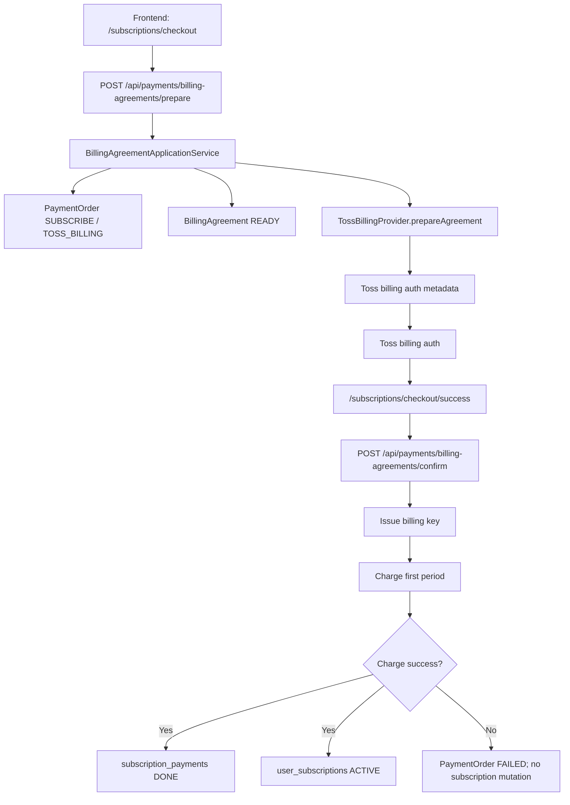
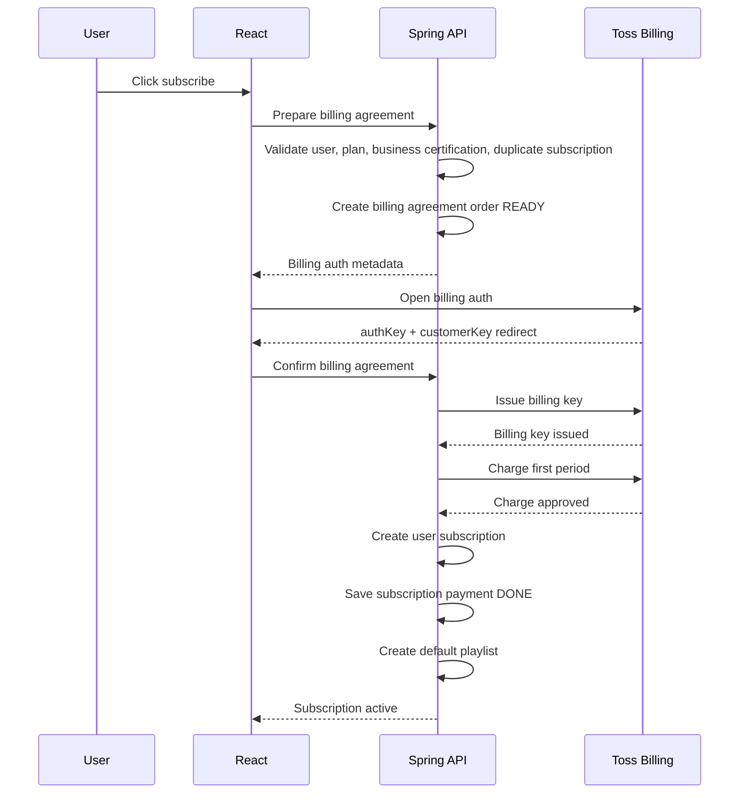
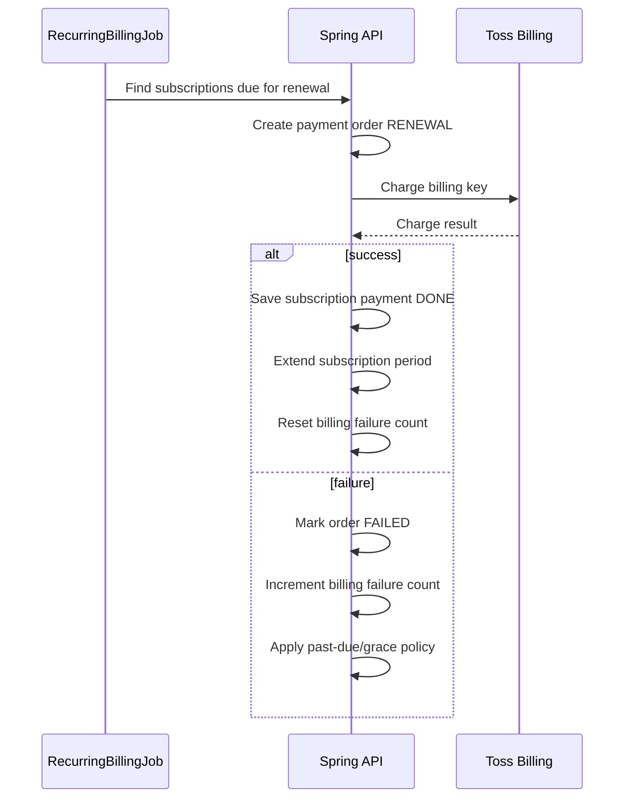

---
version: 2.0
last_updated: 2026-07-16
project: ATS
owner: sa
category: design
status: stable
dependencies:
  - path: api-spec.md
    reason: Current payment API DTO contract
  - path: db-schema.md
    reason: Current payment persistence contract
  - path: payment-operations-runbook.md
    reason: Operational recovery boundary
---

# Payment Integration Design

> Purpose: Define a recurring-first subscription payment architecture that supports local mock/testing flows, Toss billing-key subscriptions, and future PG extension without repeatedly changing the subscription domain model.

---

## 1. Overview

ATStudio subscription payment is now centered on Toss billing-key recurring payment.

Current implementation facts:

- New subscription user flow enters the dedicated `/subscriptions/checkout` route and opens Toss billing auth.
- Billing-key confirmation immediately performs the first charge, then activates the subscription.
- Renewal charges are executed by ATStudio's scheduler through `RecurringPaymentProvider.charge()`.
- Upgrade uses the existing active billing agreement to charge the remaining-period price difference immediately.
- If Toss reports the stored billing key as removed/invalid during an upgrade charge, ATStudio marks the local billing agreement `EXPIRED`, clears issued-key fields, returns `BILLING_AGREEMENT_REAUTH_REQUIRED`, and keeps the current subscription unchanged.
- Existing active/grace-period subscribers can re-register a payment method through a zero-amount `BILLING_AGREEMENT` order.
- Downgrade is scheduled as a pending change and applied at the next renewal charge.
- Toss one-time checkout remains a provider capability, but subscription `SUBSCRIBE`/`UPGRADE` prepare and confirm are blocked for user-facing subscription scope.
- Expired `READY`/`IN_PROGRESS` payment orders are closed by scheduler.
- Local reconciliation keyset-scans eligible ledger rows and `ACTIVE` billing agreements in bounded configurable batches. Scheduled execution persists every detected Incident batch while API issue details use a separate bounded cap.
- Provider API reconciliation keyset-scans nonterminal/finalization candidates and compares Toss payment state by `orderId` when lookup configuration is available. Locally `DONE` orders are rechecked only within the configured age window and per-run cap, and orders with a locally succeeded refund are excluded from that completed-payment comparison.
- Reconciliation separates an on-demand ADMIN observation path from scheduled recovery. The read-only endpoint performs provider/local comparisons without claiming orders, changing payment or entitlement state, or creating/updating/resolving Incidents; only scheduled recovery persists and resolves mismatch Incidents.
- Admins have a payment operations view for payment orders, billing agreements, finalized subscription payments, and reconciliation incidents.
- Account withdrawal authenticates first, locks the billing agreement before the subscription, rejects withdrawal while a provider-outcome-pending charge order exists, cancels local renewal eligibility before soft deletion, and dispatches billing-key cleanup only after commit.
- Withdrawal cleanup failure retains encrypted key material for a daily agreement-specific retry and creates a deduplicated reconciliation Incident; it never triggers an automatic refund.

The payment layer separates:

1. Payment preparation.
2. PG or mock checkout.
3. Payment confirmation.
4. Subscription activation or upgrade after confirmed payment.

## 2. Design Goal

The system must support local mock/testing payment and Toss recurring payment through explicit application contracts:

| Mode | Purpose | External charge |
|---|---|---|
| `MOCK` | Local and compatibility tests | No real charge |
| `TOSS` | Legacy/test one-time payment adapter | Not used by user-facing subscription change flows |
| `TOSS_BILLING` | Toss recurring billing-key integration | Real recurring charge in live mode, no real withdrawal with Toss test key |
| `KAKAOPAY` | Future adapter candidate | Future |

Primary goal:

- Local development must never require real payment.
- Real PG integration must not require rewriting subscription business logic.
- A subscription must be activated, upgraded, or renewed only after payment confirmation succeeds.
- Payment attempts must be auditable even when they fail or are cancelled.
- User-facing subscription payment should prefer recurring billing. One-time payment is not the standard subscription purchase or upgrade model.

Non-goals for the first checkout integration:

- Refund execution was excluded from the first checkout slice; it is now handled by separate admin refund ledger/provider cancel APIs. Refund-linked entitlement correction is also handled by a separate explicit target-state admin API workflow.
- Multi-PG routing by user choice in the first release.
- KakaoPay implementation.
- One-time subscription products, passes, credits, or manual renewal products.

## 3. Recommended PG Direction

Use Toss Payments as the first real PG adapter.

Rationale:

- Toss has a clear test/live key distinction.
- The confirm flow maps cleanly to a React checkout page plus Spring Boot backend.
- Official docs describe `paymentKey`, `orderId`, and `amount` confirmation, which matches a server-side verification step.
- Toss also supports billing-key based automatic payment, so the same provider can cover both one-time payment and recurring billing.
- KakaoPay remains a valid later adapter, especially if KakaoPay-specific checkout is required.

External references:

- [Toss Payments API guide](https://docs.tosspayments.com/en/api-guide)
- [Toss Payments integration types](https://docs.tosspayments.com/en/integration-types)
- [Toss billing API guide](https://docs-pay.toss.im/reference/billing)
- [KakaoPay online payment docs](https://developers.kakaopay.com/docs/payment/online)

## 4. Decisions

| ID | Decision | Status |
|---|---|---|
| PAY-D01 | Use Toss as the first real PG provider. | Accepted |
| PAY-D02 | Use true recurring billing as the user-facing subscription payment model; block one-time subscription prepare/confirm for `SUBSCRIBE` and `UPGRADE`. | Accepted |
| PAY-D03 | Keep `POST /api/user-subscriptions` only as a blocked legacy endpoint returning `SUBSCRIPTION_CHECKOUT_REQUIRED`; direct subscription mutation is removed from user-facing and backend paths. | Accepted |
| PAY-D04 | Keep mock one-time subscription payment out of user-facing subscription flow. | Superseded |
| PAY-D05 | Remove one-time checkout from user-facing subscription upgrade and route upgrades through recurring billing charge. | Accepted |

## 5. Core Architecture



### 5.1 Backend Components

| Component | Responsibility |
|---|---|
| `PaymentController` | Payment prepare, confirm, cancel/fail callback endpoints |
| `PaymentApplicationService` | Orchestrates payment order lifecycle and subscription action application |
| `PaymentProvider` | Provider-neutral interface for mock/Toss/KakaoPay |
| `MockPaymentProvider` | Local deterministic payment result generator |
| `TossPaymentProvider` | Toss payment confirm/retrieve/cancel integration |
| `TossBillingProvider` | Toss billing-key registration and recurring charge integration |
| `PaymentOrder` | Internal payment intent and audit state |
| `BillingAgreement` | Stored recurring billing agreement and provider billing key metadata |
| `SubscriptionPayment` | Finalized payment record linked to a subscription |
| `WithdrawalBillingCleanupCoordinator` | Handles the ID-only withdrawal cleanup event after commit and runs the daily 01:15 retry. |
| `WithdrawalBillingCleanupService` | Performs agreement-specific Provider cleanup in `REQUIRES_NEW`, records/resolves Incidents, and clears issued-key material only after convergent Provider completion. |

### 5.2 Provider Interface Draft

```java
public interface PaymentProvider {
    PaymentPrepareResult prepare(PaymentPrepareCommand command);
    PaymentConfirmResult confirm(PaymentConfirmCommand command);
    PaymentCancelResult cancel(PaymentCancelCommand command);
}
```

Recurring billing needs a second provider interface because the command shape and lifecycle are different from one-time checkout.

```java
public interface RecurringPaymentProvider {
    BillingAgreementPrepareResult prepareAgreement(BillingAgreementPrepareCommand command);
    BillingAgreementConfirmResult confirmAgreement(BillingAgreementConfirmCommand command);
    RecurringChargeResult charge(BillingChargeCommand command);
    BillingAgreementCancelResult cancelAgreement(BillingAgreementCancelCommand command);
}
```

Provider implementations must not directly mutate `user_subscriptions`.
They only return payment results.
The application service applies subscription changes after verification.

## 6. Payment Models

ATStudio subscription user flows should use recurring billing as the standard model.

| Model | Description | First implementation priority |
|---|---|---|
| Recurring subscription billing | User registers a billing agreement, the system charges the first period immediately, and renewals are automatic. | Standard |
| One-time subscription payment | Blocked for subscription `SUBSCRIBE` and `UPGRADE`; keep only as a future non-subscription provider capability if a separate product exists. | Not user-facing |

Recurring billing reuses the payment order ledger for initial charges, upgrade charges, and renewal charges.

## 7. Payment Purposes

| Purpose | Meaning | Subscription action after payment |
|---|---|---|
| `SUBSCRIBE` | First subscription purchase | Create `user_subscriptions`, create default playlist |
| `UPGRADE` | Immediate higher-tier change | Charge prorated difference through the active billing agreement, then apply upgrade immediately |
| `RENEWAL` | Automatic recurring billing charge | Extend current subscription period |
| `SCHEDULED_CHANGE` | Lower-tier or next-cycle-only change | No payment; schedule or overwrite pending change |
| `NO_CHANGE` | Current plan/current cycle selected | No payment; clear pending change |
| `BILLING_AGREEMENT` | Billing key registration | Store or update billing agreement only |

`SCHEDULED_CHANGE` and `NO_CHANGE` should not create a payment order unless future business policy requires paid downgrade or reservation-change handling.
`BILLING_AGREEMENT` does not itself grant subscription access unless paired with a confirmed initial payment.

## 8. State Model

### 8.1 Payment Order State

Introduce a separate payment order state so failed attempts are traceable.

| State | Meaning |
|---|---|
| `READY` | Internal payment order created, checkout not confirmed |
| `IN_PROGRESS` | User entered PG/mock checkout flow |
| `DONE` | Provider confirmation or billing charge succeeded and subscription action applied |
| `FAILED` | Provider confirmation failed |
| `CANCELLED` | User cancelled checkout |
| `EXPIRED` | Payment order expired before confirmation |

### 8.2 Billing Agreement State

| State | Meaning |
|---|---|
| `READY` | Registration started but not confirmed |
| `ACTIVE` | Billing key is usable for recurring charges |
| `SUSPENDED` | Temporarily disabled after repeated charge failures |
| `CANCELLED` | User or admin cancelled recurring billing |
| `EXPIRED` | Provider-side billing key is no longer usable |

### 8.3 Subscription Payment State

Existing `PaymentStatus` can remain for finalized records, but it is too small for the payment attempt lifecycle.

Recommended split:

- `payment_orders.status`: full attempt lifecycle.
- `subscription_payments.payment_status`: finalized financial record status (`DONE`, `REFUND`, future `PARTIAL_REFUND` if needed).

## 9. Database Design

### 9.1 New Table: `payment_orders`

```sql
CREATE TABLE payment_orders (
    id BIGINT NOT NULL AUTO_INCREMENT,
    order_id VARCHAR(64) NOT NULL,
    user_id BIGINT NOT NULL,
    purpose ENUM('SUBSCRIBE','UPGRADE','RENEWAL','BILLING_AGREEMENT') NOT NULL,
    provider ENUM('MOCK','TOSS','TOSS_BILLING','KAKAOPAY') NOT NULL,
    status ENUM('READY','IN_PROGRESS','DONE','FAILED','CANCELLED','EXPIRED') NOT NULL DEFAULT 'READY',
    subscription_id BIGINT NOT NULL,
    user_subscription_id BIGINT NULL,
    billing_cycle ENUM('MONTHLY','YEARLY') NOT NULL,
    amount DECIMAL(10,2) NOT NULL,
    currency VARCHAR(3) NOT NULL DEFAULT 'KRW',
    pg_transaction_id VARCHAR(200) NULL,
    provider_payload JSON NULL,
    failure_code VARCHAR(100) NULL,
    failure_message VARCHAR(500) NULL,
    expires_at DATETIME NOT NULL,
    confirmed_at DATETIME NULL,
    created_at DATETIME NOT NULL DEFAULT CURRENT_TIMESTAMP,
    updated_at DATETIME NOT NULL DEFAULT CURRENT_TIMESTAMP ON UPDATE CURRENT_TIMESTAMP,
    PRIMARY KEY (id),
    UNIQUE KEY uq_payment_orders_order_id (order_id),
    CONSTRAINT fk_payment_orders_user FOREIGN KEY (user_id) REFERENCES users(id),
    CONSTRAINT fk_payment_orders_subscription FOREIGN KEY (subscription_id) REFERENCES subscriptions(id),
    CONSTRAINT fk_payment_orders_user_subscription FOREIGN KEY (user_subscription_id) REFERENCES user_subscriptions(id)
);
```

Notes:

- `order_id` is the merchant-side stable identifier sent to the PG.
- `amount` must be recalculated and compared during confirmation.
- `provider_payload` stores sanitized provider metadata only. It must not store secrets.
- `expires_at` prevents stale checkout confirmation.

### 9.2 New Table: `billing_agreements`

```sql
CREATE TABLE billing_agreements (
    id BIGINT NOT NULL AUTO_INCREMENT,
    user_id BIGINT NOT NULL,
    provider ENUM('TOSS_BILLING','KAKAOPAY') NOT NULL,
    status ENUM('READY','ACTIVE','SUSPENDED','CANCELLED','EXPIRED') NOT NULL DEFAULT 'READY',
    provider_customer_key VARCHAR(100) NOT NULL,
    billing_key_ciphertext VARCHAR(1000) NULL,
    billing_key_fingerprint VARCHAR(128) NULL,
    pay_method VARCHAR(50) NULL,
    masked_method VARCHAR(100) NULL,
    next_billing_at DATE NULL,
    last_charged_at DATETIME NULL,
    failure_count INT NOT NULL DEFAULT 0,
    cancelled_at DATETIME NULL,
    created_at DATETIME NOT NULL DEFAULT CURRENT_TIMESTAMP,
    updated_at DATETIME NOT NULL DEFAULT CURRENT_TIMESTAMP ON UPDATE CURRENT_TIMESTAMP,
    PRIMARY KEY (id),
    UNIQUE KEY uq_billing_agreements_user_provider (user_id, provider),
    CONSTRAINT fk_billing_agreements_user FOREIGN KEY (user_id) REFERENCES users(id)
);
```

Security notes:

- Store billing keys server-side only.
- Store encrypted billing key material, not plain text.
- Keep a non-reversible fingerprint for lookup/debugging.
- Never expose billing keys to the frontend.
- `billing_key_ciphertext` and `billing_key_fingerprint` are nullable while an agreement is `READY`, but must be present before the agreement becomes `ACTIVE`.
- New ciphertext uses `v2:<keyId>:<nonce>:<ciphertext>` with the key ID bound into AES-GCM AAD. Existing `v1:<nonce>:<ciphertext>` remains decryptable with the legacy secret.
- When `app.payment.provider=TOSS_BILLING`, startup validates the legacy v1 secret, active key ID, and every configured decryption key. Blank, placeholder, duplicate, or missing active-key entries fail startup without logging secret values.

### 9.3 Existing Table: `subscription_payments`

Keep the table as the finalized payment ledger.

Recommended additions:

| Column | Reason |
|---|---|
| `payment_order_id` | Link final payment to the attempted order |
| `provider` | Distinguish mock/Toss/KakaoPay records |
| `method` | Store card/easy-pay/etc. when provider returns it |
| `billing_agreement_id` | Link renewal payments to the billing agreement when applicable |

These additions can be deferred if `pg_transaction_id` and `payment_order_id` are enough for the first release.

## 10. API Design Draft

### 10.0 Role Boundary

- User payment endpoints under `/api/payments/**` require a `USER` authority and explicitly reject any principal carrying `ADMIN` with `403 Forbidden` before controller invocation.
- ADMIN payment support and audited operations remain under `/api/admin/payments/**`; the user payment controller is not an alternate ADMIN operation path.
- Existing USER recurring billing prepare, confirm, read, and cancellation behavior remains unchanged.

### 10.1 Prepare Subscription Payment

`POST /api/payments/subscriptions/prepare`

Current policy: blocked for subscription scope.

Request:

```json
{
  "purpose": "SUBSCRIBE",
  "subscriptionId": 1,
  "billingCycle": "MONTHLY"
}
```

Response:

```json
{
  "errorCode": "INVALID_ARGUMENT"
}
```

The endpoint remains present only to reject stale clients explicitly. Current frontend code does not call it.

### 10.2 Confirm Payment

`POST /api/payments/confirm`

Request:

```json
{
  "orderId": "ATS-20260516-ABC123",
  "amount": 9900,
  "provider": "MOCK",
  "providerToken": "mock-token"
}
```

For Toss:

```json
{
  "orderId": "ATS-20260516-ABC123",
  "amount": 9900,
  "provider": "TOSS",
  "paymentKey": "toss-payment-key"
}
```

Subscription-purpose response:

```json
{
  "errorCode": "PAYMENT_ORDER_INVALID_STATE"
}
```

### 10.3 Mark Cancelled or Failed

`POST /api/payments/cancel`

Use this when the checkout page returns from a cancel/fail URL or the mock UI triggers cancellation.

### 10.4 Prepare Billing Agreement

`POST /api/payments/billing-agreements/prepare`

Request:

```json
{
  "subscriptionId": 1,
  "billingCycle": "MONTHLY"
}
```

Response:

```json
{
  "orderId": "ATS-BILL-20260716-ABC123",
  "provider": "TOSS_BILLING",
  "purpose": "BILLING_AGREEMENT",
  "agreementStatus": "READY",
  "subscriptionId": 1,
  "billingCycle": "MONTHLY",
  "amount": 0,
  "currency": "KRW",
  "expiresAt": "2026-07-16T23:10:00",
  "checkout": {
    "type": "TOSS_BILLING_AUTH",
    "clientKey": "test_ck_...",
    "customerKey": "ats_user_1_xxxxx",
    "method": "CARD",
    "successUrl": "http://localhost:5173/subscriptions/checkout/success",
    "failUrl": "http://localhost:5173/subscriptions/checkout/fail"
  }
}
```

For a new subscription, `purpose=SUBSCRIBE` and `amount` is the first-period charge. For an existing active or grace-period subscription's payment-method re-registration, `purpose=BILLING_AGREEMENT` and `amount=0`.

### 10.5 Confirm Billing Agreement

`POST /api/payments/billing-agreements/confirm`

Stores the billing key after provider callback verification. The request fields are `orderId`, `authKey`, `customerKey`, and `amount`. The flat response fields are `orderId`, `orderStatus`, `provider`, `agreementStatus`, `nextBillingAt`, and nullable `subscription`; there is no nested billing-agreement object. This endpoint must not activate a subscription by itself unless the same flow also confirms an initial payment.

### 10.6 Cancel Billing Agreement

`DELETE /api/payments/billing-agreements/me`

Provider-level billing agreement cancellation endpoint. Current subscriber UX does not expose this as a separate "cancel automatic renewal" action; the user-facing cancellation path is `DELETE /api/user-subscriptions/me`, which stops the next renewal while preserving already-paid access and retaining the encrypted billing key for possible reactivation before `expiresAt`.

When this provider-level endpoint is used, the provider billing key is deleted and the local issued-key fields are cleared. Such a cancellation cannot be reactivated until the user completes the payment-method re-registration flow.

Account withdrawal through `DELETE /api/users/me` is a separate path. After password validation, it locks the local billing agreement before the subscription and user, then rejects the operation if a `SUBSCRIBE`, `UPGRADE`, or `RENEWAL` order is still awaiting a Provider outcome or local finalization. Otherwise, it marks the agreement and ACTIVE subscription `CANCELLED`, soft-deletes the user, and requests Provider cleanup after commit. The withdrawal path does not preserve paid access for the deleted account and does not create a refund.

### 10.7 Deprecated Compatibility Endpoint

`POST /api/user-subscriptions`

Blocked legacy policy:

- Returns `410 Gone` / `SUBSCRIPTION_CHECKOUT_REQUIRED`.
- Must not create subscriptions or payment rows.
- Must not be used by production real-PG checkout or current frontend code.
- Remove the endpoint only in a separately approved change after current frontend and supported clients have no callers, callback/bookmark telemetry or an agreed observation window shows no stale use, recurring replacements are documented and tested, and the API/route/test/client-document removal has rollback guidance.

## 11. Process Flows

### 11.1 First Subscription: Recurring Billing



### 11.2 Upgrade

1. User chooses a higher plan.
2. Frontend calls `GET /api/utils/subscription-change-preview`.
3. User confirms the preview.
4. Backend requires an active billing agreement.
5. Backend recalculates the remaining-period price difference and rounds the immediate amount to whole KRW.
6. If the rounded amount is greater than `0`, backend creates a `PaymentOrder` with `purpose = UPGRADE` and `provider = TOSS_BILLING`.
7. Backend charges the stored billing key with `RecurringPaymentProvider.charge()`.
8. If the provider returns a removed/not-found/invalid billing-key failure, backend marks the local billing agreement `EXPIRED`, clears the issued-key metadata, stores the failed order, returns `BILLING_AGREEMENT_REAUTH_REQUIRED`, and does not change the subscription.
9. If the rounded amount is `0`, backend skips the provider charge but still requires a reusable billing agreement for the next renewal.
10. After charge success or a zero-amount skip, backend applies the higher plan immediately while preserving the current `billingCycle` and `expiresAt`.
11. Backend saves `subscription_payments` only when a provider charge is attempted and succeeds.
12. The next renewal date remains unchanged; the next renewal charge uses the upgraded plan and selected billing cycle through pending renewal settings when the selected cycle differs from the current cycle.
13. When only the billing cycle is pending after an upgrade, frontend must label it as a billing-cycle reservation, not as a pending plan upgrade.

### 11.3 Scheduled Change and Pending Clear

Lower-tier and billing-cycle-only changes remain payment-free:

1. User chooses a lower plan or a different next billing cycle.
2. Frontend displays effective date from preview.
3. Backend stores or overwrites `pendingSubscriptionId` and `pendingBillingCycle`.
4. `RecurringRenewalService` applies the pending change when the next renewal charge succeeds.
5. If the user chooses the current plan and current billing cycle, backend returns `NO_CHANGE` and clears pending values.

### 11.4 Recurring Billing Registration

1. User chooses recurring subscription.
2. Frontend calls billing agreement prepare.
3. User authenticates payment method through Toss billing-key flow.
4. Backend verifies callback and stores encrypted billing key.
5. If initial payment is required immediately, backend creates and confirms a `SUBSCRIBE` payment order.
6. Subscription becomes active only after the initial payment is confirmed.

### 11.4.1 Payment Method Re-registration

1. Active or CANCELLED grace-period subscriber has no usable billing key because the local billing agreement is missing, still `READY` after an interrupted registration, `EXPIRED`, `SUSPENDED`, or has no issued-key metadata.
2. Frontend opens `/subscriptions/checkout?purpose=BILLING_AGREEMENT` with the current subscription plan and billing cycle.
   - If the user came from an upgrade preview, the route also carries return context such as `returnPlan`, `returnCycle`, and `returnAmount`. This context is display/continuation metadata only; it is not used to charge during payment-method registration.
3. Backend creates a zero-amount `PaymentOrder` with `purpose = BILLING_AGREEMENT`; this order does not grant or change subscription access by itself.
4. User completes Toss billing auth.
5. Backend exchanges `authKey` for a new billing key, stores it encrypted, marks the billing agreement `ACTIVE`, and sets `nextBillingAt` to the current subscription `expiresAt`.
6. Backend does not create `subscription_payments` and does not charge the card during re-registration.
7. If return context was present, frontend returns to the subscription management page with the selected plan/cycle preselected so the user can confirm the upgrade charge.
8. Future upgrades and renewals can use the new billing key.

### 11.5 Recurring Renewal



### 11.6 Account Withdrawal and Billing-Key Cleanup

1. Backend verifies the submitted password before any billing mutation.
2. The withdrawal transaction acquires locks in the canonical billing-agreement, subscription, then user order and revalidates the password against the locked user.
3. Withdrawal fails with `PAYMENT_ORDER_INVALID_STATE` while a `SUBSCRIBE`, `UPGRADE`, or `RENEWAL` order is `PROCESSING`, `PROVIDER_SUCCEEDED`, or `PENDING_PROVIDER_CONFIRMATION` for the agreement.
4. A non-terminal Toss billing agreement and an ACTIVE subscription are marked `CANCELLED` only after those fences pass.
5. When encrypted key material exists, Backend publishes `WithdrawalBillingCleanupRequestedEvent` containing only `billingAgreementID`.
6. Backend removes transient user-owned rows and marks the user deleted.
7. An `AFTER_COMMIT` listener calls `WithdrawalBillingCleanupService.cleanup()` in an agreement-specific `REQUIRES_NEW` transaction.
8. Provider success clears the encrypted key, fingerprint, masked-method metadata, next billing date, and last charged timestamp, then resolves any matching Incident.
9. Provider failure or an exception keeps the agreement `CANCELLED`, retains encrypted key material, and creates or increments a `WARNING` `LOCAL_DONE_PROVIDER_NOT_DONE` Incident deduplicated by agreement ID.
10. At 01:15 daily, a single-server retry selects only deleted users with `CANCELLED` agreements and nonblank encrypted keys.
11. `ALREADY_REMOVED_BILLING_KEY` is treated as convergent success because the Provider-side objective is already complete.
12. The renewal query excludes deleted users. Renewal claim, immediate pre-Provider authorization, Provider-success recording, and entitlement finalization each recheck the agreement, user, subscription, and order fences so cancellation or deletion cannot charge or reactivate access.

Withdrawal does not call the refund workflow. Any refund remains a separate support-approved admin operation with its own ledger, approval, and Provider execution.

## 12. Business Rules

1. A subscription or upgrade must never be applied before payment confirmation.
2. `orderId`, authenticated user, purpose, subscriptionId, billingCycle, and amount must match the server-side `payment_orders` record during confirmation.
3. Client-provided amount is only a consistency check; server-calculated amount is authoritative.
4. Payment confirmation must be idempotent by `orderId`.
5. If PG confirmation succeeds but local subscription update fails, the system must record the failure and trigger a compensating cancellation/refund path.
6. Legacy one-time mock mode is not user-facing for subscription scope. Recurring subscription tests must use Toss test billing configuration or provider test doubles that exercise success, failure, cancellation, and expiration states.
7. Secrets such as Toss secret keys or KakaoPay admin keys must remain server-side only.
8. Billing keys must be encrypted at rest and never returned to the frontend.
9. Recurring renewal must be idempotent per subscription period.
10. User-facing subscription cancellation must stop future charges but must not remove already-paid access.
11. Cancellation reactivation before `expiresAt` may reuse the stored encrypted billing key; raw card details are never stored or returned.
12. Account withdrawal must make the local agreement and subscription non-renewable before user soft deletion, regardless of Provider cleanup outcome.
13. Deleted users must be excluded at both renewal-query and service boundaries before a Provider charge is possible.
14. Account withdrawal must not create an automatic refund; refund and entitlement correction remain separate audited admin workflows.
15. Withdrawal and entitlement correction must acquire the billing-agreement lock before the subscription lock and must reject mutation while a Provider charge result is non-terminal.
16. A recorded Provider success must remain visible for reconciliation even when a later cancellation fence prevents local entitlement finalization.

## 13. Frontend Design

### 13.1 Subscription Checkout Page

Current user-facing checkout uses recurring billing only:

- All `/subscriptions/checkout*`, legacy `/subscriptions/payment*`, and `/subscriptions/billing/*` callback routes are USER-only. ADMIN is redirected to `/admin/payments` before the checkout page renders.

1. Load selected plan and billing cycle.
2. Call `POST /api/payments/billing-agreements/prepare`.
3. Open Toss billing auth through `requestBillingAuth()`.
4. Confirm the success callback with `POST /api/payments/billing-agreements/confirm`.
5. Navigate to `/subscriptions/manage` only after billing-key issue and first charge both succeed.

| Action | Result |
|---|---|
| Open Toss billing auth | Uses server-issued client key and customer key |
| Toss success redirect | Calls billing agreement confirm with `authKey`, `customerKey`, `orderId`, and `amount` |
| Toss fail redirect | Shows safe retry guidance; stale order cleanup is handled by the payment-order expiration scheduler |
| Legacy `/subscriptions/payment/success` redirect | Blocked with a safe message; no one-time confirm call |

### 13.2 Subscription Manage Page

For upgrades:

1. Keep preview flow.
2. If `changeType = UPGRADE`, call the subscription change API after user confirmation.
3. The backend charges the active billing agreement and applies the upgrade only after charge success.
4. Do not route user-facing upgrades to the one-time subscription payment page.
5. If an upgrade also schedules a different next renewal cycle, show the plan as already active and describe only the billing-cycle change as pending.

For scheduled changes:

1. Continue direct `changeMySubscription()` scheduling for lower-tier or next-cycle changes.
2. Do not create a payment order.
3. Keep plan choices available even when a pending change exists, so the user can overwrite or clear the reservation.

For recurring billing:

1. Show payment method registration status when `BillingAgreement` exists.
2. Do not show a separate "cancel automatic renewal" action on the current subscription manage page; "cancel subscription" is the user-facing stop-renewal action.
3. Show a "keep subscription" action while a CANCELLED grace-period subscription is still before `expiresAt`.
4. Show next billing date separately from current access expiration date when both are available.
5. If the billing agreement is missing, `READY`, `EXPIRED`, `SUSPENDED`, or cancelled without masked method metadata, show a payment-method re-registration action that routes to `purpose=BILLING_AGREEMENT`.

## 14. Migration Plan

### Phase A: Mock-first Payment Contract

Status: Implemented.

- Add `payment_orders` table and entity.
- Add `PaymentController`.
- Implement `MockPaymentProvider`.
- Move subscription activation into confirm flow.
- Keep current `POST /api/user-subscriptions` as an explicit blocked legacy path until stale clients are no longer a concern.

### Phase B: Toss One-time Payment Integration

Status: Implemented for the direct checkout/confirm path with Toss test-key friendly configuration. This path is now legacy/test-only for subscription scope. Later phases moved recurring subscription checkout to billing-key based charging, implemented provider reconciliation and admin refund/entitlement-correction APIs, and left webhook handling as an optional auxiliary hardening item.

- Add Toss configuration:
  - `app.payment.provider=TOSS`
  - `app.payment.toss.client-key`
  - `app.payment.toss.secret-key`
  - `app.payment.toss.success-url`
  - `app.payment.toss.fail-url`
- Implement Toss confirm API call server-side.
- Validate `orderId` and `amount`.
- Use Toss test keys only in non-production.

Operational note:

- The default one-time provider remains `MOCK` for legacy/non-subscription test paths, but recurring subscription checkout does not fall back to mock payment. If Toss billing keys are missing, checkout preparation fails with `PAYMENT_PROVIDER_NOT_CONFIGURED`.
- For local Toss recurring testing, set Toss test `client-key` and `secret-key` in `application-local.yml` or equivalent environment variables before `bootRun`.
- Use `http://localhost:5173` consistently for the frontend and Toss success/fail URLs unless CORS also explicitly allows the alternative origin.
- Existing `IN_PROGRESS` payment orders from interrupted local tests are audit records. Start a new checkout attempt instead of reusing old Toss redirect URLs.

### Phase C: Toss Recurring Billing Design Implementation

Status: Implemented for the billing-key registration, immediate first charge, encrypted billing-key storage, renewal scheduler, and 3-day/3-retry failure policy.

- Add `billing_agreements` table and entity.
- Implement `RecurringPaymentProvider`.
- Implement Toss billing-key registration.
- Implement recurring renewal job.
- Define past-due/grace behavior before enabling production recurring billing.
- Keep billing keys server-only and encrypted at rest.
- Cancel automatic renewal without removing already-paid access before `expiresAt`.

### Phase D: Payment UX and Operations Stabilization

Status: Implemented for the 2026-05-21 hardening slice plus the 2026-05-23 billing-method recovery patch.

The one-time Toss Widget inline UX concern was retired because subscription purchase and upgrade now use recurring billing auth/charge instead of one-time checkout. The 2026-05-21 hardening slice adds a dedicated checkout/callback route, backend one-time subscription blocking, stale order expiration, local ledger reconciliation logging, renewal failure email notices, and a read-only admin payment view. The 2026-05-23 recovery patch adds removed billing-key detection and active-subscription payment-method re-registration. The 2026-07-13 P0 slice adds local-first account-withdrawal cancellation, after-commit Provider cleanup, durable Incident/retry handling, already-removed convergence, and deleted-user renewal guards. The 2026-07-16 operations slice replaces fixed/local unbounded reconciliation reads with bounded keyset batches, adds key-ID billing-key rotation compatibility, and fixes every payment cron and date calculation to a configurable `Asia/Seoul` default business-zone clock. The acceptance-hardening remediation also separates read-only reconciliation diagnostics from scheduled mutation and adds cross-flow cancellation and payment-result fences.

Recommended checkout surface:

| Option | Recommendation | Rationale |
|---|---|---|
| Billing auth checkout/callback route | Implemented for recurring billing auth and redirect-heavy recovery | Browser history, success/fail callback handling, mobile authentication return, and retry recovery are simpler. |
| Inline debug state panel | Retired for subscription checkout | Must not expose raw keys or raw provider payloads. |
| One-time Toss widget modal/drawer | Retired for subscription scope | Keep only if a future non-subscription one-time product is designed. |

User-facing state guidance:

| State | User message direction | Backend state anchor |
|---|---|---|
| Preparing | Show that the order is being prepared; allow retry if preparation fails. | `payment_orders.READY` |
| PG in progress | Prevent duplicate submissions and keep a clear return path. | `payment_orders.IN_PROGRESS` |
| Success | Confirm server-side first, then move to subscription management. | `payment_orders.DONE`, `subscription_payments.DONE` |
| User cancelled | No subscription mutation; provide a new checkout attempt. | `payment_orders.CANCELLED` |
| Failed | Show safe user copy and a retry action; hide raw PG payloads. | `payment_orders.FAILED` |
| Expired/interrupted | Treat old redirects as stale and start a fresh checkout. | `payment_orders.EXPIRED` or expired `expires_at` |
| Billing past due | Show grace-period access and next retry guidance. | `billing_agreements.failure_count`, `next_billing_at`, `user_subscriptions.expiresAt` |

Operator-facing minimum visibility:

- Latest `payment_orders` for a user, including purpose, provider, status, amount, order ID, sanitized failure code/message, and timestamps.
- Related `subscription_payments` for finalized charges.
- Related `payment_receipts` for safe provider receipt/cash receipt evidence when successful charges return receipt metadata.
- Current `billing_agreements` status, masked method, next billing date, failure count, and cancellation date.
- Persisted `payment_reconciliation_incidents` for scheduled local/provider mismatch detection, including status, severity, dedupe key, occurrence count, safe order/provider fields, and resolution note. Structured Provider identifiers are stored only as deterministic `REF-*` support references.
- Withdrawal cleanup failures appear in the same Incident ledger as `LOCAL_DONE_PROVIDER_NOT_DONE`, with the billing agreement/user references and no raw billing key.
- Append-only `payment_operation_audit_logs` for incident status changes, system-created receipt evidence events, admin refund workflow transitions, admin entitlement correction workflow transitions, and settlement import/reconcile/ignore transitions.
- Related `payment_entitlement_corrections` for refund-linked local access correction with before/target subscription state snapshots.
- Related `payment_settlements` for CSV/manual settlement evidence import, local payment/refund comparison, generated missing-provider review rows, and ignore workflow.
- Read-only payment support view first. Incident status changes are allowed for operations workflow. Receipt/audit views, settlement import/reconciliation, refund request/approval/provider execution, and refund-linked entitlement correction now exist in `/admin/payments`. Webhook reconciliation and multi-PG operations remain separate follow-up scopes.

Sensitive-data boundary:

- Ordinary users must not see raw `authKey`, `customerKey`, `billingKey`, Toss secret key, or raw provider payload.
- Operators may see internal `orderId`, sanitized failure code/message, provider, purpose, amount, timestamps, and masked payment method.
- Operators may see safe receipt URLs, deterministic masked `REF-*` support references, and audit status transitions in admin-only payment operations APIs. Raw provider payment, refund, receipt, and settlement identifiers remain protected server-side fields used only where provider operations require them. Newly persisted Incident/audit free text omits raw identifiers completely, and response serialization sanitizes labelled raw identifiers retained in legacy free text without exposing prefixes or suffixes.
- Operators may see reconciliation incident workflow metadata such as `OPEN`, `ACKNOWLEDGED`, `RESOLVED`, `IGNORED`, occurrence count, and resolution note.
- Billing keys remain encrypted server-side only; only fingerprint/masked method may appear in diagnostics.
- Withdrawal cleanup logs may contain the billing agreement ID, aggregate retry counts, outcome, and exception class/simple failure type. They must not contain the decrypted key or raw exception message.

### Phase E: Remaining Production Hardening

- Provider API-backed reconciliation is implemented for bounded keyset batches of eligible Toss billing payment orders by `orderId`; recent locally `DONE` verification has an independent age window and per-run cap and skips locally succeeded refunds. The ADMIN GET diagnostic uses non-claiming reads and returns observations only.
- Scheduled reconciliation is the explicit mutating recovery path: it may claim/finalize eligible state, persists mismatch incidents, and can send optional operator email when explicitly configured.
- Local and provider API response issue details are capped independently from total mismatch counters; truncation is explicit in the admin response.
- Deployment remains single-server. No distributed scheduler lock is present or approved in this slice.
- Provider success plus local persistence failure is covered by the payment operations runbook; admin refund ledger/provider cancel APIs are available when a support-approved refund is needed, and local access correction is available through the separate entitlement correction APIs after refund success.
- Receipt evidence storage and payment operation audit logs are implemented as the first P2-A foundation without provider mutation.
- Refund, settlement, and tax invoice operating policy is documented in [Payment Refund, Receipt, Settlement, and Tax Invoice Policy](payment-refund-receipt-settlement-policy.md); refund backend, entitlement correction backend, settlement import/reconciliation, and first-class admin payment operation UI are complete. Tax invoice workflow is on hold for the current card-only recurring subscription scope.
- Add external notification channels as follow-up work if email/log/admin-screen operations are insufficient.
- Provider-side webhook handling remains optional auxiliary work and must not become the sole source of truth for recurring billing access.
- Add optional Toss Settlement API adapter automation as a separate REQ/SR item if manual CSV import becomes insufficient. Reopen tax invoice implementation only if ATStudio approves B2B invoice, bank-transfer, postpaid, or contract purchase payments.
- Cash receipt issue/cancel automation remains on hold for the current card-only recurring billing scope; keep evidence capture only unless a cash-like payment method is approved.

## 15. Open Decisions

| ID | Decision | Recommended answer |
|---|---|---|
| PAY-D01 | First PG provider | Toss Payments first (accepted) |
| PAY-D02 | Subscription model | Use recurring billing for user-facing subscription purchase/change; block one-time subscription prepare/confirm |
| PAY-D03 | Keep direct `POST /api/user-subscriptions`? | Blocked legacy endpoint; no direct subscription mutation |
| PAY-D04 | Mock UI detail level | Include success/fail/cancel buttons |
| PAY-D05 | One-time checkout role | Not user-facing for subscription scope; stale subscription routes are blocked |
| PAY-D06 | Payment admin screen | Payment operations UI includes support views, reconciliation incident workflow, receipt/audit views, settlement operations, and separate refund/entitlement-correction operation tabs |
| PAY-D07 | Refund/cancel automation | Implement admin refund ledger/provider cancel APIs; keep entitlement correction as a separate explicit target-state operation |
| PAY-D08 | Recurring billing failure grace period | 3-day grace period with up to 3 retry attempts (accepted) |
| PAY-D09 | Initial recurring subscription charge | Billing-key registration followed by immediate first charge (accepted) |
| PAY-D10 | Production checkout surface | Dedicated `/subscriptions/checkout` callback route implemented for recurring billing auth |
| PAY-D11 | Upgrade payment model | Use active billing agreement for immediate prorated charge; preserve current billing cycle and next billing date |
| PAY-D12 | Downgrade payment model | Schedule pending plan/cycle and apply after the next successful renewal charge with no immediate charge |
| PAY-D13 | Removed billing-key recovery | Mark local agreement `EXPIRED`, clear issued-key metadata, keep the subscription unchanged, and require zero-amount `BILLING_AGREEMENT` re-registration |
| PAY-D14 | Refund/receipt/settlement/tax invoice policy | Policy documented; receipt evidence, operation audit, refund ledgers, entitlement correction ledgers, and settlement import/reconciliation implemented; tax invoice workflow is on hold for current card-only recurring billing and requires a future B2B/non-card payment scope before REQ/SR approval |

## 16. Implementation Risk Notes

- Legacy `UserSubscriptionService.subscribe()` now fails with `SUBSCRIPTION_CHECKOUT_REQUIRED`; direct mock-style subscription mutation and its production implementation were removed.
- One-time Toss confirm is blocked for subscription `SUBSCRIBE`/`UPGRADE` orders before provider confirmation.
- `proratedAmount` must mean "amount to charge" for PG integration. Negative values must not be sent to PG; Toss billing charges must use whole-KRW amounts.
- Test mode safety must be explicit in configuration, not implied by class names.
- KakaoPay and TossPay test behavior differs by integration path. Provider-specific docs must be checked again before implementation.
- Toss billing-key flow uses server-side API keys and billing keys. Treat them as sensitive payment credentials.
- Recurring billing introduces retry, grace, and notification requirements that do not exist in the current subscription model.
- Withdrawal cleanup retry assumes one scheduler owner. A multi-server deployment requires a separately approved scheduler ownership/locking design.

## Related Documents

- [API Specification](api-spec.md)
- [DB Schema](db-schema.md)
- [Payment Operations Runbook](payment-operations-runbook.md)
- [P0 Remediation Closure Report](../audit/p0-release-blocker-closure-20260713.md)
- [Payment Refund, Receipt, Settlement, and Tax Invoice Policy](payment-refund-receipt-settlement-policy.md)
- [User Subscription Use Cases](usecase/user-subscription.md)
- [Screen Flow](../ui/screen-flow.md)
- [Modal List](../ui/modal-list.md)
