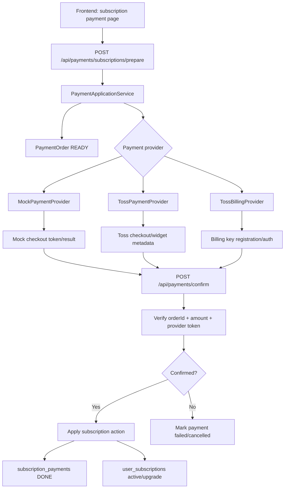
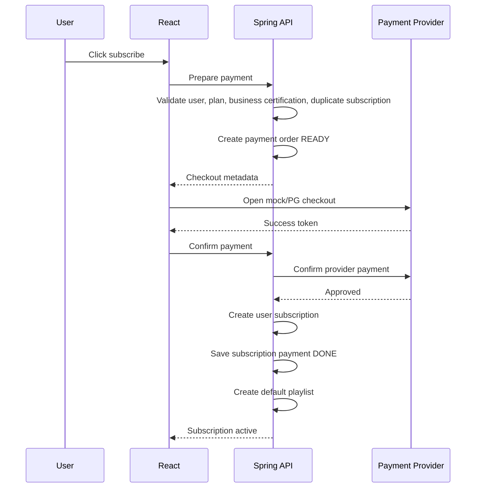
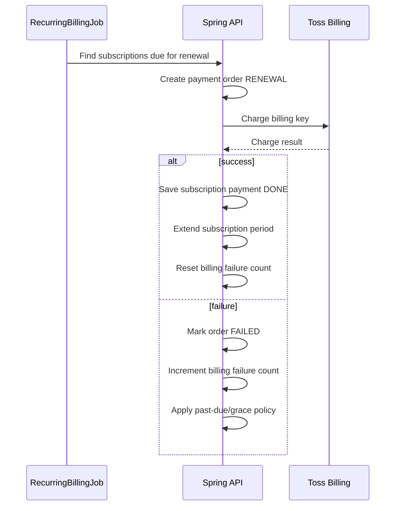

# Payment Integration Design

> Purpose: Define a payment architecture that supports local mock payment, Toss one-time payment, and Toss recurring billing without changing the subscription domain model repeatedly.

---

## 1. Overview

ATStudio currently has subscription plans, subscription records, and payment records, but payment is not a real PG flow yet.

Current implementation facts:

- `SubscriptionPaymentPage` directly calls `POST /api/user-subscriptions`.
- `UserSubscriptionService.subscribe()` creates the subscription first, then records a payment through `PaymentService`.
- `MockPaymentServiceImpl` always saves `subscription_payments.payment_status = DONE` with a `MOCK-*` transaction ID.
- Upgrade payment is also called inside `UserSubscriptionService.changeSubscription()`.
- `subscription_payments` exists, but there is no separate payment order, checkout, confirm, cancel, failure, or callback contract.

This design introduces a payment layer that separates:

1. Payment preparation.
2. PG or mock checkout.
3. Payment confirmation.
4. Subscription activation or upgrade after confirmed payment.

## 2. Design Goal

The system must support local mock payment and Toss real payment through the same application contract:

| Mode | Purpose | External charge |
|---|---|---|
| `MOCK` | Local and test flows | No real charge |
| `TOSS` | Toss one-time payment integration | Real charge in live mode, no live-data effect with Toss test keys |
| `TOSS_BILLING` | Toss recurring billing-key integration | Real recurring charge in live mode, no real withdrawal with Toss test key |
| `KAKAOPAY` | Future adapter candidate | Future |

Primary goal:

- Local development must never require real payment.
- Real PG integration must not require rewriting subscription business logic.
- A subscription must be activated, upgraded, or renewed only after payment confirmation succeeds.
- Payment attempts must be auditable even when they fail or are cancelled.
- Recurring billing must be designed now, even if implementation starts after the one-time payment lane.

Non-goals for the first integration:

- Billing key storage implementation in Phase A. The target recurring billing storage model is still defined here.
- Refund automation beyond recording a future cancellation/refund extension point.
- Multi-PG routing by user choice in the first release.
- KakaoPay implementation.

## 3. Recommended PG Direction

Use Toss Payments as the first real PG adapter.

Rationale:

- Toss has a clear test/live key distinction.
- The confirm flow maps cleanly to a React checkout page plus Spring Boot backend.
- Official docs describe `paymentKey`, `orderId`, and `amount` confirmation, which matches a server-side verification step.
- Toss also supports billing-key based automatic payment, so the same provider can cover both one-time payment and recurring billing.
- KakaoPay remains a valid later adapter, especially if KakaoPay-specific checkout is required.

External references:

- [Toss Payments API guide](https://docs.tosspayments.com/en/api-guide)
- [Toss Payments integration types](https://docs.tosspayments.com/en/integration-types)
- [Toss billing API guide](https://docs-pay.toss.im/reference/billing)
- [KakaoPay online payment docs](https://developers.kakaopay.com/docs/payment/online)

## 4. Decisions

| ID | Decision | Status |
|---|---|---|
| PAY-D01 | Use Toss as the first real PG provider. | Accepted |
| PAY-D02 | Design both one-time subscription payment and true recurring billing. | Accepted |
| PAY-D03 | Keep `POST /api/user-subscriptions` temporarily as a deprecated compatibility endpoint, but remove it from user-facing payment flows. | Accepted |
| PAY-D04 | Implement mock payment with the same prepare/confirm contract as real payment. | Proposed |
| PAY-D05 | Implement one-time payment before recurring billing, while keeping recurring entities and interfaces in the design. | Proposed |

## 5. Core Architecture



### 5.1 Backend Components

| Component | Responsibility |
|---|---|
| `PaymentController` | Payment prepare, confirm, cancel/fail callback endpoints |
| `PaymentApplicationService` | Orchestrates payment order lifecycle and subscription action application |
| `PaymentProvider` | Provider-neutral interface for mock/Toss/KakaoPay |
| `MockPaymentProvider` | Local deterministic payment result generator |
| `TossPaymentProvider` | Toss payment confirm/retrieve/cancel integration |
| `TossBillingProvider` | Toss billing-key registration and recurring charge integration |
| `PaymentOrder` | Internal payment intent and audit state |
| `BillingAgreement` | Stored recurring billing agreement and provider billing key metadata |
| `SubscriptionPayment` | Finalized payment record linked to a subscription |

### 5.2 Provider Interface Draft

```java
public interface PaymentProvider {
    PaymentPrepareResult prepare(PaymentPrepareCommand command);
    PaymentConfirmResult confirm(PaymentConfirmCommand command);
    PaymentCancelResult cancel(PaymentCancelCommand command);
}
```

Recurring billing needs a second provider interface because the command shape and lifecycle are different from one-time checkout.

```java
public interface RecurringPaymentProvider {
    BillingAgreementPrepareResult prepareAgreement(BillingAgreementPrepareCommand command);
    BillingAgreementConfirmResult confirmAgreement(BillingAgreementConfirmCommand command);
    RecurringChargeResult charge(BillingChargeCommand command);
    BillingAgreementCancelResult cancelAgreement(BillingAgreementCancelCommand command);
}
```

Provider implementations must not directly mutate `user_subscriptions`.
They only return payment results.
The application service applies subscription changes after verification.

## 6. Payment Models

ATStudio should support two subscription payment models.

| Model | Description | First implementation priority |
|---|---|---|
| One-time subscription payment | User pays once and receives access until `expiresAt`. Renewal is manual unless the user pays again. | First |
| Recurring subscription billing | User registers a billing agreement, and the system automatically charges at renewal time. | Second |

The first implementation should complete one-time payment first because it is simpler and establishes the shared payment order, confirm, and audit model. Recurring billing should reuse the payment order ledger for every renewal charge.

## 7. Payment Purposes

| Purpose | Meaning | Subscription action after payment |
|---|---|---|
| `SUBSCRIBE` | First subscription purchase | Create `user_subscriptions`, create default playlist |
| `UPGRADE` | Immediate higher-tier change | Upgrade existing subscription immediately |
| `RENEWAL` | Automatic recurring billing charge | Extend current subscription period |
| `DOWNGRADE` | Lower-tier change | No payment; schedule pending change |
| `BILLING_AGREEMENT` | Billing key registration | Store or update billing agreement only |

`DOWNGRADE` should not create a payment order unless future business policy requires paid downgrade handling.
`BILLING_AGREEMENT` does not itself grant subscription access unless paired with a confirmed initial payment.

## 8. State Model

### 8.1 Payment Order State

Introduce a separate payment order state so failed attempts are traceable.

| State | Meaning |
|---|---|
| `READY` | Internal payment order created, checkout not confirmed |
| `IN_PROGRESS` | User entered PG/mock checkout flow |
| `DONE` | Provider confirmation or billing charge succeeded and subscription action applied |
| `FAILED` | Provider confirmation failed |
| `CANCELLED` | User cancelled checkout |
| `EXPIRED` | Payment order expired before confirmation |

### 8.2 Billing Agreement State

| State | Meaning |
|---|---|
| `READY` | Registration started but not confirmed |
| `ACTIVE` | Billing key is usable for recurring charges |
| `SUSPENDED` | Temporarily disabled after repeated charge failures |
| `CANCELLED` | User or admin cancelled recurring billing |
| `EXPIRED` | Provider-side billing key is no longer usable |

### 8.3 Subscription Payment State

Existing `PaymentStatus` can remain for finalized records, but it is too small for the payment attempt lifecycle.

Recommended split:

- `payment_orders.status`: full attempt lifecycle.
- `subscription_payments.payment_status`: finalized financial record status (`DONE`, `REFUND`, future `PARTIAL_REFUND` if needed).

## 9. Database Design

### 9.1 New Table: `payment_orders`

```sql
CREATE TABLE payment_orders (
    id BIGINT NOT NULL AUTO_INCREMENT,
    order_id VARCHAR(64) NOT NULL,
    user_id BIGINT NOT NULL,
    purpose ENUM('SUBSCRIBE','UPGRADE','RENEWAL','BILLING_AGREEMENT') NOT NULL,
    provider ENUM('MOCK','TOSS','TOSS_BILLING','KAKAOPAY') NOT NULL,
    status ENUM('READY','IN_PROGRESS','DONE','FAILED','CANCELLED','EXPIRED') NOT NULL DEFAULT 'READY',
    subscription_id BIGINT NOT NULL,
    user_subscription_id BIGINT NULL,
    billing_cycle ENUM('MONTHLY','YEARLY') NOT NULL,
    amount DECIMAL(10,2) NOT NULL,
    currency VARCHAR(3) NOT NULL DEFAULT 'KRW',
    pg_transaction_id VARCHAR(200) NULL,
    provider_payload JSON NULL,
    failure_code VARCHAR(100) NULL,
    failure_message VARCHAR(500) NULL,
    expires_at DATETIME NOT NULL,
    confirmed_at DATETIME NULL,
    created_at DATETIME NOT NULL DEFAULT CURRENT_TIMESTAMP,
    updated_at DATETIME NOT NULL DEFAULT CURRENT_TIMESTAMP ON UPDATE CURRENT_TIMESTAMP,
    PRIMARY KEY (id),
    UNIQUE KEY uq_payment_orders_order_id (order_id),
    CONSTRAINT fk_payment_orders_user FOREIGN KEY (user_id) REFERENCES users(id),
    CONSTRAINT fk_payment_orders_subscription FOREIGN KEY (subscription_id) REFERENCES subscriptions(id),
    CONSTRAINT fk_payment_orders_user_subscription FOREIGN KEY (user_subscription_id) REFERENCES user_subscriptions(id)
);
```

Notes:

- `order_id` is the merchant-side stable identifier sent to the PG.
- `amount` must be recalculated and compared during confirmation.
- `provider_payload` stores sanitized provider metadata only. It must not store secrets.
- `expires_at` prevents stale checkout confirmation.

### 9.2 New Table: `billing_agreements`

```sql
CREATE TABLE billing_agreements (
    id BIGINT NOT NULL AUTO_INCREMENT,
    user_id BIGINT NOT NULL,
    provider ENUM('TOSS_BILLING','KAKAOPAY') NOT NULL,
    status ENUM('READY','ACTIVE','SUSPENDED','CANCELLED','EXPIRED') NOT NULL DEFAULT 'READY',
    provider_customer_key VARCHAR(100) NOT NULL,
    billing_key_ciphertext VARCHAR(1000) NULL,
    billing_key_fingerprint VARCHAR(128) NULL,
    pay_method VARCHAR(50) NULL,
    masked_method VARCHAR(100) NULL,
    next_billing_at DATE NULL,
    last_charged_at DATETIME NULL,
    failure_count INT NOT NULL DEFAULT 0,
    cancelled_at DATETIME NULL,
    created_at DATETIME NOT NULL DEFAULT CURRENT_TIMESTAMP,
    updated_at DATETIME NOT NULL DEFAULT CURRENT_TIMESTAMP ON UPDATE CURRENT_TIMESTAMP,
    PRIMARY KEY (id),
    UNIQUE KEY uq_billing_agreements_user_provider (user_id, provider),
    CONSTRAINT fk_billing_agreements_user FOREIGN KEY (user_id) REFERENCES users(id)
);
```

Security notes:

- Store billing keys server-side only.
- Store encrypted billing key material, not plain text.
- Keep a non-reversible fingerprint for lookup/debugging.
- Never expose billing keys to the frontend.
- `billing_key_ciphertext` and `billing_key_fingerprint` are nullable while an agreement is `READY`, but must be present before the agreement becomes `ACTIVE`.

### 9.3 Existing Table: `subscription_payments`

Keep the table as the finalized payment ledger.

Recommended additions:

| Column | Reason |
|---|---|
| `payment_order_id` | Link final payment to the attempted order |
| `provider` | Distinguish mock/Toss/KakaoPay records |
| `method` | Store card/easy-pay/etc. when provider returns it |
| `billing_agreement_id` | Link renewal payments to the billing agreement when applicable |

These additions can be deferred if `pg_transaction_id` and `payment_order_id` are enough for the first release.

## 10. API Design Draft

### 10.1 Prepare Subscription Payment

`POST /api/payments/subscriptions/prepare`

Request:

```json
{
  "purpose": "SUBSCRIBE",
  "subscriptionId": 1,
  "billingCycle": "MONTHLY"
}
```

Response:

```json
{
  "orderId": "ATS-20260516-ABC123",
  "provider": "MOCK",
  "amount": 9900,
  "currency": "KRW",
  "expiresAt": "2026-05-16T23:10:00",
  "checkout": {
    "type": "MOCK",
    "confirmToken": "mock-token"
  }
}
```

For Toss, `checkout` should include client-safe fields only, such as client key, order name, customer info, success URL, fail URL, and amount.

### 10.2 Confirm Payment

`POST /api/payments/confirm`

Request:

```json
{
  "orderId": "ATS-20260516-ABC123",
  "amount": 9900,
  "provider": "MOCK",
  "providerToken": "mock-token"
}
```

For Toss:

```json
{
  "orderId": "ATS-20260516-ABC123",
  "amount": 9900,
  "provider": "TOSS",
  "paymentKey": "toss-payment-key"
}
```

Response:

```json
{
  "orderId": "ATS-20260516-ABC123",
  "status": "DONE",
  "purpose": "SUBSCRIBE",
  "subscription": {
    "id": 100,
    "status": "ACTIVE"
  }
}
```

### 10.3 Mark Cancelled or Failed

`POST /api/payments/cancel`

Use this when the checkout page returns from a cancel/fail URL or the mock UI triggers cancellation.

### 10.4 Prepare Billing Agreement

`POST /api/payments/billing-agreements/prepare`

Request:

```json
{
  "subscriptionId": 1,
  "billingCycle": "MONTHLY"
}
```

Response:

```json
{
  "agreementId": 10,
  "provider": "TOSS_BILLING",
  "authUrl": "https://...",
  "expiresAt": "2026-05-16T23:10:00"
}
```

### 10.5 Confirm Billing Agreement

`POST /api/payments/billing-agreements/confirm`

Stores the billing key after provider callback verification. This endpoint must not activate a subscription by itself unless the same flow also confirms an initial payment.

### 10.6 Cancel Billing Agreement

`DELETE /api/payments/billing-agreements/me`

Cancels automatic future renewal. It must not immediately cancel already-paid subscription access.

### 10.7 Deprecated Compatibility Endpoint

`POST /api/user-subscriptions`

Temporary policy:

- Remains available only as a compatibility endpoint during migration.
- Must be removed from all user-facing payment UI.
- Must not be used for production real-PG checkout.
- Recommended guard: `app.payment.legacy-subscribe-enabled`, enabled only for local/test until the new flow is stable.

## 11. Process Flows

### 11.1 First Subscription: One-time Payment



### 11.2 Upgrade

1. User chooses a higher plan.
2. Frontend calls `GET /api/utils/subscription-change-preview`.
3. Frontend prepares payment with `purpose = UPGRADE`.
4. Backend recalculates the same amount when preparing and confirming.
5. After confirmation, backend applies `UserSubscription.upgrade(...)`.
6. Backend saves `subscription_payments` with the charged amount.

### 11.3 Downgrade

Downgrade remains payment-free:

1. User chooses a lower plan.
2. Frontend displays effective date from preview.
3. Backend stores `pendingSubscriptionId` and `pendingBillingCycle`.
4. `SubscriptionScheduler` applies the pending change at expiry.

### 11.4 Recurring Billing Registration

1. User chooses recurring subscription.
2. Frontend calls billing agreement prepare.
3. User authenticates payment method through Toss billing-key flow.
4. Backend verifies callback and stores encrypted billing key.
5. If initial payment is required immediately, backend creates and confirms a `SUBSCRIBE` payment order.
6. Subscription becomes active only after the initial payment is confirmed.

### 11.5 Recurring Renewal



## 12. Business Rules

1. A subscription or upgrade must never be applied before payment confirmation.
2. `orderId`, authenticated user, purpose, subscriptionId, billingCycle, and amount must match the server-side `payment_orders` record during confirmation.
3. Client-provided amount is only a consistency check; server-calculated amount is authoritative.
4. Payment confirmation must be idempotent by `orderId`.
5. If PG confirmation succeeds but local subscription update fails, the system must record the failure and trigger a compensating cancellation/refund path.
6. Mock mode must support success, failure, cancellation, and expiration so local tests can exercise real states.
7. Secrets such as Toss secret keys or KakaoPay admin keys must remain server-side only.
8. Billing keys must be encrypted at rest and never returned to the frontend.
9. Recurring renewal must be idempotent per subscription period.
10. Cancelling recurring billing must stop future charges but must not remove already-paid access.

## 13. Frontend Design

### 13.1 Subscription Payment Page

Replace direct `subscribe()` execution with:

1. Load selected plan and billing cycle.
2. Call prepare endpoint.
3. Render provider-specific checkout action.
4. Confirm result.
5. Navigate to `/subscriptions/manage` only after confirmation succeeds.

Mock UI states:

| Action | Result |
|---|---|
| Confirm mock payment | Calls confirm endpoint and activates subscription |
| Fail mock payment | Marks order failed and shows retry |
| Cancel mock payment | Marks order cancelled and returns to plan page |

Toss UI states:

| Action | Result |
|---|---|
| Open Toss payment | Loads Toss V2 widget with server-issued order metadata |
| Toss success redirect | Calls confirm endpoint with `paymentKey`, `orderId`, and `amount` |
| Toss fail redirect | Marks order failed when `orderId` is available and shows a retry path |

### 13.2 Subscription Manage Page

For upgrades:

1. Keep preview flow.
2. If `changeType = UPGRADE`, route to the subscription payment page with `purpose=UPGRADE`.
3. The payment page prepares and confirms the order; subscription mutation remains behind payment confirmation.

For downgrades:

1. Continue direct `changeMySubscription()` scheduling.
2. Do not create a payment order.

For recurring billing:

1. Show payment method registration status when `BillingAgreement` exists.
2. Provide "change payment method" and "cancel automatic renewal" actions.
3. Show next billing date separately from current access expiration date when both are available.

## 14. Migration Plan

### Phase A: Mock-first Payment Contract

Status: Implemented.

- Add `payment_orders` table and entity.
- Add `PaymentController`.
- Implement `MockPaymentProvider`.
- Move subscription activation into confirm flow.
- Keep current `POST /api/user-subscriptions` temporarily as a compatibility path or mark it deprecated.

### Phase B: Toss One-time Payment Integration

Status: Implemented for the direct checkout/confirm path with Toss test-key friendly configuration. Webhook, refund, reconciliation, and transaction compensation remain Phase D hardening items.

- Add Toss configuration:
  - `app.payment.provider=TOSS`
  - `app.payment.toss.client-key`
  - `app.payment.toss.secret-key`
  - `app.payment.toss.success-url`
  - `app.payment.toss.fail-url`
- Implement Toss confirm API call server-side.
- Validate `orderId` and `amount`.
- Use Toss test keys only in non-production.

Operational note:

- The default provider is `MOCK`; restarting the backend without local config or environment variables will create mock payment orders.
- For local Toss testing, set `app.payment.provider=TOSS` and Toss test keys in `application-local.yml` or equivalent environment variables before `bootRun`.
- Use `http://localhost:5173` consistently for the frontend and Toss success/fail URLs unless CORS also explicitly allows the alternative origin.
- Existing `IN_PROGRESS` payment orders from interrupted local tests are audit records. Start a new checkout attempt instead of reusing old Toss redirect URLs.

### Phase C: Toss Recurring Billing Design Implementation

Status: Implemented for the billing-key registration, immediate first charge, encrypted billing-key storage, renewal scheduler, and 3-day/3-retry failure policy.

- Add `billing_agreements` table and entity.
- Implement `RecurringPaymentProvider`.
- Implement Toss billing-key registration.
- Implement recurring renewal job.
- Define past-due/grace behavior before enabling production recurring billing.
- Keep billing keys server-only and encrypted at rest.
- Cancel automatic renewal without removing already-paid access before `expiresAt`.

### Phase D: Payment UX and Operations Stabilization

Status: Design in progress under `REQ-20260518-ATS-001`.

The current page-fixed Toss checkout/billing auth surface is an intentional debug-friendly intermediate state. Production UX should separate the PG surface from the main subscription page while preserving enough progress and recovery visibility for local testing.

Recommended checkout surface:

| Option | Recommendation | Rationale |
|---|---|---|
| Page-fixed Toss widget/auth surface | Keep only for local/debug visibility | It exposes order/provider/progress state clearly, but feels like the PG UI is embedded in the subscription page. |
| Modal/drawer checkout | Acceptable for one-time Toss widget after iframe/mobile/z-index verification | Closest to the expected "payment window" feel, but needs viewport and fixed-player overlap checks. |
| Dedicated checkout route | Preferred default for recurring billing auth and redirect-heavy recovery | Browser history, success/fail callback handling, mobile authentication return, and retry recovery are simpler. |

User-facing state guidance:

| State | User message direction | Backend state anchor |
|---|---|---|
| Preparing | Show that the order is being prepared; allow retry if preparation fails. | `payment_orders.READY` |
| PG in progress | Prevent duplicate submissions and keep a clear return path. | `payment_orders.IN_PROGRESS` |
| Success | Confirm server-side first, then move to subscription management. | `payment_orders.DONE`, `subscription_payments.DONE` |
| User cancelled | No subscription mutation; provide a new checkout attempt. | `payment_orders.CANCELLED` |
| Failed | Show safe user copy and a retry action; hide raw PG payloads. | `payment_orders.FAILED` |
| Expired/interrupted | Treat old redirects as stale and start a fresh checkout. | `payment_orders.EXPIRED` or expired `expires_at` |
| Billing past due | Show grace-period access and next retry guidance. | `billing_agreements.failure_count`, `next_billing_at`, `user_subscriptions.expiresAt` |

Operator-facing minimum visibility:

- Latest `payment_orders` for a user, including purpose, provider, status, amount, order ID, sanitized failure code/message, and timestamps.
- Related `subscription_payments` for finalized charges.
- Current `billing_agreements` status, masked method, next billing date, failure count, and cancellation date.
- Read-only support view first. Refund, receipt, settlement, webhook reconciliation, and multi-PG operations remain separate follow-up scopes.

Sensitive-data boundary:

- Ordinary users must not see raw `authKey`, `customerKey`, `billingKey`, Toss secret key, or raw provider payload.
- Operators may see internal `orderId`, sanitized failure code/message, provider, purpose, amount, timestamps, and masked payment method.
- Billing keys remain encrypted server-side only; only fingerprint/masked method may appear in diagnostics.

### Phase E: Production Hardening

- Add webhook handling.
- Add compensating cancel/refund handling.
- Add payment order expiration job.
- Add admin payment audit screen based on Phase D requirements.
- Add recurring billing failure alerts and retry policy.

## 15. Open Decisions

| ID | Decision | Recommended answer |
|---|---|---|
| PAY-D01 | First PG provider | Toss Payments first (accepted) |
| PAY-D02 | Subscription model | Include one-time payment and recurring billing (accepted) |
| PAY-D03 | Keep direct `POST /api/user-subscriptions`? | Temporarily deprecated compatibility endpoint (accepted) |
| PAY-D04 | Mock UI detail level | Include success/fail/cancel buttons |
| PAY-D05 | One-time vs recurring implementation order | One-time first, recurring second |
| PAY-D06 | Payment admin screen | Design read-only support view first; defer mutation/refund operations |
| PAY-D07 | Refund/cancel automation | Defer implementation, design compensation hook now |
| PAY-D08 | Recurring billing failure grace period | 3-day grace period with up to 3 retry attempts (accepted) |
| PAY-D09 | Initial recurring subscription charge | Billing-key registration followed by immediate first charge (accepted) |
| PAY-D10 | Production checkout surface | Dedicated checkout route preferred for recurring billing auth; modal/drawer acceptable for one-time Toss widget after UI verification |

## 16. Implementation Risk Notes

- Legacy `UserSubscriptionService` compatibility endpoints still perform subscription mutation directly and should remain outside user-facing real-PG checkout.
- Current Toss confirm calls the PG before local subscription mutation, but full compensation/refund automation is still Phase D work.
- `proratedAmount` must mean "amount to charge" for PG integration. Negative values should not be sent to PG.
- Test mode safety must be explicit in configuration, not implied by class names.
- KakaoPay and TossPay test behavior differs by integration path. Provider-specific docs must be checked again before implementation.
- Toss billing-key flow uses server-side API keys and billing keys. Treat them as sensitive payment credentials.
- Recurring billing introduces retry, grace, and notification requirements that do not exist in the current subscription model.

## Related Documents

- [API Specification](api-spec.md)
- [DB Schema](db-schema.md)
- [User Subscription Use Cases](usecase/user-subscription.md)
- [Screen Flow](../ui/screen-flow.md)
- [Modal List](../ui/modal-list.md)
