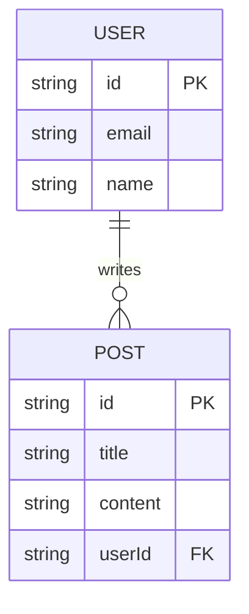

# [Design] Database Design (DB Design)

> **@fileoverview**: Project data storage structure and relationship design
> **Related WI**: [WI-ID]
> **Related ADR**: [ADR-ID]

---

## 1. Overview
- **Purpose**: Define system data persistence layer design and optimization strategy.
- **Tech Stack**: (e.g., SQLite, PostgreSQL, Redis, etc.)
- **Tools**: (e.g., DBeaver, Prisma, Flyway, etc.)

## 2. ER Diagram (ERD)

## 3. Table/Collection Detailed Specification
- (write if needed)

## 4. Indexes and Performance Optimization
- (write if needed)

## 5. Migration Plan
- (write if needed)
