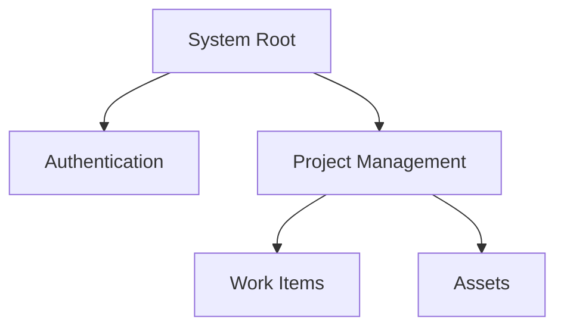
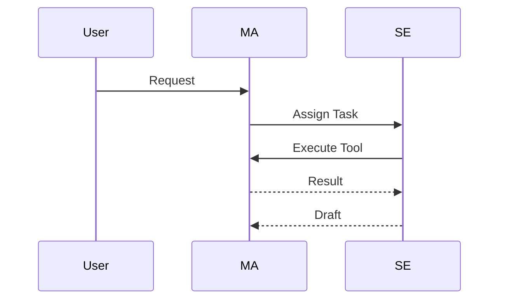

# [Design] Information Architecture Design

> **@fileoverview**: System data flow and logical hierarchy structure design
> **Related WI**: [WI-ID]

---

## 1. Overview
- **Purpose**: Design classification system for information handled by the system and information navigation paths for users/agents.
- **Tech Stack**: (e.g., Mermaid, Lucidchart, Draw.io, etc.)

## 2. Information Hierarchy
- Describe hierarchical structure of system's main data entities and functions.

## 3. Data Flow
- Describe data movement and transformation process for main scenarios.

## 4. Sitemap / Menu Structure (if needed)
- Define connection relationships between screens if UI is included.

## 5. Term and Concept Mapping
- Mapping between domain-specific terms and system entities.
| Domain Term | System Entity | Description |
| :--- | :--- | :--- |
| Work | Work Item | Minimum execution unit |
