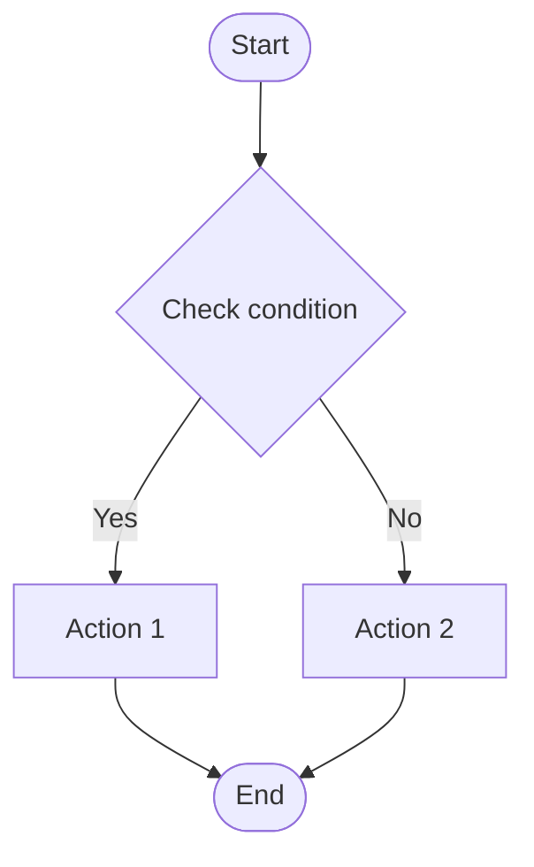

# [Design] Process Design

> **@fileoverview**: System business logic, state changes and workflow design
> **Related WI**: [WI-ID]
> **Related ADR**: [ADR-ID]

---

## 1. Overview
- **Purpose**: Define execution flow and business rules for specific features or services.
- **Scope**: (e.g., order processing workflow, user approval workflow, etc.)

## 2. Process Flow (Flowchart)

## 3. State Definition (State Machine)
- Define if state changes of system or entity are complex.
| Current State | Event | Next State | Description |
| :--- | :--- | :--- | :--- |
| PENDING | APPROVE | ACTIVE | Activate on approval |
| ACTIVE | SUSPEND | SUSPENDED | Suspend temporarily |

## 4. Business Rules
- Core logic and policies to comply with in the process.
1. **Rule 1**: All payments must be preceded by inventory check before approval.
2. **Rule 2**: ...

## 5. Exception Handling
- Response plans for process interruption or error occurrence.
- (e.g., On payment failure, change order status to 'FAILED' and notify user)
